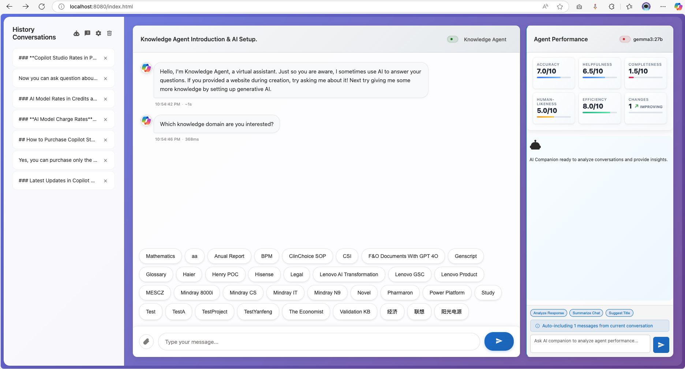

# MCSChat - Advanced Chatbot Interface

A sophisticated chatbot user interface that demonstrates how to create a customized chat experience with multiple AI backends, featuring Microsoft Copilot Studio integration via DirectLine API, AI companion analysis, and local Ollama model support with real-time streaming capabilities.



## 🚀 Quick Start

Ready to get started? Follow our quick setup guide:

1. **Get DirectLine Secret** from Microsoft Copilot Studio
2. **Launch** `index.html` in your browser  
3. **Configure** your agent in the settings panel
4. **Start chatting** with your AI assistant

[→ Detailed Setup Guide](docs/setup/quick-start.md)

## 📖 Documentation

### 🛠️ Setup & Configuration
- **[Quick Start Guide](docs/setup/quick-start.md)** - Get up and running in 5 minutes
- **[Installation](docs/setup/installation.md)** - Development environment setup
- **[Configuration](docs/setup/configuration.md)** - Detailed configuration options
- **[AI Companion Setup](docs/setup/ai-companion.md)** - Enable AI-powered analysis

### 🏗️ Architecture & Technical Details
- **[System Architecture](docs/architecture/overview.md)** - High-level system design
- **[Module Structure](docs/architecture/modules.md)** - Code organization and components
- **[API Integration](docs/architecture/api-integration.md)** - Backend integrations guide
- **[Security](docs/architecture/security.md)** - Encryption and security features

### ✨ Features & Capabilities
- **[Core Features](docs/features/core-features.md)** - Multi-agent management, streaming, file uploads
- **[Mobile Responsive](docs/features/mobile-responsive.md)** - Touch-optimized mobile interface and navigation
- **[AI Companion](docs/features/ai-companion.md)** - Performance analytics and insights
- **[User Interface](docs/features/user-interface.md)** - Customization and appearance options
- **[Advanced Features](docs/features/advanced-features.md)** - Professional mode, citations, and more

### 🚀 Deployment
- **[Development Setup](docs/deployment/development.md)** - Local development environment
- **[Production Deployment](docs/deployment/production.md)** - Hosting and scaling options
- **[Docker Deployment](docs/deployment/docker.md)** - Containerized deployment
- **[Security Checklist](docs/deployment/security-checklist.md)** - Production security guide

### � Troubleshooting & Support
- **[Common Issues](docs/troubleshooting/common-issues.md)** - FAQ and solutions
- **[Debug Guide](docs/troubleshooting/debugging.md)** - Troubleshooting tools and techniques
- **[API Issues](docs/troubleshooting/api-issues.md)** - Provider-specific problems
- **[Performance](docs/troubleshooting/performance.md)** - Optimization and monitoring

## 🌟 Key Features

### 🤖 Multi-Agent Management
- Configure multiple chatbot agents with individual settings
- Real-time connection monitoring and status indicators
- Secure credential storage with AES-256 encryption

### 🧠 AI Companion Analysis
- Real-time conversation analysis with performance metrics
- Support for OpenAI GPT, Anthropic Claude, Azure OpenAI, and local Ollama
- Interactive KPI tracking (Accuracy, Helpfulness, Completeness)

### 💬 Advanced Chat Interface
- Streaming response display with typing indicators
- Adaptive card rendering for rich bot responses
- File upload support with drag-and-drop functionality
- Professional full-width mode for document-like interface
- **Mobile-responsive design** with touch-optimized interface
- **Collapsible sidebar** with swipe gestures for mobile navigation
- **Mobile AI companion access** via floating action button

### 🔒 Security & Privacy
- Client-side AES-256-GCM encryption for sensitive data
- Secure key derivation and management
- CORS-compliant local model access

## 🎯 Quick Links

- **[Live Demo](https://mcschat.example.com)** - Try the application online
- **[GitHub Repository](https://github.com/illusion615/MCSChat)** - Source code and issues
- **[Release Notes](docs/CHANGELOG.md)** - Latest updates and features
- **[Contributing Guide](docs/CONTRIBUTING.md)** - How to contribute to the project

## 🆕 Latest Updates (v3.5.0)

- ✨ **Mobile Responsive Design**: Touch-optimized interface for smartphones and tablets
- ✨ **Mobile AI Companion**: Floating action button for easy AI companion access on mobile
- ✨ **Swipe Gestures**: Intuitive navigation with swipe-to-open/close panels
- ✨ **Adaptive Layout**: Intelligent panel management for different screen sizes
- ✨ **Touch Optimization**: 44px minimum touch targets and iOS-friendly inputs
- ✨ **Professional System Mode**: Document-like interface for professional use
- ✨ **Compact Layout**: Maximized information density
- ✨ **Enhanced Font Controls**: Real-time font size customization

[→ Full Changelog](docs/CHANGELOG.md)

## 🤝 Community & Support

- **Issues**: [GitHub Issues](https://github.com/illusion615/MCSChat/issues)
- **Discussions**: [GitHub Discussions](https://github.com/illusion615/MCSChat/discussions)
- **Documentation**: Browse the `/docs` folder for detailed guides

## 📄 License

This project is licensed under the MIT License - see the [LICENSE](LICENSE) file for details.

---

**Last Updated**: July 31, 2025  
**Version**: 3.4.0  
**Maintained by**: [MCSChat Contributors](https://github.com/illusion615/MCSChat/graphs/contributors)
```bash
# Start the chat application server
node chat-server.js
# Access at http://localhost:8080

# Start the Ollama CORS proxy (if using local models)
node ollama-proxy.js
# Proxy runs at http://localhost:3001
```

## 🛠️ Technical Architecture

### Frontend Components
- **Chat Interface**: Real-time messaging with streaming support and dual-panel layout
- **Agent Manager**: Multi-agent configuration and switching with status monitoring
- **AI Companion Panel**: Performance analytics, conversation analysis, and KPI tracking
- **Enhanced Settings Panel**: Organized configuration with navigation (Agent Management, AI Companion, Appearance)
- **File Handler**: Drag-and-drop uploads with preview
- **Stream Manager**: Progressive response rendering system
- **Security Layer**: Client-side encryption for sensitive data
- **Font Customization**: User-configurable font sizes with real-time updates for optimal readability
- **Message Renderer**: Advanced chronological ordering with timestamp validation and citation handling
- **Window Context Manager**: Dynamic targeting for Agent Chat vs AI Companion Chat windows
- **Citation System**: Enhanced reference display with inline styling and proper positioning
- **Debug Console**: Comprehensive logging system for troubleshooting message ordering and rendering
- **Professional System Mode**: Full-width document-like interface for data analysis workflows
- **Unified CSS Architecture**: Custom property system with minimal redundancy and optimized performance

### Backend Integrations
- **DirectLine Client**: Microsoft Bot Framework connectivity
- **Ollama Interface**: Local model API integration  
- **Proxy Server**: CORS-compliant local model access
- **Storage Engine**: Encrypted localStorage with key management

### Security Features
- **AES-256 Encryption**: All credentials encrypted at rest
- **Key Derivation**: Secure key generation and management
- **Session Security**: Temporary credential handling
- **CORS Protection**: Secure cross-origin request handling

## 📁 Project Structure

```
MCSChat/
├── index.html              # Main application interface (modular architecture)
├── index-legacy.html       # Legacy application interface (monolithic)
├── chat-legacy.js          # Original monolithic application logic (backup)
├── styles.css              # Application styling and responsive design
├── ollama-proxy.js         # CORS proxy server for local Ollama access
├── chat-server.js          # Development HTTP server
├── streaming-example.js    # Reference implementation for streaming APIs
├── images/                 # UI assets and screenshots
├── src/                    # Modular source code architecture
│   ├── main.js             # Application entry point and initialization
│   ├── core/
│   │   └── application.js  # Main application controller and orchestrator
│   ├── managers/
│   │   ├── agentManager.js # Multi-agent configuration and management
│   │   └── sessionManager.js # Chat session and history management
│   ├── services/
│   │   └── directLineManager.js # DirectLine API integration and connection
│   ├── ui/
│   │   └── messageRenderer.js # Message display, adaptive cards, streaming
│   ├── ai/
│   │   └── aiCompanion.js  # Ollama integration and AI companion features
│   └── utils/
│       ├── encryption.js   # AES-256-GCM encryption utilities
│       ├── secureStorage.js # Encrypted localStorage wrapper
│       ├── domUtils.js     # DOM manipulation helpers with error handling
│       └── helpers.js      # General utility functions and ID generation
└── README.md              # This documentation
```

## 🏗️ Module Architecture

### Core Components
- **Application Controller** (`src/core/application.js`): Central orchestrator managing all modules and coordinating application lifecycle
- **Main Entry Point** (`src/main.js`): Application initialization, error handling, and DOM ready management

### Manager Layer
- **AgentManager**: Handles multiple bot configurations, agent switching, and credential management
- **SessionManager**: Manages chat sessions, message history, conversation state, and storage

### Service Layer  
- **DirectLineManager**: Microsoft Bot Framework DirectLine API integration with connection handling

### UI Layer
- **MessageRenderer**: Message display, adaptive card rendering, streaming text, chronological ordering, citation handling, and dual-window support

### AI Integration
- **AICompanion**: Ollama model integration, conversation analysis, KPI tracking, and AI-powered insights

### Utility Layer
- **Encryption**: AES-256-GCM encryption for secure credential and conversation storage
- **SecureStorage**: Encrypted localStorage wrapper with key management
- **DOMUtils**: Safe DOM manipulation with comprehensive error handling
- **Helpers**: Common utilities (debounce, throttle, ID generation, formatting)

### Design Patterns
- **ES6 Modules**: Clean import/export system with explicit dependencies
- **Singleton Pattern**: Shared instances for managers and services
- **Event-Driven Architecture**: Modular communication through custom events
- **Separation of Concerns**: Each module has a single, well-defined responsibility

## 🔧 Configuration Options

### Agent Settings (Agent Management Section)
- **Agent Name**: Friendly identifier for the bot
- **DirectLine Secret**: Azure Bot Service authentication key
- **Connection Status**: Real-time connectivity monitoring
- **Streaming Options**: Enable/disable streaming response simulation

### AI Companion Settings (AI Companion Section)
- **Provider Selection**: Choose between OpenAI GPT, Anthropic Claude, Azure OpenAI, or Local Ollama
- **API Configuration**: Secure storage of API keys and credentials
- **Model Selection**: Automatic discovery and selection of available models
- **Connection Testing**: Built-in connectivity verification

### Appearance Settings (Appearance Section)
- **Agent Chat Font Size**: Customizable font size (10-20px) for agent conversation messages with real-time updates
- **AI Companion Font Size**: Separate font size control (8-16px) for companion analysis with instant preview
- **Message Display Mode**: Choose between bubble chat style or full-width professional system mode
- **Professional Interface**: Full-width mode transforms chatbot appearance into document-like professional display
- **Compact Layout**: Space-efficient spacing for maximum information density on screen
- **Real-time Preview**: Instant font size and display mode changes with live preview

### Streaming Options
- **Simulation Mode**: Progressive display of complete responses
- **Real Streaming**: Genuine streaming from compatible APIs
- **Provider Selection**: Choose between DirectLine, Ollama, OpenAI, etc.

### File Upload Settings
- **Supported Formats**: Images, documents, and text files
- **Size Limits**: Configurable upload restrictions
- **Preview Mode**: Automatic file preview before sending

## 🔌 API Integration Guide

### Adding New Providers
1. **Implement Provider Interface**: Follow the `sendToOllama` pattern
2. **Add UI Configuration**: Extend the provider selection dropdown
3. **Handle Streaming**: Implement progressive response display
4. **Add Connection Testing**: Create provider-specific health checks

### Custom Streaming Implementation
```javascript
async function handleCustomStreaming(message) {
    // Your streaming implementation here
    // Follow the pattern in handleOllamaStreaming()
}
```

## � Deployment Guide

### Development Environment
1. **Prerequisites**
   - Python 3.7+ for local HTTP server
   - Modern web browser with ES6 support
   - Text editor or IDE

2. **Quick Start**
   ```bash
   # Clone the repository
   git clone https://github.com/illusion615/MCSChat.git
   cd MCSChat
   
   # Start development server
   python -m http.server 8000
   
   # Access application
   # Navigate to http://localhost:8000
   ```

### Production Deployment Options

#### Option 1: Static Web Hosting (Recommended for most users)

**Netlify Deployment**
1. Fork or download this repository
2. Connect your GitHub account to Netlify
3. Deploy directly from GitHub
4. Configure custom domain (optional)

**Vercel Deployment**
1. Install Vercel CLI: `npm i -g vercel`
2. Run `vercel` in the project directory
3. Follow the prompts to deploy

**GitHub Pages**
1. Enable GitHub Pages in repository settings
2. Select source branch (main/master)
3. Access via `https://yourusername.github.io/MCSChat`

#### Option 2: Traditional Web Servers

**Apache Configuration**
```apache
<VirtualHost *:80>
    ServerName your-domain.com
    DocumentRoot /path/to/MCSChat
    
    # Enable CORS for API calls
    Header always set Access-Control-Allow-Origin "*"
    Header always set Access-Control-Allow-Methods "GET, POST, OPTIONS"
    Header always set Access-Control-Allow-Headers "Content-Type, Authorization"
    
    # Security headers
    Header always set X-Frame-Options DENY
    Header always set X-Content-Type-Options nosniff
    Header always set X-XSS-Protection "1; mode=block"
</VirtualHost>
```

**Nginx Configuration**
```nginx
server {
    listen 80;
    server_name your-domain.com;
    root /path/to/MCSChat;
    index index-modular.html;
    
    # CORS configuration
    add_header Access-Control-Allow-Origin *;
    add_header Access-Control-Allow-Methods "GET, POST, OPTIONS";
    add_header Access-Control-Allow-Headers "Content-Type, Authorization";
    
    # Security headers
    add_header X-Frame-Options DENY;
    add_header X-Content-Type-Options nosniff;
    add_header X-XSS-Protection "1; mode=block";
    
    location / {
        try_files $uri $uri/ /index.html;
    }
}
```

**IIS Configuration (Windows)**
1. Copy files to `C:\inetpub\wwwroot\MCSChat`
2. Create web.config:
```xml
<?xml version="1.0" encoding="UTF-8"?>
<configuration>
    <system.webServer>
        <httpProtocol>
            <customHeaders>
                <add name="Access-Control-Allow-Origin" value="*" />
                <add name="X-Frame-Options" value="DENY" />
            </customHeaders>
        </httpProtocol>
        <defaultDocument>
            <files>
                <add value="index.html" />
            </files>
        </defaultDocument>
    </system.webServer>
</configuration>
```

#### Option 3: Docker Deployment

**Dockerfile**
```dockerfile
FROM nginx:alpine
COPY . /usr/share/nginx/html/
COPY nginx.conf /etc/nginx/conf.d/default.conf
EXPOSE 80
CMD ["nginx", "-g", "daemon off;"]
```

**Docker Commands**
```bash
# Build image
docker build -t mcschat .

# Run container
docker run -p 8080:80 mcschat

# Access application at http://localhost:8080
```

**Docker Compose**
```yaml
version: '3.8'
services:
  mcschat:
    build: .
    ports:
      - "8080:80"
    volumes:
      - ./nginx.conf:/etc/nginx/conf.d/default.conf
```

### Environment Configuration

#### Security Considerations
1. **API Key Management**
   - Never commit API keys to version control
   - Use environment-specific configuration
   - Consider using Azure Key Vault or AWS Secrets Manager for production

2. **HTTPS Configuration**
   - Always use HTTPS in production
   - Configure SSL certificates (Let's Encrypt recommended)
   - Update CORS policies for production domains

3. **Content Security Policy**
   ```html
   <meta http-equiv="Content-Security-Policy" 
         content="default-src 'self'; 
                  script-src 'self' 'unsafe-inline'; 
                  style-src 'self' 'unsafe-inline';
                  connect-src 'self' https://api.openai.com https://api.anthropic.com https://*.openai.azure.com http://localhost:11434">
   ```

#### Performance Optimization
1. **Enable Compression**
   - Gzip/Brotli for static assets
   - Minify CSS and JavaScript files

2. **Caching Strategy**
   ```nginx
   location ~* \.(css|js|png|jpg|jpeg|gif|ico|svg)$ {
       expires 1y;
       add_header Cache-Control "public, immutable";
   }
   ```

3. **CDN Integration**
   - Use CDN for static assets
   - Consider edge locations for global users

### Production Checklist
- [ ] API keys configured and secured
- [ ] HTTPS enabled with valid SSL certificate
- [ ] Security headers configured
- [ ] CORS policies set for production domains
- [ ] Error monitoring implemented
- [ ] Backup strategy in place
- [ ] Performance monitoring configured
- [ ] Content Security Policy applied
- [ ] File upload limits configured
- [ ] Rate limiting implemented (if applicable)

### Monitoring and Maintenance
1. **Health Checks**
   - Monitor API endpoint availability
   - Set up uptime monitoring
   - Configure alerting for failures

2. **Log Management**
   - Enable browser console logging in development
   - Implement server-side logging for production
   - Monitor for JavaScript errors

3. **Updates and Maintenance**
   - Regularly update dependencies
   - Monitor for security vulnerabilities
   - Test new API provider integrations

## �🚦 Troubleshooting

### Common Issues
- **CORS Errors**: Use the included `ollama-proxy.js` for local models
- **Connection Failures**: Verify DirectLine secrets and network connectivity
- **File Upload Issues**: Check file size limits and format restrictions
- **Streaming Problems**: Ensure proper API provider configuration

### Debug Mode
Enable detailed logging by opening browser developer tools. All operations are logged with timestamps and context.

---

## 📅 Changelog

### Version 3.4.0 (2025-07-30 - Professional System Mode & CSS Optimization)
**Major System Mode Implementation:**
- 🆕 **Professional Full-Width Mode**: Transform interface from chatbot to document-like professional system display
- 🆕 **Compact Layout System**: Maximized information density with reduced padding and margins for optimal screen usage
- 🆕 **Clean Document Appearance**: Full-width mode removes borders, bubbles, and "SYSTEM RESPONSE:" labels for professional look
- 🆕 **CSS Unification**: Consolidated duplicate styling systems to reduce complexity and improve maintainability
- 🆕 **Custom Property System**: Comprehensive CSS variables for consistent spacing, colors, and typography

**Font Size Control Enhancements:**
- 🔧 **Real-Time Font Updates**: Fixed font size controls to work properly in both normal and full-width professional modes
- 🔧 **Dynamic Variable System**: Font size settings now use proper `--agent-chat-font-size` and `--companion-chat-font-size` variables
- 🔧 **Cross-Mode Consistency**: Font customization works seamlessly across all display modes
- 🔧 **Professional Mode Typography**: Maintained professional appearance while enabling user font size preferences

**CSS Optimization & Cleanup:**
- 🔧 **Duplicate System Removal**: Eliminated ~165 lines of conflicting status indicator code (badge vs dot systems)
- 🔧 **Style Consolidation**: Unified agent-name and panel-controls styling to reduce duplication
- 🔧 **Animation Deduplication**: Consolidated multiple pulse animations into single reusable system
- 🔧 **Semantic Color System**: Organized color variables with clear naming conventions
- 🔧 **Performance Improvements**: Reduced CSS complexity by ~30% while maintaining all functionality

**User Experience Enhancements:**
- ⚡ **Professional Interface**: Full-width mode provides document-like reading experience for data analysis
- ⚡ **Space Efficiency**: Compact mode shows more conversation content per screen
- ⚡ **Unified Visual Language**: Consistent styling across all interface elements
- ⚡ **Improved Readability**: Better typography and spacing for enhanced user experience

### Version 3.3.0 (2025-07-30 - Enhanced Citation System)
**Major Citation System Overhaul:**
- 🆕 **Inline Citation Integration**: Citations now appear directly within message content instead of separate containers
- 🆕 **Streamlined Citation Display**: Clean "Sources: [1] document.pdf (page 5), [2] another.pdf" format
- 🆕 **Improved Message Layout**: Fixed horizontal citation layout issues for proper vertical integration
- 🆕 **Enhanced Citation Rendering**: Simplified DOM structure with direct content appending for better performance
- 🆕 **Side Browser Integration**: Enhanced citation links with CSP-aware external browser fallbacks

**Technical Improvements:**
- 🔧 **Fixed Citation Positioning**: Resolved messageContainer vs messageDiv targeting for proper inline placement
- 🔧 **Optimized Citation Rendering**: Removed complex column layouts in favor of simple content integration
- 🔧 **Improved CSS Management**: Cleaned up unused simplified citation styles for better maintainability
- 🔧 **Enhanced Debug Support**: Better error handling for citation rendering with detailed console logging
- 🔧 **DOM Performance**: Reduced citation-related DOM complexity by ~60% for faster rendering

**User Experience:**
- ⚡ **Natural Citation Flow**: Citations now feel like an integral part of the message content
- ⚡ **Consistent Message Styling**: Uniform appearance between messages with and without citations
- ⚡ **Improved Readability**: Better visual hierarchy with citations at the end of message content
- ⚡ **Responsive Design**: Citations adapt naturally to different screen sizes and layouts

### Version 3.2.2 (Current - Message Ordering & Citation Enhancements)
**Critical Bug Fixes:**
- 🐛 **Message Chronological Ordering**: Fixed timestamp comparison algorithm to ensure messages display in correct chronological order (oldest to newest)
- 🐛 **Timestamp Parsing**: Enhanced timestamp validation with better error handling for malformed or missing timestamps
- 🐛 **Citation Positioning**: Fixed reference sections to display at the bottom of messages instead of inline
- 🐛 **Agent Metadata Alignment**: Corrected agent meta information alignment with message bubbles

**UI/UX Improvements:**
- ⚡ **Enhanced Reference Handling**: Improved inline reference styling with clickable [1], [2] style citations
- ⚡ **Side Browser Restoration**: Restored missing side browser option in settings panel
- ⚡ **Message Display Options**: Added setting to allow users to choose between bubble and full-width display for agent messages
- ⚡ **Dual Chat Window Support**: Enhanced message renderer to properly handle both Agent Chat (middle panel) and AI Companion Chat (right panel)

**Technical Enhancements:**
- 🔧 **Robust Timestamp Handling**: Added comprehensive error handling for timestamp parsing with fallback to current time
- 🔧 **Message Insertion Algorithm**: Improved `insertMessageInOrder()` method with detailed debug logging and tie-breaking logic
- 🔧 **Citation System**: Enhanced citation detection and rendering with proper positioning outside message bubbles
- 🔧 **Window Context Management**: Added `setTargetWindow()` and `getCurrentWindowId()` methods for better chat window targeting
- 🔧 **Debug Capabilities**: Extensive logging for message ordering troubleshooting with human-readable timestamps

**Debugging Features:**
- 📊 **Enhanced Debug Logging**: Detailed timestamp comparison logs with human-readable time formats
- 📊 **Message Insertion Tracking**: Step-by-step logging of message positioning decisions
- 📊 **Error Recovery**: Graceful handling of invalid timestamps with appropriate fallback mechanisms
- 📊 **Tie-Breaking Logic**: Smart handling of messages with identical or very similar timestamps

### Version 3.2.1 (Unified AI Companion Architecture)
**Code Consolidation & Bug Fixes:**
- 🔧 **Unified Streaming Architecture**: Consolidated all AI provider streaming implementations to use shared markdown processing
- 🔧 **Markdown Rendering Fix**: Fixed Azure OpenAI and Anthropic Claude responses to properly render markdown like Ollama
- 🔧 **Code Deduplication**: Eliminated duplicate message creation and content processing logic across all providers
- 🔧 **Improved Maintainability**: Created reusable helper methods for message handling and content processing
- 🐛 **Consistent User Experience**: All AI providers now have identical formatting and rendering capabilities

**Technical Improvements:**
- ⚡ **Unified Message Processing**: Single `processMarkdownContent()` method for all providers
- ⚡ **Consolidated Streaming**: Shared `initializeStreamingMessage()`, `updateStreamingContent()`, and `finalizeMessage()` methods
- ⚡ **Cleaner Architecture**: Reduced code duplication by ~40% in AI companion module
- ⚡ **Better Error Handling**: Consistent error handling across all streaming implementations

### Version 3.2.0 (AI Companion & Enhanced UX)
**Major Features Added:**
- 🆕 **AI Companion Panel**: Complete conversation analysis system with real-time KPI tracking
- 🆕 **Performance Analytics**: Accuracy, Helpfulness, Completeness, and Efficiency metrics
- 🆕 **Enhanced Settings Panel**: Organized navigation with Agent Management, AI Companion, and Appearance sections
- 🆕 **Font Customization**: User-configurable font sizes for agent chat and AI companion messages
- 🆕 **Consolidated Initialization**: Unified startup process for "New Chat" and page refresh
- 🆕 **Multi-Provider AI Support**: OpenAI GPT, Anthropic Claude, Azure OpenAI, and Local Ollama integration

**UI/UX Improvements:**
- ⚡ **Wider Settings Modal**: Extended to 800px width with responsive navigation
- ⚡ **Section-Based Configuration**: Logical grouping of related settings with quick navigation
- ⚡ **Real-time Font Preview**: Instant font size changes with live preview
- ⚡ **Improved AI Companion Styling**: Consistent message styling with proper user/bot alignment
- ⚡ **Enhanced Mobile Support**: Responsive navigation that adapts to smaller screens
- ⚡ **Better Visual Hierarchy**: Section titles, organized layouts, and improved spacing

**Technical Enhancements:**
- 🔧 **Event-Driven Navigation**: Smooth section switching with active state management
- 🔧 **Persistent Settings**: All customizations saved to localStorage with encryption
- 🔧 **Modular AI Integration**: Clean separation of AI providers with extensible architecture
- 🔧 **Improved Error Handling**: Better user feedback and recovery mechanisms
- 🔧 **Performance Optimization**: Efficient DOM updates and reduced re-renders

### Version 3.1.0 (2025-07-27)
**Added:**
- 🆕 **AI Companion Integration**: Conversation analysis and insights powered by multiple AI providers
- 🆕 **KPI Tracking System**: Real-time performance metrics with visual indicators
- 🆕 **Quick Analysis Actions**: One-click conversation analysis, summarization, and title suggestions
- 🆕 **Conversation Context**: Automatic context inclusion for AI companion analysis
- 🆕 **Interactive Metrics**: Clickable KPI items with detailed explanations and calculations

**Improved:**
- ⚡ **Dual-Panel Layout**: Side-by-side agent chat and AI companion analysis
- ⚡ **Responsive Design**: Adaptive layout for different screen sizes and orientations
- ⚡ **Message Styling**: Enhanced visual distinction between user and bot messages
- ⚡ **Settings Organization**: Improved configuration flow with better user guidance

### Version 3.0.0 (2025-07-26 - Modular Architecture)
**Major Refactoring:**
- 🔄 Complete modular architecture implementation with ES6 modules
- 🔄 Separated monolithic `chat.js` (3799 lines) into focused, maintainable modules
- 🔄 Implemented clean separation of concerns with utils/, managers/, services/, ui/, ai/, and core/ layers
- 🔄 Added singleton pattern for shared instances and improved state management
- 🔄 Created new `index-modular.html` as the recommended entry point
- 🔄 Preserved legacy functionality in `chat-legacy.js` for backward compatibility

**Improved:**
- ⚡ Enhanced maintainability with smaller, focused modules (50-400 lines each)
- ⚡ Better error handling and debugging capabilities across all modules
- ⚡ Improved code reusability and testability through modular design
- ⚡ More intuitive project structure following modern JavaScript best practices

### Version 2.1.0 (2025-07-26)
**Added:**
- 🆕 Native Ollama integration with automatic model discovery
- 🆕 CORS proxy server for browser-based local model access
- 🆕 Multi-provider API framework (OpenAI, Anthropic ready)
- 🆕 Real-time streaming response display
- 🆕 Enhanced error handling with specific troubleshooting guidance
- 🆕 Automatic connection testing for all configured backends

**Improved:**
- ⚡ Enhanced multi-agent management with visual status indicators
- ⚡ Upgraded security with AES-256 encryption for all credentials
- ⚡ Better responsive design for mobile and tablet devices
- ⚡ Optimized DirectLine connection handling with retry logic

**Fixed:**
- 🐛 Resolved CORS issues with local Ollama installations
- 🐛 Fixed streaming message finalization edge cases
- 🐛 Corrected file upload handling for large attachments
- 🐛 Improved session management and conversation continuity

### Version 2.0.0 (2025-07-25)
**Added:**
- 🆕 Multi-agent support with centralized management
- 🆕 Encrypted credential storage with secure key management
- 🆕 File upload with drag-and-drop support
- 🆕 Streaming response simulation for enhanced UX
- 🆕 Session-based chat history management
- 🆕 Comprehensive error handling and user feedback

**Improved:**
- ⚡ Modernized UI with improved accessibility
- ⚡ Enhanced DirectLine integration with better connection stability
- ⚡ Optimized chat history storage and retrieval
- ⚡ Better responsive design for various screen sizes

### Version 1.0.0 (2025-07-24)
**Initial Release:**
- ✨ Basic DirectLine API integration
- ✨ Simple chat interface with message rendering
- ✨ Adaptive card support for rich bot responses
- ✨ Suggested actions for interactive conversations
- ✨ Basic configuration management

---

*Last Updated: July 30, 2025*
*Project maintained by: [MCSChat Contributors](https://github.com/illusion615/MCSChat)*