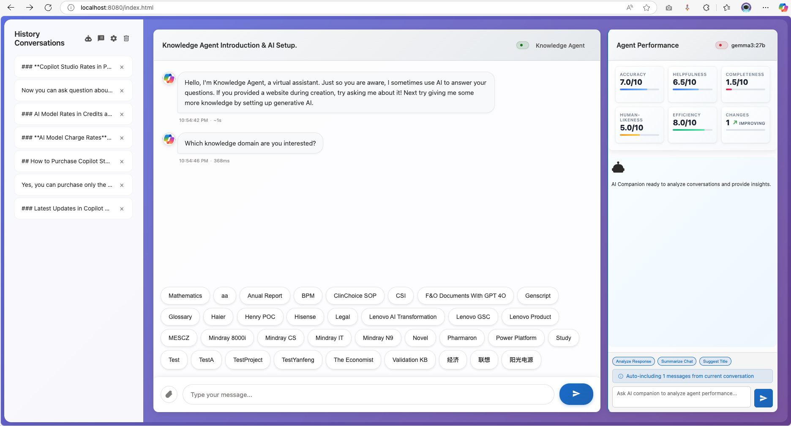

# MCSChat - Advanced AI Chat Interface

A sophisticated chatbot user interface that demonstrates how to create a customized chat experience with multiple AI backends, featuring Microsoft Copilot Studio integration via DirectLine API, AI companion analysis, and local Ollama model support with real-time streaming capabilities.



## 🚀 Quick Start

Ready to get started? Follow our quick setup guide:

1. **Get DirectLine Secret** from Microsoft Copilot Studio
2. **Launch** `index.html` in your browser  
3. **Configure** your agent in the settings panel
4. **Start chatting** with your AI assistant

[→ Detailed Setup Guide](docs/setup/quick-start.md)

## 📖 Documentation

### 🛠️ Setup & Configuration
- **[Quick Start Guide](docs/setup/quick-start.md)** - Get up and running in 5 minutes
- **[Installation](docs/setup/installation.md)** - Development environment setup
- **[Configuration](docs/setup/configuration.md)** - Detailed configuration options
- **[AI Companion Setup](docs/setup/ai-companion.md)** - Enable AI-powered analysis

### 🏗️ Architecture & Technical Details
- **[System Architecture](docs/architecture/overview.md)** - High-level system design
- **[Module Structure](docs/architecture/modules.md)** - Code organization and components
- **[API Integration](docs/architecture/api-integration.md)** - Backend integrations guide
- **[Security](docs/architecture/security.md)** - Encryption and security features

### ✨ Features & Capabilities
- **[Core Features](docs/features/core-features.md)** - Multi-agent management, streaming, file uploads
- **[Mobile Responsive](docs/features/mobile-responsive.md)** - Touch-optimized mobile interface and navigation
- **[AI Companion](docs/features/ai-companion.md)** - Performance analytics and insights
- **[User Interface](docs/features/user-interface.md)** - Customization and appearance options
- **[Advanced Features](docs/features/advanced-features.md)** - Professional mode, citations, and more

### 🚀 Deployment
- **[Development Setup](docs/deployment/development.md)** - Local development environment
- **[Production Deployment](docs/deployment/production.md)** - Hosting and scaling options
- **[Docker Deployment](docs/deployment/docker.md)** - Containerized deployment
- **[Security Checklist](docs/deployment/security-checklist.md)** - Production security guide

### 🔧 Development & Migration
- **[Contributing Guide](docs/development/CONTRIBUTING.md)** - How to contribute to the project
- **[Migration Guides](docs/migration/)** - Legacy system migration documentation
- **[Performance Optimization](docs/performance/)** - Performance tuning and optimization

### 🛠️ Troubleshooting & Support
- **[DirectLine Issues](docs/troubleshooting/DIRECTLINE_COMPLETE_FIX.md)** - Complete DirectLine connection troubleshooting
- **[Connection Problems](docs/troubleshooting/CONNECTION_DEBUGGING_FIXES.md)** - Connection debugging and fixes
- **[Performance Issues](docs/troubleshooting/RETRY_LOOP_BUG_FIX.md)** - Retry loops and stability problems
- **[Mobile Issues](docs/troubleshooting/mobile-issues.md)** - Mobile platform specific problems
- **[All Troubleshooting](docs/troubleshooting/README.md)** - Complete troubleshooting index

## 🌟 Key Features

### 🤖 Multi-Agent Management
- Configure multiple chatbot agents with individual settings
- Real-time connection monitoring and status indicators
- Secure credential storage with AES-256 encryption

### 🧠 AI Companion Analysis
- Real-time conversation analysis with performance metrics
- Support for OpenAI GPT, Anthropic Claude, Azure OpenAI, and local Ollama
- Interactive KPI tracking (Accuracy, Helpfulness, Completeness)

### 💬 Advanced Chat Interface
- Streaming response display with typing indicators
- Adaptive card rendering for rich bot responses
- File upload support with drag-and-drop functionality
- Professional full-width mode for document-like interface
- **Mobile-responsive design** with touch-optimized interface
- **Collapsible sidebar** with swipe gestures for mobile navigation
- **Mobile AI companion access** via floating action button

### 🔒 Security & Privacy
- Client-side AES-256-GCM encryption for sensitive data
- Secure key derivation and management
- CORS-compliant local model access

### � Unified Icon System
- SVG-based icon management with fallback support
- Consistent iconography across all UI components
- Optimized loading with async icon collection
- KPI and performance analytics icons

## 🎯 Quick Links

- **[GitHub Repository](https://github.com/illusion615/MCSChat)** - Source code and issues
- **[Release Notes](CHANGELOG.md)** - Latest updates and features
- **[Project Tasks](TODO.md)** - Current development priorities

## 🆕 Latest Updates (v3.6.0)

- ✨ **Documentation Organization**: Consolidated and organized all documentation into logical categories
- ✨ **Test File Organization**: Moved all test files from root to structured `/tests` directory
- ✨ **Performance Documentation**: Comprehensive performance optimization guides
- ✨ **Troubleshooting Guides**: Complete troubleshooting documentation with DirectLine fixes
- ✨ **Feature Documentation**: Organized feature-specific documentation and guides
- ✨ **Clean Project Structure**: Eliminated root directory clutter for better maintainability

[→ Full Changelog](CHANGELOG.md)

## 🤝 Community & Support

- **Issues**: [GitHub Issues](https://github.com/illusion615/MCSChat/issues)
- **Discussions**: [GitHub Discussions](https://github.com/illusion615/MCSChat/discussions)
- **Documentation**: Browse the `/docs` folder for detailed guides

## 📄 License

This project is licensed under the MIT License - see the [LICENSE](LICENSE) file for details.

---

**Last Updated**: August 22, 2025  
**Version**: 3.6.0  
**Maintained by**: [MCSChat Contributors](https://github.com/illusion615/MCSChat/graphs/contributors)
```bash
# Start the chat application server
node chat-server.js
# Access at http://localhost:8080

# Start the Ollama CORS proxy (if using local models)
node ollama-proxy.js
# Proxy runs at http://localhost:3001
```

## 🛠️ Technical Architecture

### Frontend Components
- **Chat Interface**: Real-time messaging with streaming support and dual-panel layout
- **Agent Manager**: Multi-agent configuration and switching with status monitoring
- **AI Companion Panel**: Performance analytics, conversation analysis, and KPI tracking
- **Enhanced Settings Panel**: Organized configuration with navigation (Agent Management, AI Companion, Appearance)
- **File Handler**: Drag-and-drop uploads with preview
- **Stream Manager**: Progressive response rendering system
- **Security Layer**: Client-side encryption for sensitive data
- **Font Customization**: User-configurable font sizes with real-time updates for optimal readability
- **Message Renderer**: Advanced chronological ordering with timestamp validation and citation handling
- **Window Context Manager**: Dynamic targeting for Agent Chat vs AI Companion Chat windows
- **Citation System**: Enhanced reference display with inline styling and proper positioning
- **Debug Console**: Comprehensive logging system for troubleshooting message ordering and rendering
- **Professional System Mode**: Full-width document-like interface for data analysis workflows
- **Unified CSS Architecture**: Custom property system with minimal redundancy and optimized performance

### Backend Integrations
- **DirectLine Client**: Microsoft Bot Framework connectivity
- **Ollama Interface**: Local model API integration  
- **Proxy Server**: CORS-compliant local model access
- **Storage Engine**: Encrypted localStorage with key management

### Security Features
- **AES-256 Encryption**: All credentials encrypted at rest
- **Key Derivation**: Secure key generation and management
- **Session Security**: Temporary credential handling
- **CORS Protection**: Secure cross-origin request handling

## 📁 Project Structure

```
MCSChat/
├── index.html              # Main application interface
├── ollama-proxy.js         # CORS proxy server for local Ollama access
├── chat-server.js          # Development HTTP server
├── src/                    # Modular source code architecture
│   ├── main.js             # Application entry point
│   ├── core/
│   │   └── application.js  # Main application controller
│   ├── managers/
│   │   ├── agentManager.js # Multi-agent configuration
│   │   └── sessionManager.js # Chat session management
│   ├── services/
│   │   └── directLineManager.js # DirectLine API integration
│   ├── ui/
│   │   └── messageRenderer.js # Message display and rendering
│   ├── ai/
│   │   └── aiCompanion.js  # AI companion features
│   ├── components/
│   │   ├── svg-icon-manager/ # Unified icon management system
│   │   └── directline/     # DirectLine components
│   └── utils/
│       ├── encryption.js   # AES-256-GCM encryption utilities
│       ├── secureStorage.js # Encrypted localStorage wrapper
│       ├── domUtils.js     # DOM manipulation helpers
│       └── helpers.js      # General utility functions
├── docs/                   # Comprehensive documentation
│   ├── migration/          # Migration guides and documentation
│   ├── performance/        # Performance optimization guides
│   ├── development/        # Development and contribution guides
│   ├── features/           # Feature documentation
│   └── troubleshooting/    # Troubleshooting guides
├── legacy/                 # Legacy code for reference
├── lib/                    # Third-party libraries
└── images/                 # UI assets and screenshots
```

## 🏗️ Module Architecture

### Core Components
- **Application Controller** (`src/core/application.js`): Central orchestrator managing all modules
- **Main Entry Point** (`src/main.js`): Application initialization and DOM ready management

### Manager Layer
- **AgentManager**: Multiple bot configurations and credential management
- **SessionManager**: Chat sessions, message history, and conversation state

### Service Layer  
- **DirectLineManager**: Microsoft Bot Framework DirectLine API integration

### UI Layer
- **MessageRenderer**: Message display, adaptive cards, streaming text, citations
- **SVG Icon Manager**: Unified icon system with async loading and fallbacks

### AI Integration
- **AICompanion**: Ollama model integration, conversation analysis, KPI tracking

### Utility Layer
- **Encryption**: AES-256-GCM encryption for secure storage
- **SecureStorage**: Encrypted localStorage wrapper
- **DOMUtils**: Safe DOM manipulation with error handling
- **Helpers**: Common utilities and formatting functions

### Design Patterns
- **ES6 Modules**: Clean import/export system
- **Singleton Pattern**: Shared instances for managers and services
- **Event-Driven Architecture**: Modular communication through custom events
- **Separation of Concerns**: Single responsibility per module

## 🔧 Configuration Options

### Agent Settings
- **Agent Name**: Friendly identifier for the bot
- **DirectLine Secret**: Azure Bot Service authentication key
- **Connection Status**: Real-time connectivity monitoring
- **Streaming Options**: Enable/disable streaming response simulation

### AI Companion Settings
- **Provider Selection**: OpenAI GPT, Anthropic Claude, Azure OpenAI, or Local Ollama
- **API Configuration**: Secure storage of API keys and credentials
- **Model Selection**: Automatic discovery and selection of available models
- **Connection Testing**: Built-in connectivity verification

### Appearance Settings
- **Agent Chat Font Size**: Customizable font size (10-20px) with real-time updates
- **AI Companion Font Size**: Separate font size control (8-16px) with instant preview
- **Message Display Mode**: Choose between bubble chat or full-width professional mode
- **Professional Interface**: Document-like professional display
- **Compact Layout**: Space-efficient spacing for maximum information density
- **Icon System**: Unified SVG icons with consistent styling

## 🚀 Development

### Quick Start
```bash
# Clone the repository
git clone https://github.com/illusion615/MCSChat.git
cd MCSChat

# Start development server
python -m http.server 8000

# Access application
# Navigate to http://localhost:8000
```

### Running Tests
### Contributing
Please read our [Contributing Guide](docs/development/CONTRIBUTING.md) for details on our code of conduct and the process for submitting pull requests.

## 🤝 Community & Support

- **Issues**: [GitHub Issues](https://github.com/illusion615/MCSChat/issues)
- **Discussions**: [GitHub Discussions](https://github.com/illusion615/MCSChat/discussions)
- **Documentation**: Browse the `/docs` folder for detailed guides

## 📄 License

This project is licensed under the MIT License - see the [LICENSE](LICENSE) file for details.

---

**Last Updated**: August 14, 2025  
**Version**: 3.5.0  
**Maintained by**: [MCSChat Contributors](https://github.com/illusion615/MCSChat/graphs/contributors)