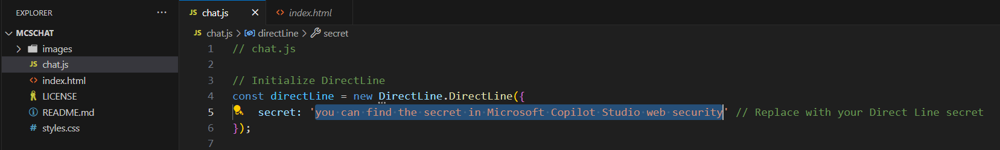
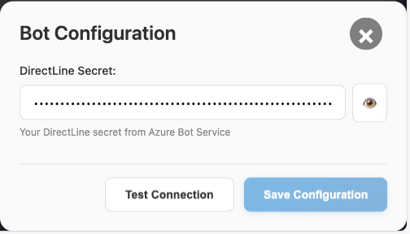

# MCSChat
Demostrate how to make a customized chatbot user interface and connect with Microsoft Copilot Studio with Direct Line API, and render message, suggest actions and adaptive card in the conversation.

**How to use**
1. Find your Microsoft Copilot Studio web channel security

2. Replace with your secret

3. Open index.html in your browser and try
