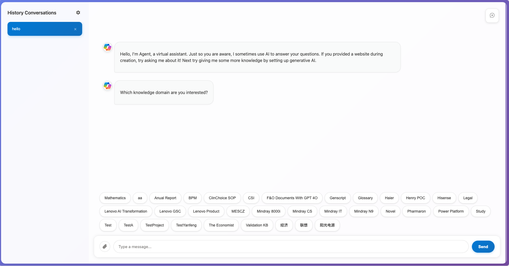

# MCSChat
Demostrate how to make a customized chatbot user interface and connect with Microsoft Copilot Studio with Direct Line API, and render message, suggest actions and adaptive card in the conversation.

**How to use**
1. Find your secret in Microsoft Copilot Studio web channel security.

2. Open index.html in your browser.

3. Click the setup button on the left panel, and input the scret variable in the popup window, test and save the configuration, it will encrypt and stored in your local.

4. Now you can test your agent.
