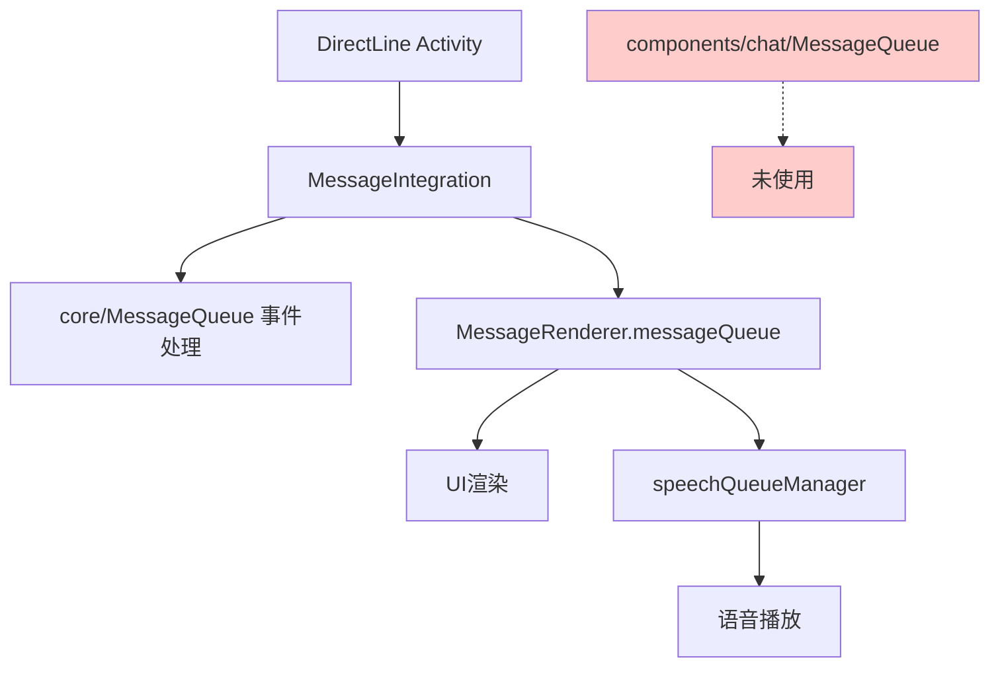
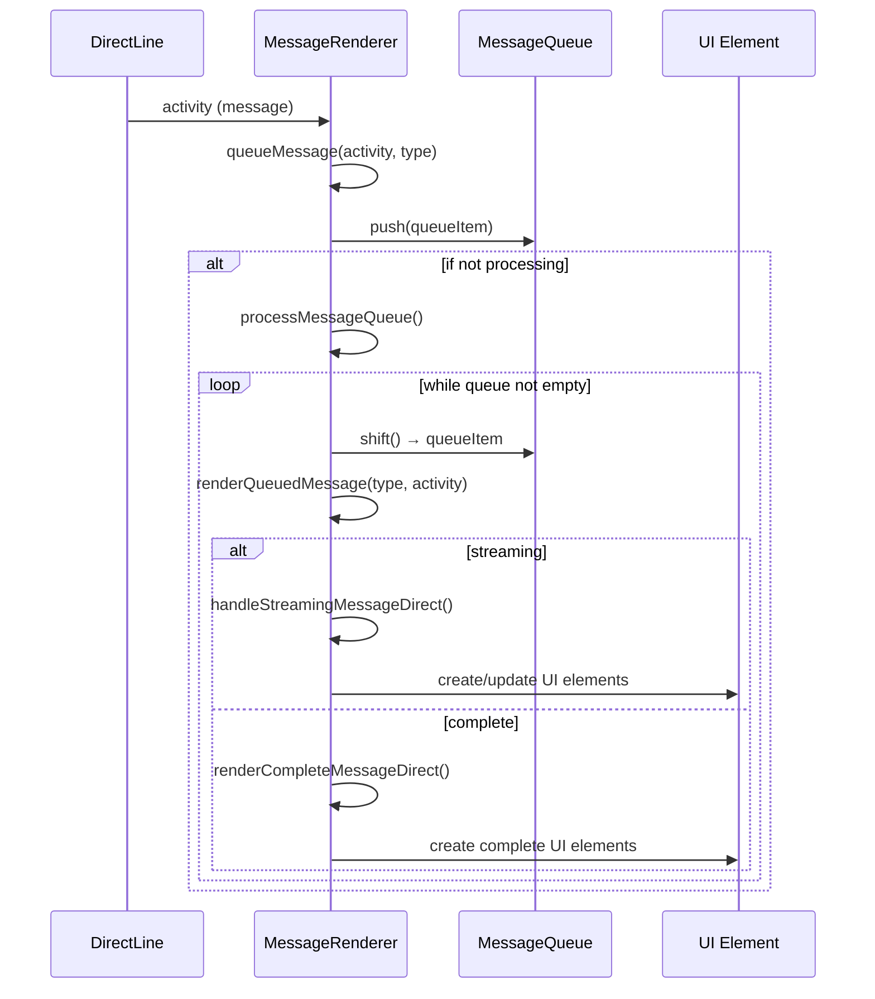
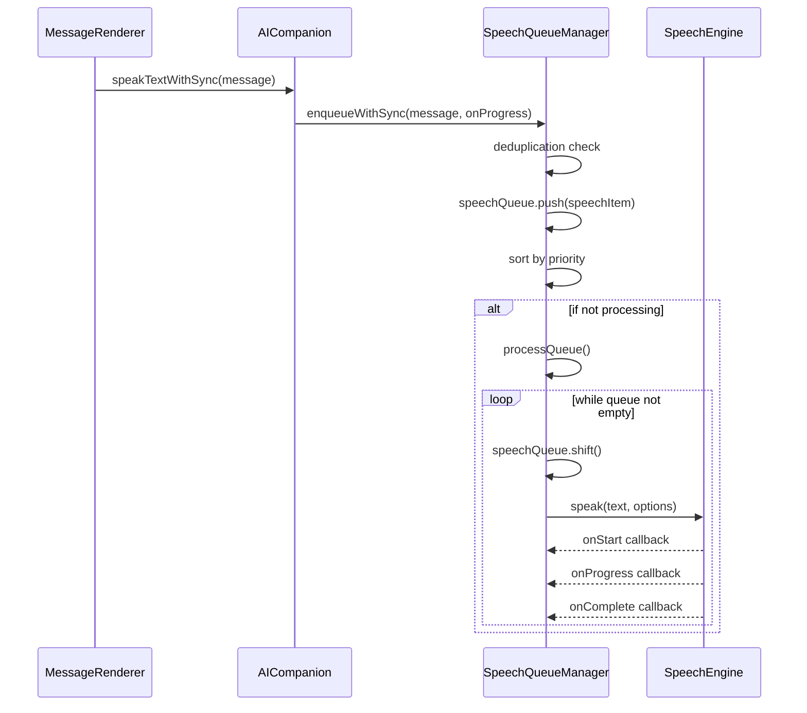
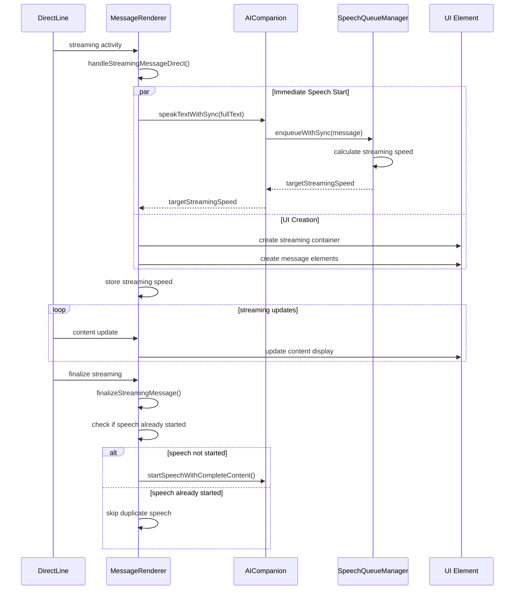
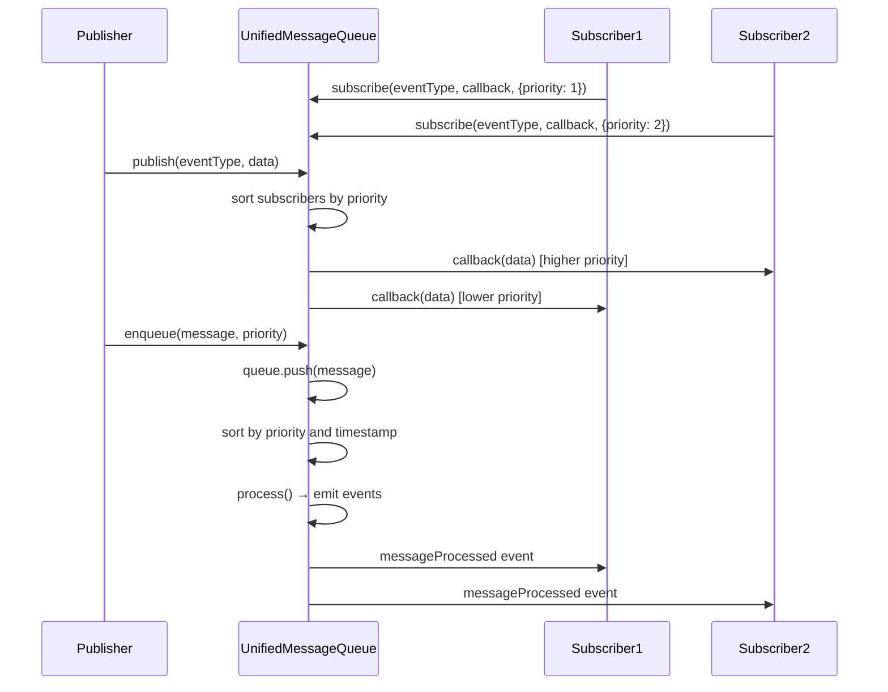
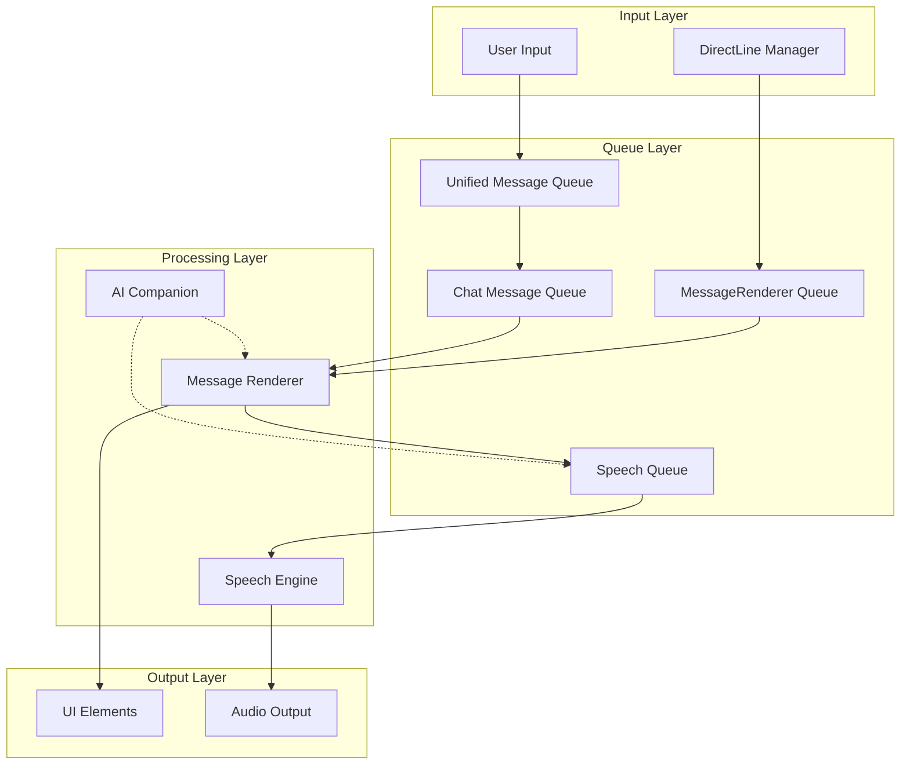

# MCSChat 队列系统设计文档

> **文档状态**: 架构分析与重构设计  
> **最后更新**: 2025年8月31日  
> **版本**: v2.0-架构重构版

---

## 📋 目录
1. [现状分析](#现状分析)
2. [Unified Message Queue 设计](#unified-message-queue-设计)
3. [功能设计](#功能设计)
4. [数据结构设计](#数据结构设计)
5. [接口设计](#接口设计)
6. [迁移计划](#迁移计划)
7. [实现细节](#实现细节)

---

## 概述

---

## 现状分析

### 📊 当前队列系统现状

通过对代码库的全面分析，MCSChat项目目前存在4个独立的队列管理模块，形成了复杂的多层队列架构：

#### **已识别的队列模块**

1. **messageRenderer.messageQueue** - ✅ 主要渲染队列
   - 位置: `src/ui/messageRenderer.js`
   - 状态: 完全激活，承担主要消息渲染任务
   - 功能: 顺序消息渲染、流式处理、去重

2. **core/messageQueue.js** - 🔄 核心事件队列  
   - 位置: `src/core/messageQueue.js`
   - 状态: 部分激活，主要用于事件系统
   - 功能: 事件驱动架构、优先级处理、DirectLine适配

3. **components/chat/MessageQueue** - ❌ 未使用队列
   - 位置: `src/components/chat/core/MessageQueue.js`
   - 状态: 未被引用，完全未使用
   - 功能: 异步任务队列（设计中）

4. **speechQueueManager.js** - ✅ 语音专用队列
   - 位置: `src/services/speechQueueManager.js`
   - 状态: 完全激活，处理语音播放
   - 功能: 语音队列、优先级、去重、流式同步

#### **架构冲突分析**

- **MessageIntegration重复队列**: 维护独立队列的同时使用core/MessageQueue
- **处理层级冗余**: DirectLine → MessageIntegration._messageQueue → core/MessageQueue → MessageRenderer.messageQueue → speechQueueManager
- **未使用代码**: components/chat/MessageQueue占用资源但无功能贡献


## Unified Message Queue 设计

### 🎯 设计目标

基于对现有架构的深入分析，我们设计了**Unified Message Queue (UMQ)**，作为chat组件的核心消息管理模块，旨在：

- **统一消息存储**: 为message存储、rendering、语音播报、streaming提供统一数据源
- **简化架构**: 从当前4层队列处理简化为统一的3层架构
- **提升性能**: 减少消息传递开销，优化处理效率
- **增强维护性**: 单一责任原则，清晰的模块边界

### 🏗️ 架构概览

```javascript
// 新的统一架构流程
DirectLine Activity 
    ↓
Unified Message Queue (UMQ)
    ↓ (事件驱动)
┌─────────────────────────────────────────┐
│  Parallel Processing Modules           │
├─────────────────┬───────────────────────┤
│ Message Renderer│    Speech Queue       │
│ (UI Display)    │    (Audio Playback)  │
└─────────────────┴───────────────────────┘
```

### 🔧 核心特性

#### **1. 统一数据模型**
所有消息类型(user、agent、ai-companion、thinking、system、error)使用统一的数据结构，支持：
- 消息内容存储与版本管理
- 流式消息状态跟踪
- 渲染状态管理
- 语音播放状态同步

#### **2. 事件驱动架构**
通过发布-订阅模式实现模块间松耦合：
- **消息生命周期事件**: created, updated, completed, error
- **渲染事件**: render-start, render-progress, render-complete
- **语音事件**: speech-start, speech-progress, speech-complete

#### **3. 智能优先级管理**
基于消息类型和紧急程度的多级优先级：
- **Critical (10)**: System errors, connection issues
- **High (7-9)**: User messages, agent responses
- **Normal (4-6)**: AI companion insights, suggestions
- **Low (1-3)**: Thinking processes, background updates

#### **4. 流式处理优化**
专为streaming场景设计的增量更新机制：
- 实时内容更新而不触发完整重渲染
- 语音与显示的智能同步
- 流式完成自动检测

---

## 功能设计

### 📋 核心功能模块

#### **1. 消息存储管理 (Message Storage)**
```javascript
class MessageStorage {
    // 统一的消息存储，支持多种消息类型
    store(message) { /* 存储消息到内存和持久化 */ }
    retrieve(messageId) { /* 按ID检索消息 */ }
    update(messageId, partial) { /* 增量更新消息内容 */ }
    query(filter) { /* 按条件查询消息 */ }
    purge(criteria) { /* 清理过期或无效消息 */ }
}
```

#### **2. 渲染队列管理 (Rendering Queue)**
```javascript
class RenderingQueue {
    // 消息渲染队列，处理UI更新
    enqueueRender(message, renderOptions) { /* 添加渲染任务 */ }
    processRenderQueue() { /* 处理渲染队列 */ }
    updateStreamingMessage(messageId, chunk) { /* 流式更新 */ }
    completeStreaming(messageId) { /* 完成流式渲染 */ }
}
```

#### **3. 语音播放队列 (Speech Queue)**
```javascript
class SpeechQueue {
    // 语音播放队列，处理TTS
    enqueueSpeech(message, speechOptions) { /* 添加语音任务 */ }
    processSpeechQueue() { /* 处理语音队列 */ }
    syncWithStreaming(messageId, progress) { /* 与流式同步 */ }
    managePriority(priority) { /* 优先级管理 */ }
}
```

#### **4. 事件管理器 (Event Manager)**
```javascript
class EventManager {
    // 统一事件管理，实现模块间通信
    subscribe(eventType, handler, options) { /* 订阅事件 */ }
    unsubscribe(eventType, handlerId) { /* 取消订阅 */ }
    emit(eventType, payload) { /* 发射事件 */ }
    createEventChain(events) { /* 创建事件链 */ }
}
```

### 🔄 消息生命周期

```javascript
// 消息从创建到完成的完整生命周期
1. Message Created → UMQ.enqueue()
2. Message Stored → Storage.store()
3. Events Emitted → EventManager.emit('message:created')
4. Parallel Processing:
   ├── Rendering → RenderingQueue.enqueueRender()
   └── Speech → SpeechQueue.enqueueSpeech()
5. Progress Updates → EventManager.emit('message:progress')
6. Completion → EventManager.emit('message:completed')
```

---

## 数据结构设计

### 📊 统一消息数据模型

```typescript
interface UnifiedMessage {
    // 基础标识
    id: string;                    // 全局唯一消息ID
    correlationId?: string;        // 关联ID，用于消息链追踪
    parentId?: string;             // 父消息ID，支持回复链
    
    // 消息内容
    type: MessageType;             // 消息类型枚举
    content: MessageContent;       // 消息内容对象
    metadata: MessageMetadata;     // 扩展元数据
    
    // 处理状态
    status: MessageStatus;         // 当前处理状态
    priority: number;              // 优先级 (1-10)
    
    // 时间信息
    timestamps: {
        created: number;           // 创建时间戳
        queued: number;            // 入队时间戳
        processing: number;        // 开始处理时间戳
        completed?: number;        // 完成时间戳
    };
    
    // 处理选项
    options: ProcessingOptions;    // 处理选项配置
    
    // 状态跟踪
    states: {
        storage: StorageState;     // 存储状态
        rendering: RenderingState; // 渲染状态
        speech: SpeechState;       // 语音状态
    };
}
```

### 🎨 消息类型定义

#### **当前系统中的消息类型分析**

通过对代码库的深入分析，当前MCSChat系统中的消息类型使用情况如下：

##### **1. System消息类型** 📊
**目的**: 系统状态通知和非会话性信息显示
**当前使用场景**:
```javascript
// ✅ 实际使用场景分析:
// 1. AI Companion中的系统通知
aiCompanion.showNotification('system', 'Audio requires user interaction...', 5000);
aiCompanion.showNotification('system', 'Audio initialization failed...', 5000);
aiCompanion.showNotification('system', 'Speech synthesis failed...', 3000);

// 2. UnifiedMessageRenderer中的类型处理
case MessageTypes.SYSTEM: // 专门的渲染逻辑
// 3. MessageAPI中的专用接口
MessageAPI.addSystemMessage(content, options);
```

**实际应用价值**: ⭐⭐⭐⭐⭐ (高价值)
- 音频系统状态通知
- 初始化进程通知  
- 用户交互要求提示
- 与会话内容明确区分

### 🔍 **重要架构发现：System消息的显示位置分析**

经过深入的代码检查，您的猜测完全正确！现有的"system"类型消息存在**严重的架构混淆**：

#### **1. 实际显示位置分析**

##### **A. AI Companion中的"system"通知 - 🚫 非聊天窗口**
```javascript
// 所有system类型通知都显示在专用通知区域，而非chat window
this.showNotification('system', 'Audio requires user interaction...', 5000);
this.showNotification('system', 'Audio initialization failed...', 5000);
this.showNotification('system', 'Speech synthesis failed...', 3000);

// 显示位置: AI Companion专用通知区域
// HTML: <div id="aiCompanionNotifications" class="ai-notifications-area">
// CSS: .ai-notifications-area { /* 独立的通知面板 */ }
```

##### **B. UnifiedChat组件中的addSystemMessage - ✅ 聊天窗口**
```javascript
// 仅在UnifiedChat组件中真正显示在聊天窗口
addSystemMessage(text) {
    const msg = { role: 'system', text, timestamp: new Date().toLocaleTimeString() };
    const node = MessageRenderer.renderMessage(this.shadowRoot, msg, {
        showAvatars: false,
        showTimestamp: this._prefs.showTimestamps
    });
    this.$.messages.appendChild(node); // ✅ 添加到聊天消息流
    this._scrollToBottom();
    return node;
}
```

#### **2. 架构混淆问题分析**

##### **问题根源**:
```javascript
// ❌ 混淆的设计：同名但不同用途
// A. 通知系统的"system"类型
aiCompanion.showNotification('system', message, duration);
// 目标: aiNotificationsArea (专用通知面板)

// B. 消息系统的"system"类型  
MessageAPI.addSystemMessage(content, options);
// 目标: chatWindow (聊天消息流)
```

##### **实际使用统计**:
```javascript
// 🔍 代码库中"system"的实际使用：
// AI Companion通知: 8处使用 → 显示在通知面板
// 统一消息系统: 仅在组件定义中存在 → 很少实际使用
// UnifiedChat组件: 1处使用 → 显示在聊天窗口
```

#### **3. 您的判断完全正确**

##### **A. 大部分"System"消息确实属于Log范畴**
```javascript
// ✅ 这些消息本质上是系统日志/通知，不是对话内容：
'Audio requires user interaction...'     // 系统状态通知
'Audio initialization failed...'         // 错误日志
'Speech synthesis failed...'             // 操作失败通知
'Speech provider fallback...'            // 系统状态变更
```

##### **B. 这些消息不应该在Message Queue中管理**
- **理由1**: 它们不是对话的一部分，而是系统状态反馈
- **理由2**: 它们有独立的UI展示区域（通知面板）
- **理由3**: 它们的生命周期与对话消息不同（短暂显示、自动消失）
- **理由4**: 它们不需要语音播放、渲染队列等对话消息功能

#### **4. 建议的架构分离**

##### **A. 重新定义消息类型边界**
```typescript
// ✅ 真正的对话消息类型（保留在Message Queue）
enum ConversationMessageType {
    USER = 'user',                    // 用户输入
    AGENT = 'agent',                  // 代理回复  
    AI_COMPANION = 'ai-companion',    // AI助手回复
    THINKING = 'thinking',            // 思考过程显示
    CONVERSATION_ERROR = 'conv-error' // 对话相关错误
}

// ✅ 系统通知类型（独立的通知系统管理）
enum SystemNotificationType {
    AUDIO_STATUS = 'audio-status',    // 音频状态
    PERMISSION_REQUEST = 'permission', // 权限请求
    SYSTEM_ERROR = 'system-error',    // 系统错误
    INITIALIZATION = 'init-status'    // 初始化状态
}
```

##### **B. 清晰的职责分工**
```javascript
// 对话消息 → UnifiedMessageQueue管理
unifiedMessageQueue.enqueue({
    type: 'user',
    content: '用户的问题'
});

// 系统通知 → UnifiedNotificationManager管理  
unifiedNotificationManager.show('audio-status', '音频初始化失败');
```

#### **5. 优化建议**

##### **立即执行**:
1. **删除MessageTypes.SYSTEM** - 避免架构混淆
2. **统一使用UnifiedNotificationManager** - 处理所有系统状态通知
3. **保留UnifiedChat.addSystemMessage** - 仅用于真正的系统级对话消息

##### **重构目标**:
- **消息队列**: 专注于对话内容的顺序处理和渲染
- **通知系统**: 专注于系统状态的短暂提醒和反馈
- **清晰边界**: 对话vs通知，持久vs临时，交互vs状态

这个发现对Unified Message Queue的设计具有重要意义 - 我们应该让消息队列专注于真正的对话内容管理，而将系统通知完全交给独立的通知系统处理。

---
**当前使用场景**:
```javascript
// ✅ 实际使用场景分析:
// 1. AI Companion错误处理
case 'error': messageType = 'error';

// 2. Application错误展示
application.showErrorMessage(message);
aiCompanion.showNotification('error', message, 8000);

// 3. MessageRendererAdapter错误处理
handleError(message) {
    this.showErrorNotification(message.data.error.message);
}

// 4. MessageAPI专用接口
MessageAPI.addErrorMessage(content, options);
```

**实际应用价值**: ⭐⭐⭐⭐⭐ (高价值)
- DirectLine连接错误
- AI模型响应错误
- 语音合成失败
- 用户操作错误反馈

##### **3. Notification消息类型** 🔔
**目的**: 通用通知和状态更新
**当前使用状况**: ❌ **未在消息系统中实际使用**

**分析发现**:
```javascript
// ❌ 在MessageTypes中定义但未实际使用
export const MessageTypes = {
    USER: 'user',
    AGENT: 'agent', 
    AI_COMPANION: 'ai-companion',
    SYSTEM: 'system',      // ✅ 有实际使用
    ERROR: 'error'         // ✅ 有实际使用
    // NOTIFICATION 未在此定义
};

// 🔍 但存在独立的通知系统:
// UnifiedNotificationManager - 独立的通知管理器
// 包含: 'init-loading', 'connection-connected', 'error', 'warning' 等
```

**实际应用价值**: ⭐⭐ (低价值) - 功能重复

### 🔍 **优化空间分析**

#### **1. Notification类型的架构冗余**
```javascript
// 当前存在两套通知系统:
// A. 消息系统中的通知 (未实际使用)
MessageTypes.NOTIFICATION (理论存在)

// B. 独立通知系统 (实际在用)
UnifiedNotificationManager {
    types: {
        'init-loading', 'connection-connected', 
        'error', 'warning', 'success', 'info'
    }
}
```

**建议优化**: 删除消息系统中的NOTIFICATION类型，统一使用UnifiedNotificationManager

#### **2. System和Error消息类型的职责优化**

```typescript
// 🎯 优化后的消息类型定义
enum MessageType {
    // 核心对话类型
    USER = 'user',                    // 用户消息
    AGENT = 'agent',                  // 代理回复
    AI_COMPANION = 'ai-companion',    // AI助手消息
    
    // 系统信息类型 (保留并细化)
    SYSTEM_INFO = 'system-info',      // 一般系统信息
    SYSTEM_WARNING = 'system-warning', // 系统警告
    SYSTEM_ERROR = 'system-error',    // 系统错误
    
    // 特殊处理类型
    THINKING = 'thinking'             // 思考过程显示
}
```

#### **3. 具体优化建议**

##### **A. 合并冗余通知系统**
```javascript
// ❌ 当前: 两套并行的通知系统
- MessageTypes.NOTIFICATION (未使用)
- UnifiedNotificationManager (实际使用)

// ✅ 优化: 统一使用UnifiedNotificationManager
- 删除MessageTypes中的NOTIFICATION
- 所有通知都通过UnifiedNotificationManager处理
- 保持消息系统专注于对话内容
```

##### **B. 细化System消息类型**
```javascript
// ❌ 当前: 单一system类型承担多种职责
MessageTypes.SYSTEM // 用于各种系统消息

// ✅ 优化: 根据重要性和用途细分
MessageTypes.SYSTEM_INFO     // 信息性系统消息
MessageTypes.SYSTEM_WARNING  // 警告性系统消息  
MessageTypes.SYSTEM_ERROR    // 错误性系统消息
```

##### **C. 优化渲染和样式处理**
```css
/* 当前system消息样式 */
.unified-message.system .unified-message-content {
    background: rgba(243, 244, 246, 0.95);
    font-family: 'SF Mono', 'Monaco', 'Consolas', monospace;
}

/* 建议的细化样式 */
.unified-message.system-info { /* 蓝色调 */ }
.unified-message.system-warning { /* 黄色调 */ }
.unified-message.system-error { /* 红色调 */ }
```

### 📊 **优化效果预期**

#### **代码简化**
- 删除未使用的NOTIFICATION类型 → 减少5-8个相关处理分支
- 统一通知系统 → 减少代码重复约200-300行
- 细化system类型 → 提升用户体验和错误识别

#### **用户体验提升**
- 更清晰的视觉区分 (info/warning/error)
- 统一的通知行为和样式
- 减少用户混淆

#### **维护便利性**
- 单一通知入口点
- 清晰的类型职责
- 更好的错误追踪和调试

---
```
interface MessageContent {
    text?: string;                 // 文本内容
    html?: string;                 // HTML格式内容
    markdown?: string;             // Markdown格式内容
    attachments?: Attachment[];    // 附件列表
    suggestedActions?: Action[];   // 建议操作
    adaptiveCard?: AdaptiveCard;   // 自适应卡片
}

interface MessageMetadata {
    source: string;                // 消息来源
    channel: string;               // 通道标识
    user?: UserInfo;               // 用户信息
    agent?: AgentInfo;             // 代理信息
    conversation?: ConversationInfo; // 会话信息
    [key: string]: any;            // 扩展字段
}
```

### ⚙️ 处理状态管理

```typescript
enum MessageStatus {
    PENDING = 'pending',           // 等待处理
    PROCESSING = 'processing',     // 正在处理
    STREAMING = 'streaming',       // 流式处理中
    COMPLETED = 'completed',       // 处理完成
    FAILED = 'failed',             // 处理失败
    CANCELLED = 'cancelled'        // 已取消
}

interface RenderingState {
    status: 'pending' | 'rendering' | 'streaming' | 'completed' | 'failed';
    progress: number;              // 渲染进度 0-100
    isVisible: boolean;            // 是否可见
    domElement?: HTMLElement;      // DOM元素引用
    streamingChunks?: string[];    // 流式数据块
}

interface SpeechState {
    status: 'pending' | 'speaking' | 'paused' | 'completed' | 'failed';
    progress: number;              // 播放进度 0-100
    utterance?: SpeechSynthesisUtterance; // 语音合成对象
    startTime?: number;            // 开始播放时间
    estimatedDuration?: number;    // 预估播放时长
}
```

---

## 接口设计

### 🎯 核心API接口

#### **1. 主要队列接口**

```typescript
interface IUnifiedMessageQueue {
    // 消息管理
    enqueue(message: UnifiedMessage): Promise<string>;
    dequeue(): Promise<UnifiedMessage | null>;
    peek(): UnifiedMessage | null;
    remove(messageId: string): Promise<boolean>;
    clear(): Promise<void>;
    
    // 查询接口
    getById(messageId: string): Promise<UnifiedMessage | null>;
    getByFilter(filter: MessageFilter): Promise<UnifiedMessage[]>;
    getStats(): QueueStats;
    
    // 状态管理
    updateMessage(messageId: string, updates: Partial<UnifiedMessage>): Promise<boolean>;
    updateStatus(messageId: string, status: MessageStatus): Promise<boolean>;
    
    // 事件接口
    on(event: string, handler: EventHandler): string;
    off(event: string, handlerId: string): boolean;
    emit(event: string, payload: any): Promise<void>;
}
```

#### **2. 流式处理接口**

```typescript
interface IStreamingProcessor {
    // 流式消息处理
    startStreaming(messageId: string, options?: StreamingOptions): Promise<void>;
    updateStreamingContent(messageId: string, chunk: string): Promise<void>;
    completeStreaming(messageId: string): Promise<void>;
    
    // 同步控制
    syncWithSpeech(messageId: string, speechProgress: number): Promise<void>;
    pauseStreaming(messageId: string): Promise<void>;
    resumeStreaming(messageId: string): Promise<void>;
}
```

#### **3. 渲染集成接口**

```typescript
interface IRenderingIntegration {
    // 渲染请求
    requestRender(message: UnifiedMessage, options?: RenderOptions): Promise<void>;
    updateRender(messageId: string, updates: RenderUpdates): Promise<void>;
    
    // DOM管理
    getDOMElement(messageId: string): HTMLElement | null;
    scrollToMessage(messageId: string): Promise<void>;
    
    // 视觉效果
    highlightMessage(messageId: string, duration?: number): Promise<void>;
    animateMessage(messageId: string, animation: AnimationType): Promise<void>;
}
```

#### **4. 语音集成接口**

```typescript
interface ISpeechIntegration {
    // 语音请求
    requestSpeech(message: UnifiedMessage, options?: SpeechOptions): Promise<void>;
    updateSpeechSettings(settings: SpeechSettings): Promise<void>;
    
    // 播放控制
    pauseSpeech(messageId?: string): Promise<void>;
    resumeSpeech(messageId?: string): Promise<void>;
    stopSpeech(messageId?: string): Promise<void>;
    
    // 同步控制
    syncWithStreaming(messageId: string, renderProgress: number): Promise<void>;
}
```

### 🔧 配置接口

```typescript
interface UnifiedQueueConfig {
    // 队列配置
    maxQueueSize: number;          // 最大队列大小
    processingDelay: number;       // 处理延迟(ms)
    enablePersistence: boolean;    // 启用持久化
    
    // 渲染配置
    rendering: {
        batchSize: number;         // 批处理大小
        streamingEnabled: boolean; // 启用流式渲染
        animationEnabled: boolean; // 启用动画效果
    };
    
    // 语音配置
    speech: {
        autoSpeak: boolean;        // 自动播放
        queueEnabled: boolean;     // 启用语音队列
        syncWithStreaming: boolean; // 与流式同步
        priorityEnabled: boolean;  // 启用优先级
    };
    
    // 性能配置
    performance: {
        enableThrottling: boolean; // 启用节流
        maxConcurrentRenders: number; // 最大并发渲染数
        gcInterval: number;        // GC间隔(ms)
    };
}
```

---

### ⚠️ **存在的问题与冲突**

#### 1. **多个MessageQueue实现重复**
```
❌ 存在重复的队列实现:
├── src/ui/messageRenderer.js (内置队列 - 主要使用)
├── src/core/messageQueue.js (统一队列 - 部分使用)
├── src/components/chat/core/MessageQueue.js (聊天组件 - 未激活)
└── src/ui/messageIntegration.js (内置队列 - 辅助使用)
```

#### 2. **激活状态分析**
- ✅ **MessageRenderer.messageQueue** - 完全激活，主要队列
- 🔄 **core/messageQueue.js** - 部分激活，通过MessageIntegration使用
- ❌ **components/chat/MessageQueue.js** - 未激活，仅导出未实际使用
- 🔄 **speechQueueManager.js** - 完全激活，独立语音队列

#### 3. **实际调用链分析**
```
实际使用的队列流程:
DirectLine → MessageIntegration → UnifiedMessageRenderer
                ↓
         core/messageQueue.js (事件处理)
                ↓
         messageRenderer.js.messageQueue (实际渲染)
                ↓
         speechQueueManager.js (语音播放)
```

## 迁移计划

### 🚀 三阶段迁移策略

#### **阶段一: 准备与隔离 (第1-2周)**

**目标**: 创建新的UMQ模块并实现基础功能，保持与现有系统的兼容性

##### 1.1 创建基础架构
```bash
# 创建新的UMQ模块目录
mkdir -p src/components/chat/queue
mkdir -p src/components/chat/queue/core
mkdir -p src/components/chat/queue/services
mkdir -p src/components/chat/queue/adapters

# 新模块文件结构
src/components/chat/queue/
├── core/
│   ├── UnifiedMessageQueue.js     # 核心队列实现
│   ├── EventManager.js            # 事件管理器
│   ├── MessageStorage.js          # 消息存储
│   └── StateManager.js            # 状态管理
├── services/
│   ├── RenderingService.js        # 渲染服务
│   ├── SpeechService.js           # 语音服务
│   └── StreamingService.js        # 流式处理服务
├── adapters/
│   ├── DirectLineAdapter.js       # DirectLine适配器
│   ├── MessageRendererAdapter.js  # 消息渲染适配器
│   └── SpeechQueueAdapter.js      # 语音队列适配器
└── index.js                       # 统一导出
```

##### 1.2 实现核心功能
- ✅ 实现基础的UnifiedMessageQueue类
- ✅ 创建事件管理系统
- ✅ 实现消息存储和状态管理
- ✅ 建立与现有系统的适配器层

##### 1.3 建立兼容性层
```javascript
// 兼容性适配器，确保现有代码继续工作
class LegacyCompatibilityAdapter {
    constructor(unifiedQueue) {
        this.unifiedQueue = unifiedQueue;
        this.legacyMessageRenderer = null;
        this.legacySpeechQueue = null;
    }
    
    // 保持与旧messageRenderer.queueMessage API的兼容性
    wrapLegacyMessageRenderer(messageRenderer) {
        const originalQueueMessage = messageRenderer.queueMessage.bind(messageRenderer);
        messageRenderer.queueMessage = (activity, renderType) => {
            // 转换为UMQ格式并处理
            this.unifiedQueue.enqueue(this.convertLegacyMessage(activity, renderType));
        };
    }
}
```

#### **阶段二: 渐进式迁移 (第3-5周)**

**目标**: 逐步将现有队列功能迁移到UMQ，保持系统稳定运行

##### 2.1 迁移消息渲染队列
```javascript
// 迁移计划: messageRenderer.js → UMQ
// 第1步: 创建适配器层
class MessageRendererMigrationAdapter {
    constructor(unifiedQueue, legacyRenderer) {
        this.umq = unifiedQueue;
        this.legacy = legacyRenderer;
        this.migrationMode = 'hybrid'; // 'hybrid', 'umq-only'
    }
    
    async processMessage(message) {
        if (this.migrationMode === 'hybrid') {
            // 并行处理，对比结果
            const [umqResult, legacyResult] = await Promise.allSettled([
                this.umq.enqueue(message),
                this.legacy.queueMessage(message.activity, message.renderType)
            ]);
            this.validateMigration(umqResult, legacyResult);
        } else {
            // 仅使用UMQ
            return this.umq.enqueue(message);
        }
    }
}
```

##### 2.2 迁移语音队列
- 保持speechQueueManager.js作为服务层，但将队列逻辑迁移到UMQ
- 实现SpeechService作为UMQ的语音处理模块
- 建立语音与渲染的统一同步机制

##### 2.3 整合事件系统
- 将core/messageQueue.js的事件系统整合到UMQ
- 迁移DirectLine适配器到新的架构
- 确保MessageIntegration使用UMQ而非内部队列

#### **阶段三: 完成迁移与优化 (第6-8周)**

**目标**: 完全切换到UMQ系统，移除旧的队列代码，优化性能

##### 3.1 代码清理
```bash
# 安全删除已迁移的旧队列代码
rm src/components/chat/core/MessageQueue.js  # 已确认未使用
# 重构并简化以下文件:
# - src/ui/messageRenderer.js (移除内置队列)
# - src/core/messageQueue.js (整合到UMQ)
# - src/ui/messageIntegration.js (移除重复队列)
```

##### 3.2 性能优化
- 实现消息批处理以提升渲染性能
- 优化事件系统以减少内存占用
- 实现智能GC以清理过期消息

##### 3.3 测试与验证
```javascript
// 迁移验证测试套件
describe('UMQ Migration Validation', () => {
    it('should maintain message ordering', async () => {
        // 验证消息顺序保持正确
    });
    
    it('should handle streaming messages correctly', async () => {
        // 验证流式消息处理
    });
    
    it('should sync speech with rendering', async () => {
        // 验证语音同步功能
    });
    
    it('should handle error scenarios gracefully', async () => {
        // 验证错误处理
    });
});
```

### 📊 迁移风险评估

#### **低风险操作**
- ✅ 删除未使用的components/chat/MessageQueue.js
- ✅ 创建新的UMQ模块（不影响现有功能）
- ✅ 建立适配器层

#### **中风险操作**
- ⚠️ 重构MessageIntegration的队列逻辑
- ⚠️ 迁移messageRenderer内置队列
- ⚠️ 整合core/messageQueue事件系统

#### **高风险操作**
- 🔴 完全移除现有队列代码
- 🔴 修改DirectLine消息流程
- 🔴 改变语音播放机制

### 🔄 回滚计划

每个迁移阶段都准备完整的回滚方案：

```javascript
// 回滚控制器
class MigrationRollbackController {
    constructor() {
        this.migrationStates = new Map();
        this.backupConfigs = new Map();
    }
    
    createCheckpoint(phase) {
        // 创建迁移检查点
        this.migrationStates.set(phase, this.captureCurrentState());
    }
    
    rollback(toPhase) {
        // 回滚到指定阶段
        const targetState = this.migrationStates.get(toPhase);
        return this.restoreState(targetState);
    }
}
```

---

## 实现细节

### 🏗️ UnifiedMessageQueue 核心实现

#### **主要类结构**

```javascript
/**
 * 统一消息队列 - 核心实现
 * 基于现有的components/chat/MessageQueue进行增强
 */
export class UnifiedMessageQueue {
    constructor(config = {}) {
        // 基础配置
        this.config = this.mergeConfig(config);
        this.messageId = 0;
        this.isProcessing = false;
        
        // 多优先级队列存储
        this.priorityQueues = new Map([
            [10, []], // Critical - 系统错误
            [9, []],  // High - 用户消息
            [8, []],  // High - 代理回复
            [7, []],  // High - 重要通知
            [6, []],  // Normal - AI助手
            [5, []],  // Normal - 建议操作
            [4, []],  // Normal - 一般通知
            [3, []],  // Low - 思考过程
            [2, []],  // Low - 后台更新
            [1, []]   // Low - 调试信息
        ]);
        
        // 消息存储和索引
        this.messageStorage = new Map();
        this.messageIndex = {
            byType: new Map(),
            byStatus: new Map(),
            byCorrelation: new Map()
        };
        
        // 事件管理器
        this.eventManager = new EventManager();
        
        // 服务集成
        this.services = {
            rendering: new RenderingService(this),
            speech: new SpeechService(this),
            streaming: new StreamingService(this)
        };
        
        // 性能监控
        this.metrics = {
            processed: 0,
            failed: 0,
            avgProcessingTime: 0,
            queueSizes: new Map()
        };
        
        this.initialize();
    }
    
    /**
     * 入队操作 - 支持多优先级
     */
    async enqueue(messageData) {
        try {
            // 创建统一消息对象
            const message = this.createUnifiedMessage(messageData);
            
            // 存储消息
            this.messageStorage.set(message.id, message);
            this.updateMessageIndex(message);
            
            // 根据优先级入队
            const priority = message.priority;
            if (!this.priorityQueues.has(priority)) {
                this.priorityQueues.set(priority, []);
            }
            this.priorityQueues.get(priority).push(message);
            
            // 更新统计
            this.updateQueueMetrics();
            
            // 发射事件
            await this.eventManager.emit('message:enqueued', {
                messageId: message.id,
                priority: priority,
                queueLength: this.getTotalQueueLength()
            });
            
            // 启动处理器（如果未运行）
            if (!this.isProcessing) {
                this.processQueues();
            }
            
            return message.id;
            
        } catch (error) {
            console.error('[UMQ] Enqueue error:', error);
            throw new Error(`Failed to enqueue message: ${error.message}`);
        }
    }
    
    /**
     * 队列处理器 - 按优先级顺序处理
     */
    async processQueues() {
        if (this.isProcessing) return;
        
        this.isProcessing = true;
        const startTime = performance.now();
        
        try {
            while (this.hasMessages()) {
                const message = this.dequeueHighestPriority();
                if (!message) break;
                
                await this.processMessage(message);
                
                // 处理间隔控制
                if (this.config.processingDelay > 0) {
                    await this.delay(this.config.processingDelay);
                }
            }
        } catch (error) {
            console.error('[UMQ] Queue processing error:', error);
            await this.eventManager.emit('queue:error', { error });
        } finally {
            this.isProcessing = false;
            const duration = performance.now() - startTime;
            this.updatePerformanceMetrics(duration);
            
            await this.eventManager.emit('queue:completed', {
                duration,
                processed: this.metrics.processed
            });
        }
    }
    
    /**
     * 处理单个消息
     */
    async processMessage(message) {
        const messageStartTime = performance.now();
        
        try {
            // 更新消息状态
            await this.updateMessageStatus(message.id, MessageStatus.PROCESSING);
            
            // 并行处理各个服务
            const processingPromises = [];
            
            // 渲染服务
            if (this.shouldRender(message)) {
                processingPromises.push(
                    this.services.rendering.processMessage(message)
                );
            }
            
            // 语音服务
            if (this.shouldSpeak(message)) {
                processingPromises.push(
                    this.services.speech.processMessage(message)
                );
            }
            
            // 流式处理服务
            if (this.isStreamingMessage(message)) {
                processingPromises.push(
                    this.services.streaming.processMessage(message)
                );
            }
            
            // 等待所有服务完成
            const results = await Promise.allSettled(processingPromises);
            
            // 检查处理结果
            const failures = results.filter(r => r.status === 'rejected');
            if (failures.length > 0) {
                console.warn('[UMQ] Some services failed:', failures);
                await this.updateMessageStatus(message.id, MessageStatus.FAILED);
            } else {
                await this.updateMessageStatus(message.id, MessageStatus.COMPLETED);
            }
            
            // 更新性能指标
            const processingTime = performance.now() - messageStartTime;
            this.updateMessageMetrics(message, processingTime);
            
        } catch (error) {
            console.error(`[UMQ] Error processing message ${message.id}:`, error);
            await this.updateMessageStatus(message.id, MessageStatus.FAILED);
            this.metrics.failed++;
        }
    }
}
```

#### **服务集成实现**

```javascript
/**
 * 渲染服务 - 与现有messageRenderer集成
 */
class RenderingService {
    constructor(umq) {
        this.umq = umq;
        this.legacyRenderer = null; // 兼容性支持
        this.renderingQueue = [];
        this.isProcessing = false;
    }
    
    async processMessage(message) {
        // 添加到渲染队列
        this.renderingQueue.push({
            message,
            options: this.extractRenderOptions(message)
        });
        
        if (!this.isProcessing) {
            await this.processRenderingQueue();
        }
    }
    
    async processRenderingQueue() {
        this.isProcessing = true;
        
        while (this.renderingQueue.length > 0) {
            const { message, options } = this.renderingQueue.shift();
            
            try {
                await this.renderMessage(message, options);
                await this.umq.eventManager.emit('render:completed', {
                    messageId: message.id
                });
            } catch (error) {
                await this.umq.eventManager.emit('render:failed', {
                    messageId: message.id,
                    error
                });
            }
        }
        
        this.isProcessing = false;
    }
}

/**
 * 语音服务 - 与speechQueueManager集成
 */
class SpeechService {
    constructor(umq) {
        this.umq = umq;
        this.speechQueue = [];
        this.currentSpeech = null;
        this.settings = this.loadSpeechSettings();
    }
    
    async processMessage(message) {
        if (!this.settings.autoSpeak) return;
        
        // 检查内容类型过滤
        if (message.type === 'thinking' && !this.settings.playThinkingContent) {
            return;
        }
        
        // 创建语音任务
        const speechTask = {
            messageId: message.id,
            text: this.extractSpeechText(message),
            priority: message.priority,
            options: this.extractSpeechOptions(message)
        };
        
        // 智能去重
        if (this.isDuplicateSpeech(speechTask)) {
            console.log('[SpeechService] Duplicate speech filtered:', speechTask.messageId);
            return;
        }
        
        this.speechQueue.push(speechTask);
        await this.processSpeechQueue();
    }
}

/**
 * 流式处理服务
 */
class StreamingService {
    constructor(umq) {
        this.umq = umq;
        this.streamingMessages = new Map();
        this.syncEnabled = true;
    }
    
    async processMessage(message) {
        if (!this.isStreamingMessage(message)) return;
        
        const streamingState = {
            messageId: message.id,
            chunks: [],
            startTime: Date.now(),
            lastUpdate: Date.now(),
            isCompleted: false
        };
        
        this.streamingMessages.set(message.id, streamingState);
        
        // 启动流式处理监听
        await this.startStreamingMonitor(message.id);
    }
    
    async updateStreamingContent(messageId, chunk) {
        const state = this.streamingMessages.get(messageId);
        if (!state) return;
        
        state.chunks.push(chunk);
        state.lastUpdate = Date.now();
        
        // 同步渲染和语音
        if (this.syncEnabled) {
            await this.syncStreamingProgress(messageId, state);
        }
        
        await this.umq.eventManager.emit('streaming:updated', {
            messageId,
            chunk,
            totalChunks: state.chunks.length
        });
    }
}
```

### 🔧 配置和初始化

```javascript
/**
 * 默认UMQ配置
 */
const DEFAULT_UMQ_CONFIG = {
    // 队列配置
    maxQueueSize: 1000,
    processingDelay: 50,
    enablePersistence: false,
    
    // 渲染配置
    rendering: {
        batchSize: 5,
        streamingEnabled: true,
        animationEnabled: true,
        maxConcurrentRenders: 3
    },
    
    // 语音配置
    speech: {
        autoSpeak: false,
        queueEnabled: true,
        syncWithStreaming: true,
        priorityEnabled: true,
        maxConcurrentSpeech: 1
    },
    
    // 性能配置
    performance: {
        enableThrottling: true,
        gcInterval: 60000, // 1分钟
        maxStoredMessages: 500,
        enableMetrics: true
    },
    
    // 兼容性配置
    compatibility: {
        enableLegacySupport: true,
        migrationMode: 'hybrid', // 'legacy', 'hybrid', 'umq-only'
        validateMigration: true
    }
};

/**
 * UMQ工厂函数
 */
export function createUnifiedMessageQueue(customConfig = {}) {
    const config = deepMerge(DEFAULT_UMQ_CONFIG, customConfig);
    const umq = new UnifiedMessageQueue(config);
    
    // 注册全局实例
    if (typeof window !== 'undefined') {
        window.UnifiedMessageQueue = umq;
    }
    
    return umq;
}
```

### 📊 性能监控和调试

```javascript
/**
 * 性能监控工具
 */
class UMQPerformanceMonitor {
    constructor(umq) {
        this.umq = umq;
        this.metrics = {
            messageCount: 0,
            averageProcessingTime: 0,
            queueSizeHistory: [],
            errorRate: 0,
            memoryUsage: []
        };
        this.startMonitoring();
    }
    
    startMonitoring() {
        // 定期收集性能数据
        setInterval(() => {
            this.collectMetrics();
        }, 5000);
    }
    
    collectMetrics() {
        const stats = this.umq.getStats();
        
        this.metrics.queueSizeHistory.push({
            timestamp: Date.now(),
            totalSize: stats.queueLength,
            byPriority: stats.queueSizesByPriority
        });
        
        // 内存使用监控
        if (typeof window !== 'undefined' && window.performance?.memory) {
            this.metrics.memoryUsage.push({
                timestamp: Date.now(),
                used: window.performance.memory.usedJSHeapSize,
                total: window.performance.memory.totalJSHeapSize
            });
        }
    }
    
    generateReport() {
        return {
            overview: this.metrics,
            recommendations: this.analyzePerformance(),
            queueHealth: this.assessQueueHealth()
        };
    }
}
```

---

## 现有系统状态与历史分析

### 📊 当前队列系统现状

通过对代码库的全面分析，MCSChat项目目前存在4个独立的队列管理模块，形成了复杂的多层队列架构：

#### **已识别的队列模块**

1. **messageRenderer.messageQueue** - ✅ 主要渲染队列
   - 位置: `src/ui/messageRenderer.js`
   - 状态: 完全激活，承担主要消息渲染任务
   - 功能: 顺序消息渲染、流式处理、去重

2. **core/messageQueue.js** - 🔄 核心事件队列  
   - 位置: `src/core/messageQueue.js`
   - 状态: 部分激活，主要用于事件系统
   - 功能: 事件驱动架构、优先级处理、DirectLine适配

3. **components/chat/MessageQueue** - ❌ 未使用队列
   - 位置: `src/components/chat/core/MessageQueue.js`
   - 状态: 未被引用，完全未使用
   - 功能: 异步任务队列（设计中）

4. **speechQueueManager.js** - ✅ 语音专用队列
   - 位置: `src/services/speechQueueManager.js`
   - 状态: 完全激活，处理语音播放
   - 功能: 语音队列、优先级、去重、流式同步

#### **架构冲突分析**

- **MessageIntegration重复队列**: 维护独立队列的同时使用core/MessageQueue
- **处理层级冗余**: DirectLine → MessageIntegration._messageQueue → core/MessageQueue → MessageRenderer.messageQueue → speechQueueManager
- **未使用代码**: components/chat/MessageQueue占用资源但无功能贡献

### ⚠️ **存在的问题与冲突**

#### 1. **多个MessageQueue实现重复**
```
❌ 存在重复的队列实现:
├── src/ui/messageRenderer.js (内置队列 - 主要使用)
├── src/core/messageQueue.js (统一队列 - 部分使用)
├── src/components/chat/core/MessageQueue.js (聊天组件 - 未激活)
└── src/ui/messageIntegration.js (内置队列 - 辅助使用)
```

#### 2. **激活状态分析**
- ✅ **MessageRenderer.messageQueue** - 完全激活，主要队列
- 🔄 **core/messageQueue.js** - 部分激活，通过MessageIntegration使用
- ❌ **components/chat/MessageQueue.js** - 未激活，仅导出未实际使用
- 🔄 **speechQueueManager.js** - 完全激活，独立语音队列

#### 3. **实际调用链分析**
```
实际使用的队列流程:
DirectLine → MessageIntegration → UnifiedMessageRenderer
                ↓
         core/messageQueue.js (事件处理)
                ↓
         messageRenderer.js.messageQueue (实际渲染)
                ↓
         speechQueueManager.js (语音播放)
```

### 📈 **优化建议总结**

#### **立即可执行的清理操作**
- ✅ 删除未使用的components/chat/MessageQueue.js
- ✅ 简化MessageIntegration队列逻辑
- ✅ 统一事件系统

#### **中长期架构重构建议**
- 🎯 统一队列架构为单一UMQ系统
- 🎯 清晰的职责分工和模块边界
- 🎯 性能优化和资源管理

通过实施本设计文档中提出的Unified Message Queue架构，我们将显著简化系统复杂性，提升性能表现，并为未来的功能扩展奠定坚实基础。
```
总计: 4个队列模块 (其中1个未激活)
├── 消息渲染队列 (3个实现)
│   ├── MessageRenderer.messageQueue (主要实现) ✅ 激活
│   ├── core/messageQueue.js (统一队列系统) 🔄 部分激活
│   └── components/chat/core/MessageQueue.js (聊天组件队列) ❌ 未激活
└── 语音播放队列 (1个实现)
    └── services/speechQueueManager.js (语音队列管理器) ✅ 激活
```

## 详细冲突分析

### 1. **MessageRenderer内置队列 vs core/messageQueue**

#### 冲突表现:
```javascript
// MessageRenderer内置队列 (src/ui/messageRenderer.js)
class MessageRenderer {
    constructor() {
        this.messageQueue = [];              // 简单数组队列
        this.isProcessingQueue = false;      // 处理状态
    }
    queueMessage(activity, renderType) {    // 直接入队
        // 简单FIFO处理
    }
}

// 统一队列系统 (src/core/messageQueue.js)
export class MessageQueue {
    constructor() {
        this.queue = [];                     // 同样是数组队列
        this.subscribers = new Map();        // 事件订阅系统
        this.isProcessing = false;           // 相同的处理状态
    }
    enqueue(message) {                       // 优先级队列
        // 复杂的优先级和事件处理
    }
}
```

#### 实际使用状况:
- **MessageRenderer队列**: 直接处理UI渲染，FIFO顺序
- **core/MessageQueue**: 通过MessageIntegration间接使用，事件驱动

### 2. **聊天组件队列的未激活状态**

#### 位置: `src/components/chat/core/MessageQueue.js`
```javascript
// 这个队列实现存在但未被使用
export class MessageQueue {
    constructor(bus) {
        this.queue = [];
        this.processing = false;
        this.bus = bus;  // 事件总线集成
    }
}
```

#### 问题分析:
- ✅ 已导出: `src/components/chat/index.js` 中有导出
- ❌ 无引用: 在整个代码库中没有实际使用
- ❌ 未集成: 与现有系统没有集成点

### 3. **MessageIntegration中的队列重复**

#### 位置: `src/ui/messageIntegration.js`
```javascript
export class MessageIntegration {
    queueMessage(type, content, metadata, options) {
        if (!this._messageQueue) {
            this._messageQueue = [];         // 又一个独立队列！
        }
        this._messageQueue.push(/* ... */);
    }
}
```

#### 冲突性质:
- 这是第4个独立的队列实现
- 与MessageRenderer和core/messageQueue功能重叠
- 增加了系统复杂性

## 具体使用流程分析

### 1. **实际激活的调用链**



### 2. **队列优先级和处理顺序**

```javascript
// 实际的消息处理优先级
1. MessageIntegration._messageQueue (预处理)
   ↓
2. core/MessageQueue (事件分发)
   ↓  
3. MessageRenderer.messageQueue (渲染队列)
   ↓
4. speechQueueManager.speechQueue (语音队列)
```

### 3. **冲突解决建议**

#### A. 清理未使用模块
```bash
# 可以安全删除的未激活组件
❌ src/components/chat/core/MessageQueue.js
❌ src/components/chat/index.js 中的 MessageQueue 导出
```

#### B. 整合重复队列
```javascript
// 建议的统一架构
DirectLine → MessageIntegration (预处理) 
          → core/MessageQueue (统一事件处理)
          → MessageRenderer (UI专用渲染)
          → speechQueueManager (语音专用)
```

#### C. 明确职责分工
- **MessageIntegration**: 消息预处理和适配
- **core/MessageQueue**: 统一事件系统和优先级管理
- **MessageRenderer**: UI渲染专用队列
- **speechQueueManager**: 语音播放专用队列

## 队列模块详细分析

### 1. 主消息渲染队列 (MessageRenderer.messageQueue) ✅ 激活

**位置**: `src/ui/messageRenderer.js`

**数据结构**:
```typescript
interface MessageQueue {
    messageQueue: QueueItem[];           // 主队列数组
    isProcessingQueue: boolean;          // 处理状态
    currentlyStreamingMessageId: string; // 当前流式消息ID
}

interface QueueItem {
    messageId: string;                   // 消息唯一标识
    activity: DirectLineActivity;        // DirectLine活动对象
    renderType: 'complete' | 'streaming' | 'simulate'; // 渲染类型
    queueTime: number;                   // 入队时间戳
}
```

**核心方法**:
- `queueMessage(activity, renderType)` - 消息入队
- `processMessageQueue()` - 队列处理
- `renderQueuedMessage(renderType, activity)` - 渲染消息
- `clearMessageQueue()` - 清空队列

**特点**:
- FIFO (先进先出) 处理顺序
- 支持流式和完整消息渲染
- 防止消息重复渲染
- 60秒超时保护机制

### 2. 统一消息队列系统 (core/messageQueue.js) 🔄 部分激活

**位置**: `src/core/messageQueue.js`

**数据结构**:
```typescript
interface UnifiedMessageQueue {
    queue: MessageItem[];                // 消息队列
    subscribers: Map<string, Subscription[]>; // 事件订阅者
    messageId: number;                   // 消息ID计数器
    isProcessing: boolean;               // 处理状态
    processingDelay: number;             // 处理延迟(50ms)
}

interface Subscription {
    id: string;                          // 订阅ID
    callback: Function;                  // 回调函数
    priority: number;                    // 优先级
    filter: Function;                    // 过滤器
}
```

**核心方法**:
- `subscribe(eventType, callback, options)` - 事件订阅
- `publish(eventType, data, options)` - 事件发布
- `enqueue(message, priority, metadata)` - 消息入队
- `process()` - 队列处理

**特点**:
- 事件驱动架构
- 支持优先级排序
- 发布/订阅模式
- 松耦合设计

### 3. 聊天组件队列 (components/chat/core/MessageQueue.js) ❌ 未激活

**位置**: `src/components/chat/core/MessageQueue.js`

**数据结构**:
```typescript
interface ChatMessageQueue {
    queue: QueueItem[];                  // 队列数组
    processing: boolean;                 // 处理状态
    bus: EventBus;                       // 事件总线
}
```

**核心方法**:
- `enqueue(item)` - 项目入队
- `_drain()` - 队列排空
- `size()` - 获取队列大小
- `clear()` - 清空队列

**特点**:
- 最小化实现
- 事件总线集成
- 异步处理
- 错误处理机制

### 4. 语音播放队列 (speechQueueManager.js) ✅ 完全激活

**位置**: `src/services/speechQueueManager.js`

**数据结构**:
```typescript
interface SpeechQueue {
    speechQueue: SpeechItem[];           // 语音队列
    isProcessing: boolean;               // 处理状态
    currentSpeech: SpeechItem;           // 当前播放项
    processingDelay: number;             // 处理延迟(200ms)
    settings: SpeechSettings;            // 语音设置
}

interface SpeechItem {
    id: string;                          // 语音项ID
    originalMessageId: string;           // 原始消息ID
    text: string;                        // 播放文本
    messageType: string;                 // 消息类型
    priority: number;                    // 优先级(3=error, 2=warning, 1=default)
    timestamp: number;                   // 创建时间
    metadata: object;                    // 元数据
    options: SpeechOptions;              // 语音选项
}
```

**核心方法**:
- `enqueue(message)` - 语音入队
- `enqueueWithSync(message, onProgress)` - 同步入队
- `processQueue()` - 队列处理
- `stopAll()` - 停止所有播放

**特点**:
- 优先级队列
- 去重机制
- 流式同步支持
- 设置持久化

## 队列系统时序图

### 1. 消息渲染流程



### 2. 语音播放流程



### 3. 流式消息同步流程



### 4. 统一队列系统事件流程



## 队列交互关系图



## 关键设计特点

### 1. 层次化设计
- **输入层**: 消息来源(DirectLine, 用户输入)
- **队列层**: 各种队列管理器
- **处理层**: 渲染器和处理器
- **输出层**: UI和音频输出

### 2. 异步处理
- 所有队列都支持异步处理
- 防止UI阻塞
- 错误隔离机制

### 3. 优先级管理
- 语音队列支持优先级(错误>警告>普通)
- 统一队列支持自定义优先级
- 保证重要消息优先处理

### 4. 去重机制
- 语音队列智能去重
- 消息队列防重复渲染
- 基于ID和内容的多重检测

### 5. 同步协调
- 语音与视觉显示同步
- 流式消息速度匹配
- 事件驱动的松耦合

### 6. 容错设计
- 超时保护机制
- 错误回调处理
- 状态清理机制

## 性能考虑

### 1. 内存管理
- 及时清理完成的队列项
- 限制队列最大长度
- 避免内存泄漏

### 2. 处理效率
- 批量处理机制
- 合理的处理延迟
- 优先级排序优化

### 3. 用户体验
- 响应式处理
- 流畅的动画
- 及时的反馈

## 未来改进方向

### 1. 队列持久化
- 支持队列状态保存
- 页面刷新后恢复
- 离线消息缓存

### 2. 性能监控
- 队列处理时间统计
- 性能瓶颈识别
- 自动优化建议

### 3. 配置化管理
- 队列参数可配置
- 运行时调整能力
- A/B测试支持

## 推荐的优化方案

### 1. **立即可执行的清理操作**

#### A. 删除未使用的队列模块
```bash
# 可以安全删除的文件 (未被引用)
rm src/components/chat/core/MessageQueue.js

# 需要修改的文件
# src/components/chat/index.js - 删除MessageQueue导出行
```

#### B. 简化MessageIntegration队列
```javascript
// 当前: MessageIntegration有独立队列
// 建议: 直接使用core/MessageQueue
export class MessageIntegration {
    constructor() {
        // 移除: this._messageQueue = [];
        // 改用: import { messageQueue } from '../core/messageQueue.js';
        this.messageQueue = messageQueue;
    }
}
```

### 2. **中长期架构重构建议**

#### A. 统一队列架构
```javascript
// 理想的单一队列流程
DirectLine Activity 
    ↓
MessageIntegration (适配和预处理)
    ↓
core/MessageQueue (统一队列 + 事件系统)
    ↓
MessageRenderer (专注UI渲染)
    ↓  
speechQueueManager (专注语音播放)
```

#### B. 清晰的职责分工
- **MessageIntegration**: 消息格式适配，不维护队列
- **core/MessageQueue**: 唯一的消息队列，负责优先级和事件
- **MessageRenderer**: 接收队列事件，专注UI渲染
- **speechQueueManager**: 独立的语音播放队列

### 3. **性能优化建议**

#### A. 减少队列层级
```javascript
// 当前: 4层队列处理
DirectLine → MessageIntegration._messageQueue 
          → core/MessageQueue 
          → MessageRenderer.messageQueue 
          → speechQueueManager

// 优化: 3层队列处理  
DirectLine → core/MessageQueue 
          → MessageRenderer 
          → speechQueueManager
```

#### B. 统一事件系统
- 所有队列使用相同的事件接口
- 减少重复的状态管理
- 统一的错误处理机制

## 总结与行动建议

### 当前状态评估
- ✅ **功能正常**: 尽管有重复，但系统功能正常
- ⚠️ **架构复杂**: 多个队列增加维护成本
- ❌ **资源浪费**: 未使用的代码占用空间

### 优先级建议
1. **高优先级**: 删除未使用的components/chat/MessageQueue
2. **中优先级**: 整合MessageIntegration队列到core/MessageQueue
3. **低优先级**: 长期重构统一架列架构

### 风险评估
- **删除未使用模块**: 低风险，无依赖关系
- **整合现有队列**: 中风险，需要仔细测试
- **重构整体架构**: 高风险，需要全面回归测试
