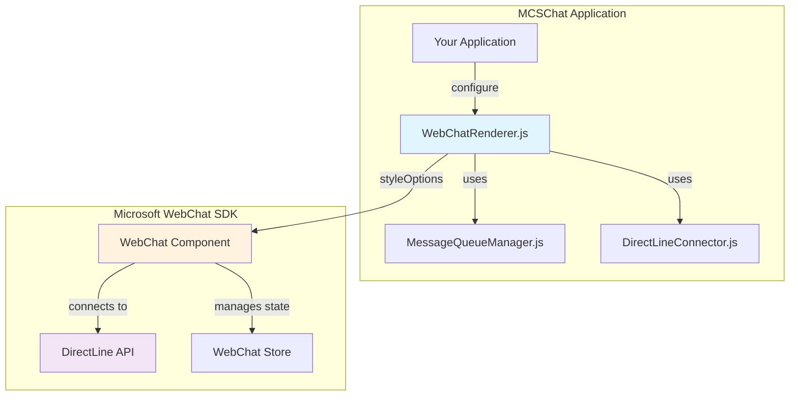

# 🎨 WebChat Component Customization Guide

> Status Note (2026-03-15): This document describes a historical architecture based on `WebChatRenderer`/`MessageQueueManager`/`DirectLineConnector`.
>
> Current baseline for active development:
> 1. `src/components/directline/DirectLineService.js`
> 2. `src/components/directline/README.md`
> 3. `docs/iterations/batch-3-directline-refactor/`

---

## 📖 Overview

**Microsoft WebChat** is the official chat UI component for Bot Framework. In MCSChat, it's managed by the `WebChatRenderer` component, providing comprehensive customization options for styling, theming, and functionality.

## 🏗️ Architecture



## 🎨 Basic Styling Options

### Core Style Properties

The `WebChatRenderer` provides extensive styling through the `styleOptions` object:

```javascript
const basicStyleOptions = {
    // 🎨 Colors
    accent: '#0078d4',                    // Primary theme color
    backgroundColor: '#f8f9fa',           // Chat background
    bubbleBackground: '#ffffff',          // Message bubble background
    bubbleFromUserBackground: '#0078d4',  // User message background
    bubbleFromUserTextColor: '#ffffff',   // User message text color
    
    // 📐 Layout & Dimensions
    bubbleBorderRadius: 8,                // Message bubble corner radius
    avatarSize: 40,                       // Avatar size in pixels
    
    // 👤 Avatar Styling
    botAvatarBackgroundColor: '#0078d4',  // Bot avatar background
    userAvatarBackgroundColor: '#6c757d', // User avatar background
    
    // 🔧 Features
    hideUploadButton: true,               // Hide file upload button
    sendBoxBorderRadius: 25,              // Input box border radius
    sendBoxHeight: 40                     // Input box height
};
```

### Usage with WebChatRenderer

```javascript
// Initialize components
const directLineConnector = new DirectLineConnector();
const messageQueueManager = new MessageQueueManager(directLineConnector);
const webChatRenderer = new WebChatRenderer(
    directLineConnector, 
    messageQueueManager, 
    { styleOptions: basicStyleOptions }
);

// Connect and render
await directLineConnector.connectUnauthenticated('your-secret');
webChatRenderer.renderWebChat(container, customStyleOptions);
```

## 🚀 Advanced Customization

### Typography & Fonts

```javascript
const typographyOptions = {
    // Font families
    primaryFont: 'Segoe UI, system-ui, sans-serif',
    monospaceFont: 'Monaco, Consolas, monospace',
    
    // Font sizes
    fontSizeSmall: '12px',
    fontSizeDefault: '14px',
    fontSizeLarge: '16px',
    
    // Text colors
    subtle: '#6b7280',                    // Secondary text color
    accent: '#0078d4',                    // Link and accent text
    
    // Line heights
    lineHeight: 1.4
};
```

### Layout & Spacing

```javascript
const layoutOptions = {
    // Padding and margins
    paddingRegular: 12,
    paddingWide: 16,
    marginRegular: 8,
    
    // Borders
    subtle: '#e1e1e1',                    // Border color
    borderWidth: 1,
    
    // Shadows
    boxShadow: '0 2px 8px rgba(0,0,0,0.1)'
};
```

### Custom CSS Injection

```javascript
const customCSSOptions = {
    rootCSS: `
        /* Custom message bubble styling */
        .webchat__bubble__content {
            border: 2px solid var(--accent);
            box-shadow: 0 2px 8px rgba(0,0,0,0.1);
            transition: all 0.2s ease;
        }
        
        .webchat__bubble__content:hover {
            transform: translateY(-1px);
            box-shadow: 0 4px 12px rgba(0,0,0,0.15);
        }
        
        /* Custom send box styling */
        .webchat__send-box {
            border-radius: 25px;
            border: 2px solid var(--accent);
            background: rgba(255, 255, 255, 0.95);
            backdrop-filter: blur(10px);
        }
        
        /* Custom scrollbar */
        .webchat__scrollable::-webkit-scrollbar {
            width: 6px;
        }
        
        .webchat__scrollable::-webkit-scrollbar-thumb {
            background: var(--accent);
            border-radius: 3px;
        }
    `
};
```

## 🔘 Custom Buttons & Actions

### Action Types

WebChat supports various action types for interactive buttons:

```javascript
const actionTypes = {
    // Message actions
    messageBack: {
        type: 'messageBack',
        title: '🏠 Main Menu',
        text: 'Show main menu',          // Hidden message sent to bot
        displayText: 'Going to menu...' // Displayed to user
    },
    
    // Immediate response
    imBack: {
        type: 'imBack',
        title: '❓ Help',
        value: 'help'                    // Displayed and sent message
    },
    
    // External links
    openUrl: {
        type: 'openUrl',
        title: '📄 Documentation',
        value: 'https://docs.microsoft.com/bot-framework'
    },
    
    // Custom data payload
    postBack: {
        type: 'postBack',
        title: '⚙️ Settings',
        value: { action: 'open_settings', data: { userId: 123 } }
    }
};
```

### Button Styling

```javascript
const buttonStyleOptions = {
    // Button appearance
    cardActionBackground: '#ffffff',
    cardActionBackgroundHover: '#f8f9fa',
    cardActionBorder: '1px solid #e1e1e1',
    cardActionBorderRadius: 6,
    cardActionColor: '#0078d4',
    cardActionHeight: 40,
    
    // Quick reply buttons
    suggestedActionBackground: '#ffffff',
    suggestedActionBorder: '2px solid #0078d4',
    suggestedActionBorderRadius: 20,
    suggestedActionColor: '#0078d4',
    
    // Hover effects
    suggestedActionBackgroundHover: '#0078d4',
    suggestedActionColorHover: '#ffffff'
};
```

### Adaptive Cards Integration

```javascript
// Example adaptive card with custom actions
const adaptiveCard = {
    type: 'AdaptiveCard',
    version: '1.3',
    body: [
        {
            type: 'TextBlock',
            text: 'Welcome to MCSChat!',
            size: 'Medium',
            weight: 'Bolder'
        },
        {
            type: 'TextBlock',
            text: 'How can I help you today?',
            wrap: true
        }
    ],
    actions: [
        {
            type: 'Action.Submit',
            title: '🤖 Chat with AI',
            data: { action: 'start_chat' }
        },
        {
            type: 'Action.OpenUrl',
            title: '📚 View Guide',
            url: 'https://example.com/guide'
        }
    ]
};
```

## 🎭 Pre-built Themes

### Light Theme

```javascript
const lightTheme = {
    accent: '#0078d4',
    backgroundColor: '#ffffff',
    bubbleBackground: '#f8f9fa',
    bubbleFromUserBackground: '#0078d4',
    bubbleFromUserTextColor: '#ffffff',
    subtle: '#e1e1e1',
    primaryFont: 'Segoe UI, system-ui, sans-serif',
    bubbleBorderRadius: 8
};
```

### Dark Theme

```javascript
const darkTheme = {
    accent: '#4fc3f7',
    backgroundColor: '#1a1a1a',
    bubbleBackground: '#2d2d2d',
    bubbleFromUserBackground: '#4fc3f7',
    bubbleFromUserTextColor: '#ffffff',
    subtle: '#404040',
    primaryFont: 'Segoe UI, system-ui, sans-serif',
    bubbleBorderRadius: 8
};
```

### Corporate Theme

```javascript
const corporateTheme = {
    accent: '#005a9e',
    backgroundColor: '#f5f5f5',
    bubbleBackground: '#ffffff',
    bubbleFromUserBackground: '#005a9e',
    bubbleFromUserTextColor: '#ffffff',
    subtle: '#cccccc',
    primaryFont: 'Arial, sans-serif',
    bubbleBorderRadius: 2,
    sendBoxBorderRadius: 2
};
```

## 🔧 Dynamic Style Updates

### Runtime Style Changes

```javascript
// Update styles dynamically
function updateChatTheme(newTheme) {
    webChatRenderer.updateStyle(newTheme);
    console.log('Theme updated:', newTheme);
}

// Color picker integration
function onColorChange(property, color) {
    const newStyles = {};
    newStyles[property] = color;
    webChatRenderer.updateStyle(newStyles);
}

// Theme switcher
function switchTheme(themeName) {
    const themes = { light: lightTheme, dark: darkTheme, corporate: corporateTheme };
    if (themes[themeName]) {
        updateChatTheme(themes[themeName]);
    }
}
```

### Responsive Styling

```javascript
const responsiveStyleOptions = {
    // Mobile-specific styles
    rootCSS: `
        @media (max-width: 768px) {
            .webchat__bubble {
                max-width: 85% !important;
            }
            
            .webchat__send-box {
                border-radius: 20px !important;
                padding: 8px !important;
            }
            
            .webchat__avatar {
                width: 32px !important;
                height: 32px !important;
            }
        }
        
        @media (max-width: 480px) {
            .webchat__bubble {
                max-width: 90% !important;
                font-size: 14px !important;
            }
        }
    `
};
```

## 📱 Mobile Optimization

### Touch-Friendly Design

```javascript
const mobileOptimizations = {
    // Larger touch targets
    cardActionHeight: 48,
    suggestedActionHeight: 44,
    
    // Improved spacing
    paddingRegular: 16,
    marginRegular: 12,
    
    // Mobile-specific CSS
    rootCSS: `
        /* Touch-friendly buttons */
        .webchat__suggested-action {
            min-height: 44px;
            padding: 12px 16px;
            margin: 4px;
        }
        
        /* Improved tap targets */
        .webchat__send-box button {
            min-width: 44px;
            min-height: 44px;
        }
        
        /* Optimized scrolling */
        .webchat__scrollable {
            -webkit-overflow-scrolling: touch;
        }
    `
};
```

## 🎨 Custom Components

### Custom Avatar Component

```javascript
const customAvatarOptions = {
    avatarSize: 40,
    botAvatarInitials: 'AI',
    userAvatarInitials: 'You',
    
    rootCSS: `
        .webchat__avatar {
            background: linear-gradient(135deg, #667eea 0%, #764ba2 100%);
            color: white;
            font-weight: bold;
            display: flex;
            align-items: center;
            justify-content: center;
            border: 2px solid white;
            box-shadow: 0 2px 4px rgba(0,0,0,0.1);
        }
    `
};
```

### Custom Send Button

```javascript
const customSendButtonOptions = {
    rootCSS: `
        .webchat__send-box button {
            background: linear-gradient(135deg, #667eea 0%, #764ba2 100%);
            border: none;
            border-radius: 50%;
            width: 44px;
            height: 44px;
            color: white;
            font-size: 18px;
            cursor: pointer;
            transition: all 0.2s ease;
            box-shadow: 0 2px 4px rgba(0,0,0,0.1);
        }
        
        .webchat__send-box button:hover {
            transform: translateY(-1px);
            box-shadow: 0 4px 8px rgba(0,0,0,0.2);
        }
        
        .webchat__send-box button:active {
            transform: translateY(0);
        }
    `
};
```

## 🔍 Debugging & Development

### Style Inspection

```javascript
// Get current style configuration
const currentStyles = webChatRenderer.getCurrentStyleOptions();
console.log('Current styles:', currentStyles);

// Check WebChat availability
if (webChatRenderer.isWebChatAvailable()) {
    console.log('WebChat version:', webChatRenderer.getWebChatVersion());
} else {
    console.error('WebChat SDK not loaded');
}

// Container information
const containerInfo = webChatRenderer.getContainerInfo();
console.log('Container info:', containerInfo);
```

### Development Tools

```javascript
// Enable debug mode
const debugOptions = {
    rootCSS: `
        /* Debug borders */
        .webchat__bubble {
            border: 1px dashed red !important;
        }
        
        .webchat__send-box {
            border: 1px dashed blue !important;
        }
        
        /* Debug information */
        .webchat__bubble::before {
            content: "Message Bubble";
            position: absolute;
            top: -20px;
            left: 0;
            font-size: 10px;
            color: red;
        }
    `
};
```

## 📚 Integration Examples

### With React

```javascript
import React, { useEffect, useRef } from 'react';
import { WebChatRenderer } from './WebChatRenderer';

function ChatComponent({ directLineSecret, theme = 'light' }) {
    const containerRef = useRef(null);
    const rendererRef = useRef(null);
    
    useEffect(() => {
        const initializeChat = async () => {
            const connector = new DirectLineConnector();
            const messageQueue = new MessageQueueManager(connector);
            const renderer = new WebChatRenderer(connector, messageQueue);
            
            await connector.connectUnauthenticated(directLineSecret);
            renderer.renderWebChat(containerRef.current, getThemeStyles(theme));
            
            rendererRef.current = renderer;
        };
        
        initializeChat();
        
        return () => {
            if (rendererRef.current) {
                rendererRef.current.destroy();
            }
        };
    }, [directLineSecret]);
    
    useEffect(() => {
        if (rendererRef.current) {
            rendererRef.current.updateStyle(getThemeStyles(theme));
        }
    }, [theme]);
    
    return <div ref={containerRef} style={{ height: '600px' }} />;
}
```

### With Vue.js

```javascript
export default {
    name: 'WebChatComponent',
    props: ['directLineSecret', 'theme'],
    data() {
        return {
            renderer: null
        };
    },
    async mounted() {
        const connector = new DirectLineConnector();
        const messageQueue = new MessageQueueManager(connector);
        this.renderer = new WebChatRenderer(connector, messageQueue);
        
        await connector.connectUnauthenticated(this.directLineSecret);
        this.renderer.renderWebChat(this.$refs.container, this.getThemeStyles());
    },
    watch: {
        theme() {
            if (this.renderer) {
                this.renderer.updateStyle(this.getThemeStyles());
            }
        }
    },
    beforeDestroy() {
        if (this.renderer) {
            this.renderer.destroy();
        }
    },
    methods: {
        getThemeStyles() {
            // Return theme styles based on this.theme
        }
    },
    template: '<div ref="container" style="height: 600px;"></div>'
};
```

## 🚀 Performance Optimization

### Efficient Styling

```javascript
// Optimize re-renders by batching style updates
const optimizedStyleUpdate = {
    // Group related style changes
    batchStyleUpdate(changes) {
        const mergedStyles = Object.assign({}, this.getCurrentStyleOptions(), changes);
        this.updateStyle(mergedStyles);
    },
    
    // Debounce rapid style changes
    debouncedStyleUpdate: debounce(function(styles) {
        this.updateStyle(styles);
    }, 100)
};
```

### Memory Management

```javascript
// Proper cleanup to prevent memory leaks
function cleanupWebChat() {
    // Clear event listeners
    webChatRenderer.setCallback('onRenderComplete', null);
    webChatRenderer.setCallback('onRenderError', null);
    
    // Destroy renderer
    webChatRenderer.destroy();
    
    // Clear references
    webChatRenderer = null;
}
```

## 🔐 Security Considerations

### Safe CSS Injection

```javascript
// Validate and sanitize custom CSS
function sanitizeCSS(cssText) {
    // Remove potentially dangerous CSS properties
    const dangerous = ['expression', 'javascript:', 'vbscript:'];
    let sanitized = cssText;
    
    dangerous.forEach(pattern => {
        sanitized = sanitized.replace(new RegExp(pattern, 'gi'), '');
    });
    
    return sanitized;
}

// Apply sanitized styles
function applySafeStyles(customCSS) {
    const safeCSS = sanitizeCSS(customCSS);
    webChatRenderer.updateStyle({ rootCSS: safeCSS });
}
```

## 📋 Troubleshooting

### Common Issues

1. **Styles not applying**: Check WebChat SDK version compatibility
2. **Performance issues**: Optimize CSS and avoid complex selectors
3. **Mobile layout problems**: Test responsive breakpoints
4. **Theme switching lag**: Implement proper debouncing

### Debug Checklist

```javascript
// Comprehensive debugging function
function debugWebChatStyles() {
    console.group('WebChat Style Debug');
    
    // Check WebChat availability
    console.log('WebChat available:', webChatRenderer.isWebChatAvailable());
    
    // Check current styles
    console.log('Current styles:', webChatRenderer.getCurrentStyleOptions());
    
    // Check container status
    console.log('Container info:', webChatRenderer.getContainerInfo());
    
    // Check for CSS conflicts
    const computedStyles = window.getComputedStyle(containerElement);
    console.log('Container computed styles:', computedStyles);
    
    console.groupEnd();
}
```

---

## 🎯 Quick Start Example

Here's a complete example to get you started:

```javascript
// 1. Initialize components
const directLineConnector = new DirectLineConnector({
    autoGreeting: true
});

const messageQueue = new MessageQueueManager(directLineConnector);

const webChatRenderer = new WebChatRenderer(directLineConnector, messageQueue, {
    styleOptions: {
        accent: '#0078d4',
        bubbleBorderRadius: 12,
        hideUploadButton: true
    }
});

// 2. Set up event handlers
webChatRenderer.setCallback('onRenderComplete', (container) => {
    console.log('WebChat rendered successfully');
});

// 3. Connect and render
async function initializeChat() {
    try {
        await directLineConnector.connectUnauthenticated('your-directline-secret');
        webChatRenderer.renderWebChat(document.getElementById('chat-container'));
    } catch (error) {
        console.error('Failed to initialize chat:', error);
    }
}

// 4. Call initialization
initializeChat();
```

This guide provides comprehensive coverage of WebChat customization options. For more specific use cases or advanced scenarios, refer to the [Microsoft Bot Framework WebChat documentation](https://github.com/microsoft/BotFramework-WebChat) and your project's specific implementation details.
