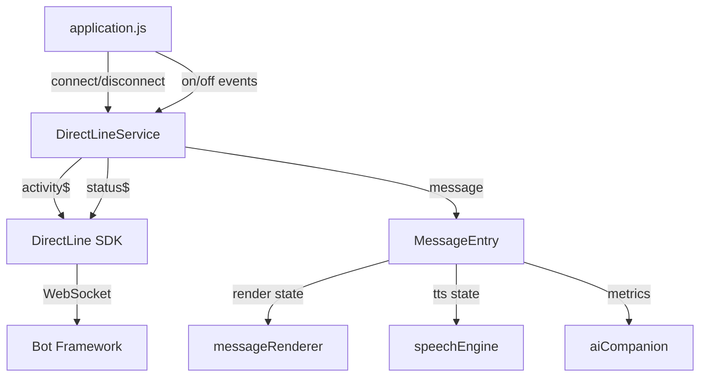

# DirectLineService Architecture

## Overview

DirectLineService is the single, authoritative DirectLine communication component for MCSChat. It replaced 12+ legacy implementations (Batch 3) and provides a UI-independent, event-driven interface for bot communication via Microsoft DirectLine 3.0.

## Component Structure

```
src/components/directline/
├── DirectLineService.js   # Core service (single file)
├── index.js               # Barrel export
└── DirectLineManager.css  # Connection status styles
```

## Core Classes

### DirectLineService

Responsibilities:
- Establish and manage DirectLine WebSocket connection
- Subscribe to activity and status streams
- Process incoming activities (message, typing, conversationUpdate, event)
- Send user messages and greeting triggers
- Maintain message queue with deduplication

### MessageEntry

Unified message data model that tracks the full lifecycle of each message:

| Field Group | Fields | Purpose |
|-------------|--------|---------|
| Identity | id, from, type, timestamp | Message identification |
| Content | text, attachments, suggestedActions, inputHint | Message payload |
| State | isComplete, isGreeting | Lifecycle flags |
| Render | render.status, render.renderedLength, render.element | UI layer state |
| TTS | tts.status, tts.spokenLength, tts.utteranceId | Speech layer state |
| Metrics | metrics.sendTime, firstTokenTime, lastTokenTime, renderCompleteTime | Performance tracking |
| Extension | meta | Arbitrary consumer data |

## Event Contract

| Event | Payload | When |
|-------|---------|------|
| `connected` | — | WebSocket connection established |
| `disconnected` | — | Connection dropped |
| `statusChange` | status code | Any connection status change |
| `message` | MessageEntry | Complete bot message received |
| `typing` | — | Bot typing activity received |
| `greeting` | MessageEntry | First bot message detected as greeting |
| `greetingTimeout` | — | No greeting within 5s of connection |
| `conversationUpdate` | activity | Conversation update activity |
| `event` | activity | Event-type activity |
| `error` | Error | Connection or processing error |

## Application Integration

The main application wires into DirectLineService in `initializeManagers()`:

```
directLineService.on('statusChange', handleConnectionStatus)
directLineService.on('message', handleCompleteMessage)
directLineService.on('typing', showProgressIndicator)  // with 500ms cooldown
directLineService.on('greeting', releaseInitialization)
directLineService.on('greetingTimeout', releaseInitialization)
directLineService.on('connected', releaseSplashScreen)
directLineService.on('error', handleError + releaseSplash)
```

## Initialization Flow

```
App starts → loadAndConnectAgent() → directLineService.connect(secret)
  → 'connecting' status
  → 'connected' status → splash released → sendGreeting()
  → 'greeting' or 'greetingTimeout' → UI ready
```

Safety timeout: 8 seconds force-releases splash if no events arrive.

## Architecture Diagram



## Constraints

1. DirectLineService does NOT touch DOM or dispatch window/document events
2. All UI bridging (document events for splash screen etc.) is done by application.js
3. Only one DirectLineService instance exists (singleton export)
4. Message deduplication is handled internally via `_seenIds` Set

## Extension Points

- **Token auth**: `connect()` can be extended to accept token instead of secret (Batch 7)
- **Native streaming**: Activity handler can add streaming chunk processing (Batch 8)
- **Metrics**: MessageEntry.metrics fields are pre-defined for TTFT/TTLT tracking (Batch 6)
