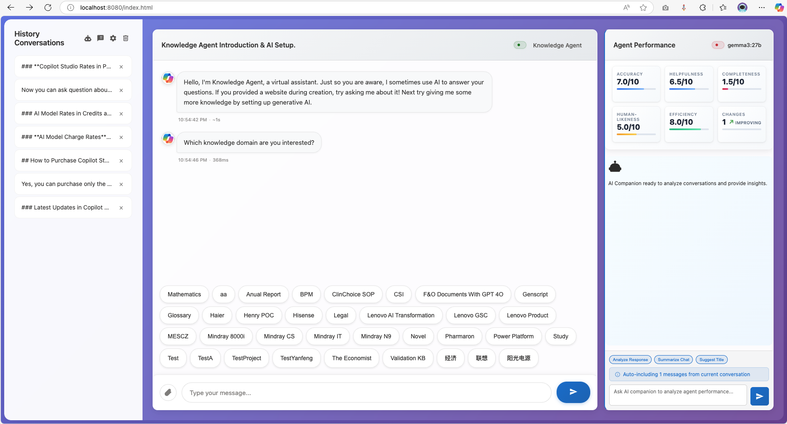

# Quick Start Guide

Get up and running with MCSChat in just a few minutes!

## Prerequisites

- Modern web browser (Chrome, Firefox, Safari, Edge)
- Microsoft Copilot Studio account (for DirectLine integration)
- Optional: Local Python 3.7+ for development server

## Step 1: Get DirectLine Secret

1. Go to your [Microsoft Copilot Studio](https://copilotstudio.microsoft.com/)
2. Open your copilot/bot
3. Navigate to **Channels** → **Web** → **Channel security**
4. Copy your **DirectLine secret**


## Step 2: Launch Application

### Option A: Direct File Access
1. Download or clone the repository
2. Open `index.html` directly in your browser

### Option B: Local Server (Recommended)
```bash
# Using Python
python -m http.server 8000

# Using Node.js (if you have it)
npx serve .

# Using the included chat server
node chat-server.js
```

Access at: `http://localhost:8000`



## Step 3: Configure Your Agent

1. Click the **Settings** button (⚙️) in the top-right
2. Navigate to **Agent Management** section
3. Click **"+ Add New Agent"**
4. Fill in the form:
   - **Agent Name**: Give your bot a friendly name
   - **DirectLine Secret**: Paste your secret from Step 1
5. Click **"Test Connection"** to verify
6. Click **"Save Agent"** when test succeeds


## Step 4: Start Chatting

1. Your agent should now appear as "Connected" in the main interface
2. Type a message in the input field
3. Press Enter or click the send button
4. Enjoy chatting with your AI assistant!


## Optional: Enable AI Companion

For conversation analysis and performance metrics:

1. In Settings, go to **AI Companion** section
2. Check **"Enable AI Companion"**
3. Choose your AI provider:
   - **OpenAI GPT**: Enter your OpenAI API key
   - **Anthropic Claude**: Enter your Anthropic API key
   - **Azure OpenAI**: Configure endpoint, deployment, and key
   - **Local Ollama**: Set up local Ollama server
4. Test the connection
5. Start analyzing your conversations!


## Optional: Customize Appearance

Adjust the interface to your preferences:

1. Go to **Appearance** section in Settings
2. Adjust **Agent Chat Font Size** (10-20px)
3. Adjust **AI Companion Font Size** (8-16px)
4. Choose message display mode (bubble or full-width)
5. Changes apply instantly!


## Next Steps

- **[Configuration Guide](configuration.md)** - Detailed configuration options
- **[AI Companion Setup](ai-companion.md)** - Advanced AI features
- **[Troubleshooting](../troubleshooting/common-issues.md)** - Common issues and solutions

## Need Help?

- Check our [Troubleshooting Guide](../troubleshooting/common-issues.md)
- Browse [Common Issues](../troubleshooting/common-issues.md)
- Open an [issue on GitHub](https://github.com/illusion615/MCSChat/issues)

---

**⏱️ Total Setup Time**: ~5 minutes  
**✅ You're Ready**: Start chatting with your AI assistant!
