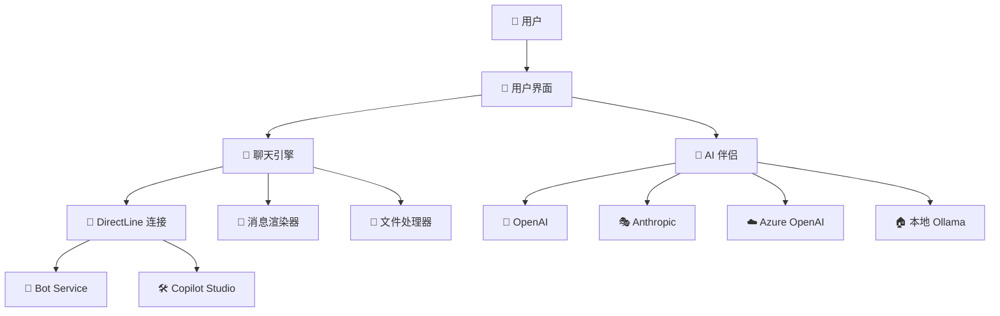
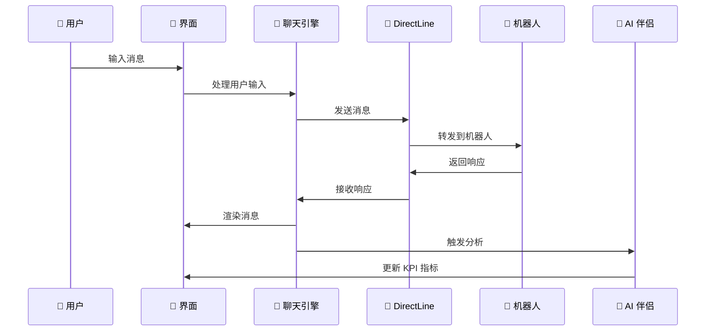
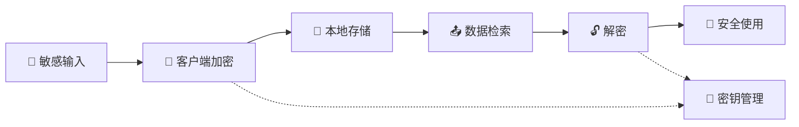

# 系统架构

[🇺🇸 English](../../en/architecture/) | [🏠 返回主页](../README.md)

## 🏗️ 总体架构

MCSChat 采用现代化的客户端架构，结合多种 AI 服务和 Microsoft Bot Framework，提供完整的智能对话体验。



## 🎨 前端架构

### 📁 项目结构
```
src/
├── main.js              # 应用入口点
├── components/          # 组件模块
│   ├── chat/           # 聊天相关组件
│   ├── ai-companion/   # AI 伴侣组件
│   ├── ui/             # 基础 UI 组件
│   └── settings/       # 设置管理组件
├── ai/                 # AI 服务模块
│   ├── openai.js       # OpenAI 集成
│   ├── anthropic.js    # Anthropic 集成
│   ├── azure.js        # Azure OpenAI 集成
│   └── ollama.js       # 本地 Ollama 集成
├── services/           # 核心服务
│   ├── directline.js   # DirectLine 通信
│   ├── storage.js      # 数据存储服务
│   ├── encryption.js   # 加密服务
│   └── speech.js       # 语音服务
└── utils/              # 工具函数
    ├── helpers.js      # 通用辅助函数
    ├── validation.js   # 数据验证
    └── performance.js  # 性能监控
```

### 🧩 核心组件

#### 💬 聊天引擎 (Chat Engine)
```javascript
class ChatEngine {
  constructor() {
    this.messageQueue = [];
    this.connectionManager = new DirectLineManager();
    this.renderer = new MessageRenderer();
    this.fileHandler = new FileHandler();
  }
  
  async sendMessage(message) {
    // 消息发送逻辑
    await this.connectionManager.send(message);
    this.renderer.displayMessage(message);
  }
  
  async receiveMessage(response) {
    // 消息接收和渲染
    await this.renderer.renderResponse(response);
    this.aiCompanion.analyze(response);
  }
}
```

#### 🧠 AI 伴侣管理器 (AI Companion Manager)
```javascript
class AICompanionManager {
  constructor() {
    this.providers = {
      openai: new OpenAIProvider(),
      anthropic: new AnthropicProvider(), 
      azure: new AzureOpenAIProvider(),
      ollama: new OllamaProvider()
    };
    this.kpiTracker = new KPITracker();
  }
  
  async analyzeConversation(context) {
    const provider = this.getActiveProvider();
    const analysis = await provider.analyze(context);
    this.kpiTracker.updateMetrics(analysis);
    return analysis;
  }
}
```

#### 🔗 DirectLine 连接管理器
```javascript
class DirectLineManager {
  constructor() {
    this.connection = null;
    this.reconnectAttempts = 0;
    this.maxReconnectAttempts = 5;
    this.heartbeatInterval = 30000;
  }
  
  async connect(config) {
    try {
      this.connection = new DirectLine({
        secret: config.secret,
        token: config.token,
        webSocket: true,
        pollingInterval: 1000
      });
      
      this.setupEventHandlers();
      return await this.waitForConnection();
    } catch (error) {
      await this.handleConnectionError(error);
    }
  }
  
  setupEventHandlers() {
    this.connection.connectionStatus$.subscribe(status => {
      this.handleConnectionStatus(status);
    });
    
    this.connection.activity$.subscribe(activity => {
      this.handleIncomingActivity(activity);
    });
  }
}
```

## 🔄 数据流架构

### 📨 消息流处理


### 🔐 安全数据流


## 🛠️ 服务层架构

### 🔌 AI 服务抽象层
```javascript
// 统一 AI 服务接口
class AIServiceProvider {
  constructor(config) {
    this.config = config;
    this.client = this.initializeClient();
  }
  
  async analyze(conversation) {
    throw new Error('analyze() must be implemented');
  }
  
  async generateResponse(prompt) {
    throw new Error('generateResponse() must be implemented');
  }
  
  async getModels() {
    throw new Error('getModels() must be implemented');
  }
}

// OpenAI 实现
class OpenAIProvider extends AIServiceProvider {
  async analyze(conversation) {
    const response = await this.client.chat.completions.create({
      model: this.config.model,
      messages: this.buildAnalysisPrompt(conversation),
      response_format: { type: 'json_object' }
    });
    
    return this.parseAnalysisResponse(response);
  }
}
```

### 💾 存储服务架构
```javascript
class StorageService {
  constructor() {
    this.encryption = new EncryptionService();
    this.localStorage = window.localStorage;
    this.sessionStorage = window.sessionStorage;
    this.indexedDB = this.initializeIndexedDB();
  }
  
  async store(key, data, options = {}) {
    const { encrypt = false, persistent = true } = options;
    
    let processedData = data;
    if (encrypt) {
      processedData = await this.encryption.encrypt(data);
    }
    
    const storage = persistent ? this.localStorage : this.sessionStorage;
    storage.setItem(key, JSON.stringify(processedData));
  }
  
  async retrieve(key, options = {}) {
    const { decrypt = false, persistent = true } = options;
    
    const storage = persistent ? this.localStorage : this.sessionStorage;
    const data = JSON.parse(storage.getItem(key));
    
    if (decrypt && data) {
      return await this.encryption.decrypt(data);
    }
    
    return data;
  }
}
```

## 🔒 安全架构

### 🛡️ 加密系统
```javascript
class EncryptionService {
  constructor() {
    this.algorithm = 'AES-GCM';
    this.keyLength = 256;
    this.ivLength = 12;
  }
  
  async generateKey(password, salt) {
    const encoder = new TextEncoder();
    const keyMaterial = await crypto.subtle.importKey(
      'raw',
      encoder.encode(password),
      { name: 'PBKDF2' },
      false,
      ['deriveBits', 'deriveKey']
    );
    
    return crypto.subtle.deriveKey(
      {
        name: 'PBKDF2',
        salt: salt,
        iterations: 100000,
        hash: 'SHA-256',
      },
      keyMaterial,
      { name: 'AES-GCM', length: 256 },
      true,
      ['encrypt', 'decrypt']
    );
  }
  
  async encrypt(data, key) {
    const encoder = new TextEncoder();
    const iv = crypto.getRandomValues(new Uint8Array(12));
    
    const encrypted = await crypto.subtle.encrypt(
      { name: 'AES-GCM', iv: iv },
      key,
      encoder.encode(data)
    );
    
    return {
      data: Array.from(new Uint8Array(encrypted)),
      iv: Array.from(iv)
    };
  }
}
```

### 🔐 访问控制
```javascript
class AccessControlService {
  constructor() {
    this.permissions = new Map();
    this.sessionManager = new SessionManager();
  }
  
  checkPermission(resource, action) {
    const userSession = this.sessionManager.getCurrentSession();
    const permissions = this.permissions.get(userSession.userId);
    
    return permissions.has(`${resource}:${action}`);
  }
  
  grantPermission(userId, resource, actions) {
    if (!this.permissions.has(userId)) {
      this.permissions.set(userId, new Set());
    }
    
    const userPermissions = this.permissions.get(userId);
    actions.forEach(action => {
      userPermissions.add(`${resource}:${action}`);
    });
  }
}
```

## 📱 响应式架构

### 🎨 CSS 架构
```css
/* 模块化 CSS 架构 */
@import 'base/reset.css';
@import 'base/typography.css';
@import 'base/variables.css';

@import 'layout/grid.css';
@import 'layout/flexbox.css';
@import 'layout/containers.css';

@import 'components/chat.css';
@import 'components/buttons.css';
@import 'components/forms.css';
@import 'components/modals.css';

@import 'responsive/mobile.css';
@import 'responsive/tablet.css';
@import 'responsive/desktop.css';
```

### 📏 断点系统
```css
/* 响应式断点 */
:root {
  --breakpoint-mobile: 480px;
  --breakpoint-tablet: 768px;
  --breakpoint-desktop: 1024px;
  --breakpoint-large: 1440px;
}

/* 移动优先设计 */
.container {
  width: 100%;
  padding: 1rem;
}

@media (min-width: 768px) {
  .container {
    max-width: 750px;
    margin: 0 auto;
  }
}

@media (min-width: 1024px) {
  .container {
    max-width: 970px;
  }
}
```

## ⚡ 性能优化架构

### 🚀 懒加载系统
```javascript
class LazyLoader {
  constructor() {
    this.loadedModules = new Set();
    this.loading = new Map();
  }
  
  async loadModule(moduleName) {
    if (this.loadedModules.has(moduleName)) {
      return this.getModule(moduleName);
    }
    
    if (this.loading.has(moduleName)) {
      return this.loading.get(moduleName);
    }
    
    const loadPromise = this.dynamicImport(moduleName);
    this.loading.set(moduleName, loadPromise);
    
    try {
      const module = await loadPromise;
      this.loadedModules.add(moduleName);
      this.loading.delete(moduleName);
      return module;
    } catch (error) {
      this.loading.delete(moduleName);
      throw error;
    }
  }
  
  async dynamicImport(moduleName) {
    switch (moduleName) {
      case 'ai-companion':
        return import('./components/ai-companion/index.js');
      case 'speech-engine':
        return import('./services/speech.js');
      case 'file-handler':
        return import('./components/file-handler/index.js');
      default:
        throw new Error(`Unknown module: ${moduleName}`);
    }
  }
}
```

### 🎯 缓存策略
```javascript
class CacheManager {
  constructor() {
    this.memoryCache = new Map();
    this.localStorage = new LocalStorageCache();
    this.sessionCache = new SessionStorageCache();
    this.indexedDBCache = new IndexedDBCache();
  }
  
  async get(key, options = {}) {
    const { strategy = 'memory-first', ttl = 3600 } = options;
    
    switch (strategy) {
      case 'memory-first':
        return this.getMemoryFirst(key, ttl);
      case 'persistent-first':
        return this.getPersistentFirst(key, ttl);
      case 'network-first':
        return this.getNetworkFirst(key, ttl);
      default:
        throw new Error(`Unknown cache strategy: ${strategy}`);
    }
  }
  
  async set(key, value, options = {}) {
    const { strategy = 'all', ttl = 3600 } = options;
    
    const cacheEntry = {
      value,
      timestamp: Date.now(),
      ttl: ttl * 1000
    };
    
    if (strategy === 'all' || strategy === 'memory') {
      this.memoryCache.set(key, cacheEntry);
    }
    
    if (strategy === 'all' || strategy === 'persistent') {
      await this.localStorage.set(key, cacheEntry);
    }
  }
}
```

## 🔄 状态管理

### 📊 应用状态
```javascript
class StateManager {
  constructor() {
    this.state = {
      ui: {
        theme: 'auto',
        sidebarCollapsed: false,
        activePanel: 'chat'
      },
      chat: {
        messages: [],
        connectionStatus: 'disconnected',
        isTyping: false
      },
      aiCompanion: {
        isEnabled: false,
        activeProvider: null,
        kpiData: {
          accuracy: 0,
          helpfulness: 0,
          completeness: 0
        }
      },
      settings: {
        botConfig: {},
        aiConfig: {},
        speechConfig: {}
      }
    };
    
    this.subscribers = new Set();
  }
  
  subscribe(callback) {
    this.subscribers.add(callback);
    return () => this.subscribers.delete(callback);
  }
  
  setState(path, value) {
    this.setNestedProperty(this.state, path, value);
    this.notifySubscribers();
  }
  
  getState(path) {
    return this.getNestedProperty(this.state, path);
  }
  
  notifySubscribers() {
    this.subscribers.forEach(callback => {
      callback(this.state);
    });
  }
}
```

## 🧪 测试架构

### 🔍 测试策略
```javascript
// 单元测试
describe('ChatEngine', () => {
  let chatEngine;
  
  beforeEach(() => {
    chatEngine = new ChatEngine();
  });
  
  test('should send message successfully', async () => {
    const message = { text: 'Hello', type: 'message' };
    const result = await chatEngine.sendMessage(message);
    expect(result.success).toBe(true);
  });
});

// 集成测试
describe('DirectLine Integration', () => {
  test('should establish connection', async () => {
    const directLineManager = new DirectLineManager();
    const config = { secret: 'test-secret' };
    
    const connection = await directLineManager.connect(config);
    expect(connection.status).toBe('connected');
  });
});

// E2E 测试
describe('Chat Flow', () => {
  test('complete conversation flow', async () => {
    await page.goto('http://localhost:8000');
    await page.fill('#messageInput', 'Hello');
    await page.click('#sendButton');
    
    const response = await page.waitForSelector('.bot-message');
    expect(await response.textContent()).toContain('Hello');
  });
});
```

## 🚀 部署架构

### 📦 构建流程
```javascript
// 构建配置
const buildConfig = {
  entry: './src/main.js',
  output: {
    path: './dist',
    filename: 'bundle.[contenthash].js'
  },
  optimization: {
    splitChunks: {
      chunks: 'all',
      cacheGroups: {
        vendor: {
          test: /[\\/]node_modules[\\/]/,
          name: 'vendors',
          chunks: 'all'
        },
        ai: {
          test: /[\\/]src[\\/]ai[\\/]/,
          name: 'ai-services',
          chunks: 'all'
        }
      }
    }
  },
  plugins: [
    new HtmlWebpackPlugin({
      template: './index.html'
    }),
    new ServiceWorkerWebpackPlugin({
      entry: './src/sw.js'
    })
  ]
};
```

### 🌐 CDN 和缓存
```javascript
// Service Worker 缓存策略
self.addEventListener('fetch', event => {
  const { request } = event;
  
  if (request.url.includes('/api/')) {
    // API 请求 - 网络优先
    event.respondWith(networkFirst(request));
  } else if (request.url.includes('.js') || request.url.includes('.css')) {
    // 静态资源 - 缓存优先
    event.respondWith(cacheFirst(request));
  } else {
    // HTML 页面 - 网络优先，缓存备用
    event.respondWith(networkFirst(request));
  }
});
```

---

**相关文档**:
- 🎨 [组件设计](./components.md) - 详细组件架构
- 🔌 [API 集成](./api-integration.md) - 外部服务集成
- ⚡ [性能优化](../performance/) - 性能优化策略
