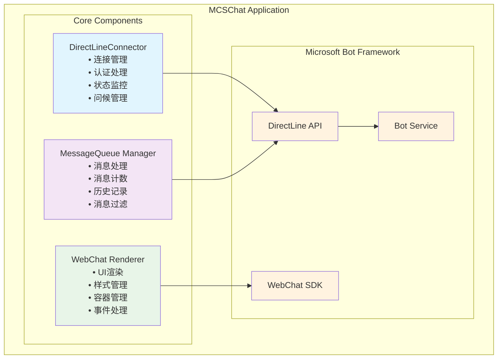

# DirectLine 组件架构设计文档

> 📚 **文档导航**: [文档索引](../../../../ARCHITECTURE_DOCUMENTATION_INDEX.md) | [三组件架构](./DIRECTLINE_COMPONENT_ARCHITECTURE_DESIGN.md) | [时序图对比](../../../../src/components/directline/docs/DIRECTLINE_SEQUENCE_DIAGRAM_COMPARISON.md) | [测试页面](../../../../tests/directline/test-directline-refactored-architecture.html)

## 📋 概述

本文档描述了 MCSChat 项目中重构后的 DirectLine 架构设计。经过关注点分离重构，原本的单一 `DirectLineConnector.js` 现在被拆分为三个专门的组件，每个组件都遵循单一职责原则，提供更好的可维护性和可扩展性。

## 🏗️ 重构后的架构设计

### 核心设计原则
- **单一职责原则**: 每个组件专注于特定功能领域
- **模块化设计**: 组件可独立使用和测试
- **清晰的依赖关系**: 组件间依赖明确且最小化
- **事件驱动**: 基于回调机制处理组件间通信
- **高内聚低耦合**: 组件内部功能紧密相关，组件间松散耦合

### 整体架构图

```
┌─────────────────────────────────────────────────────────────┐
│                    MCSChat Application                      │
├─────────────────────────────────────────────────────────────┤
│  ┌─────────────────┐  ┌─────────────────┐  ┌─────────────────┐ │
│  │ DirectLine      │  │ MessageQueue    │  │ WebChat         │ │
│  │ Connector       │  │ Manager         │  │ Renderer        │ │
│  │                 │  │                 │  │                 │ │
│  │ • 连接管理       │  │ • 消息处理       │  │ • UI渲染        │ │
│  │ • 认证处理       │  │ • 消息计数       │  │ • 样式管理       │ │
│  │ • 状态监控       │  │ • 历史记录       │  │ • 容器管理       │ │
│  │ • 问候管理       │  │ • 消息过滤       │  │ • 事件处理       │ │
│  └─────────────────┘  └─────────────────┘  └─────────────────┘ │
│           │                     │                     │        │
├───────────┼─────────────────────┼─────────────────────┼────────┤
│           ▼                     ▼                     ▼        │
│  ┌─────────────────────────────────────────────────────────────┐ │
│  │              Microsoft Bot Framework                         │ │
│  │  ┌─────────────────┐  ┌─────────────────┐  ┌──────────────┐ │ │
│  │  │ DirectLine API  │  │ WebChat SDK     │  │ Bot Service  │ │ │
│  │  └─────────────────┘  └─────────────────┘  └──────────────┘ │ │
│  └─────────────────────────────────────────────────────────────┘ │
└─────────────────────────────────────────────────────────────────┘
```

## 🔧 组件详细设计

### 1. DirectLineConnector.js - 核心连接管理器

**职责范围**: DirectLine 连接的建立、维护和管理
**设计原则**: 专注于连接层面的逻辑，不涉及UI和消息处理

#### 核心功能
```javascript
class DirectLineConnector {
    // 连接管理
    connectUnauthenticated(secret, options)    // 未认证连接
    connectAuthenticated(tokenEndpoint, options) // 认证连接
    disconnect()                               // 断开连接
    reconnect(connectionData, options)         // 重新连接
    
    // 状态管理
    getConnectionInfo()                        // 获取连接信息
    isConnected: boolean                       // 连接状态属性
    
    // 消息发送（基础功能）
    sendMessage(message)                       // 发送消息
    sendGreeting()                             // 发送问候
    
    // 资源访问（供其他组件使用）
    getDirectLine()                            // 获取DirectLine实例
    getWebChatStore()                          // 获取WebChat Store
    
    // 事件管理
    setCallback(event, callback)               // 设置回调
    triggerCallback(event, ...args)            // 触发回调
    
    // 生命周期
    destroy()                                  // 销毁连接器
}
```

#### 状态变量
- `directLine`: DirectLine 连接实例
- `currentAuthMode`: 认证模式 ('unauthenticated' | 'authenticated')
- `isConnected`: 连接状态布尔值
- `webChatStore`: WebChat Store 实例
- `messageCount`: 接收消息计数

#### 支持的回调事件
- `onConnectionStatusChange`: 连接状态变化
- `onMessageReceived`: 消息接收
- `onError`: 错误处理
- `onLog`: 日志记录
- `onGreetingStatusChange`: 问候状态变化

### 2. 非认证连接 - connectUnauthenticated()

```javascript
async connectUnauthenticated(secret, options = {})
```

**功能**: 使用 DirectLine Secret 建立到 Bot 的非认证连接

**使用场景**: 
- 开发和测试环境
- 简单的公开 Bot
- 不需要用户身份验证的场景

**调用流程**:
1. **参数验证**: 验证 secret 格式 (正则: `/^[A-Za-z0-9_\-\.]{20,}$/`)
2. **配置构建**: 合并传入参数和默认配置
3. **DirectLine 创建**: 使用 `WebChat.createDirectLine()` 创建连接
4. **连接设置**: 调用 `setupConnection()` 建立监听
5. **状态更新**: 更新内部状态和触发回调

**配置参数**:
```javascript
{
    secret: 'your-directline-secret',
    webSocket: true,          // 启用 WebSocket
    timeout: 20000,           // 连接超时(ms)
    pollingInterval: 1000,    // 轮询间隔(ms)
    domain: 'custom-domain'   // 可选的自定义域名
}
```

### 3. 认证连接 - connectAuthenticated()

```javascript
async connectAuthenticated(tokenEndpoint, options = {})
```

**功能**: 使用 Token Endpoint 建立到 Copilot Studio 的认证连接

**使用场景**:
- 生产环境的 Copilot Studio Bot
- 需要用户身份验证的企业应用
- 支持区域化部署的场景

**详细流程**:

#### 第一阶段: 环境信息提取
```javascript
const environmentEndPoint = tokenEndpoint.slice(0, tokenEndpoint.indexOf("/powervirtualagents"));
const apiVersion = tokenEndpoint.slice(tokenEndpoint.indexOf("api-version")).split("=")[1];
```

#### 第二阶段: 区域设置获取
```javascript
const regionalChannelSettingsURL = `${environmentEndPoint}/powervirtualagents/regionalchannelsettings?api-version=${apiVersion}`;
const regionResponse = await fetch(regionalChannelSettingsURL);
```
