# Unified Chat Component Design Document

> **Status**: ✅ Implemented & Validated  
> **Last Updated**: August 29, 2025  
> **Version**: 1.1.0

## Change Management Workflow

This workflow governs all future changes. Follow it strictly:

1) Requirement intake
- Record the new requirement in this document first (Problem, Goals, Non‑goals, Acceptance Criteria, Affected Areas).
- Sketch UI/UX deltas using this spec’s semantic elements (e.g., <chat-container>, <message-bubble>, <suggested-actions>).

2) Update this design document first
- Add a “Design Changes” subsection describing the delta with before/after bullets.
- Specify impacts: structure (HTML), styling (CSS vars, tokens), behavior (JS), accessibility.
- Bump Version and Last Updated above. Keep changes minimal and explicit.
- If changes are breaking or ambiguous, pause and request owner’s decision before coding.

3) Implement based on the updated spec
- Modify only the relevant code/html/js/css. Keep semantic custom elements and the unified suggested‑actions system (click‑to‑send‑and‑hide) intact unless explicitly changed here.
- Prefer incremental edits; avoid introducing parallel/legacy patterns.

4) Quality gates (green-before-done)
- Build/lint/typecheck (if applicable) and a quick smoke test.
- Manually verify the two reference pages render correctly:
    - markup.html (strict layout/styling validator)
    - layout-configurator.html (WYSIWYG preview with live updates)

5) Consolidation and housekeeping
- Remove temporary/demo scaffolds not listed in Artifacts below.
- Place artifacts under appropriate folders. Avoid duplicates and empty placeholders.
- Update this document’s “Design Changes” and Version metadata to reflect the final state.

6) Conflicts policy
- If any conflict arises between requirement and this spec, stop and ask for guidance before further action.

Artifacts (authoritative in this folder)
- UNIFIED_CHAT_COMPONENT_DESIGN.md (this file)
- markup.html (strict design-compliant validator)
- layout-configurator.html (WYSIWYG tool for live configuration and testing)

## Overview

The **Unified Chat Component** is a comprehensive yet simple Web Component designed to provide a robust foundation for chat interfaces across different platforms and services. This component represents a careful balance between functionality and simplicity, ensuring it can serve as a universal building block for chat applications while remaining lightweight and maintainable.

### Problem Statement

Modern chat applications often suffer from:
- **Tight coupling** between UI and service logic
- **Platform-specific implementations** that cannot be reused
- **Over-engineered solutions** that are difficult to maintain
- **Inconsistent user experiences** across different implementations
- **Limited extensibility** when requirements change

### Solution Approach

Our unified chat component addresses these challenges by:
- **Separating concerns** cleanly between presentation and business logic
- **Providing a universal interface** that works with any chat service
- **Following web standards** for maximum compatibility and longevity
- **Enabling progressive enhancement** without breaking existing functionality
- **Maintaining simplicity** while providing powerful extensibility hooks

## Design Philosophy

### 1. **Keep It Simple (KISS Principle)**
The component focuses exclusively on core chat functionality—displaying messages and handling user input. Complex features like analytics, monitoring, and enterprise integrations are deliberately excluded from the core to maintain simplicity and clarity of purpose.

**Rationale**: Simple components are easier to understand, test, maintain, and debug. They also have fewer dependencies and are less likely to break when external systems change.

### 2. **Web Standards First**
We use native Web Components (Custom Elements, Shadow DOM) rather than framework-specific implementations. This ensures broad compatibility and future-proofing.

**Rationale**: Web standards evolve slowly and maintain backward compatibility. Framework-agnostic components can be used in any application regardless of the chosen frontend framework.

### 3. **Service Agnostic Architecture**
The component operates purely as a UI layer with no knowledge of specific chat services (DirectLine, OpenAI, etc.). All service integration happens through well-defined events and adapters.

**Rationale**: This separation allows the same component to work with any chat backend without modification, improving reusability and reducing coupling.

### 4. **Progressive Enhancement**
Core functionality works immediately, while advanced features (voice, search, attachments) can be added as optional plugins without affecting the base component.

**Rationale**: Users can start with a minimal implementation and add complexity only as needed, reducing initial development time and ongoing maintenance burden.

### 5. **Explicit State Management**
All component state is centralized and explicitly managed, making the component's behavior predictable and debuggable.

**Rationale**: Explicit state management reduces bugs, improves testability, and makes the component's behavior easier to understand and modify.

## Core Features

### **Feature Classification Framework**

We organize features into three distinct phases to enable progressive implementation and avoid over-engineering:

### ✅ **Essential Features (Phase 1) - MVP Core**

These features form the absolute minimum viable product and represent the core value proposition of the component:

#### **Message Display System**
- **Threaded message rendering** with proper visual hierarchy
- **Multi-format content support** (plain text, HTML, Markdown)
- **Responsive message layout** that adapts to different screen sizes
- **Message type differentiation** (user, assistant, system) with distinct visual styles
- **Timestamp display** with localized formatting

**Design Rationale**: Message display is the primary function of any chat component. Without reliable, visually appealing message rendering, no other features matter.

#### **User Input Interface**
- **Multi-line text input** with automatic resizing
- **Send functionality** with keyboard shortcuts (Enter to send, Shift+Enter for new line)
- **Input validation** to prevent empty messages
- **Real-time character counting** (optional, configurable)

**Design Rationale**: Input handling must be intuitive and responsive. Users expect standard chat input behaviors, and deviating from conventions creates friction.

#### **Message Queue Management**
- **Asynchronous message processing** to prevent UI blocking
- **Message ordering** and conflict resolution
- **Basic error handling** for failed message operations
- **Event-driven architecture** for external system integration

**Design Rationale**: A robust message queue ensures consistent behavior under various conditions (slow networks, rapid user input, external system delays).

#### **Responsive Layout Foundation**
- **Mobile-first design** that scales up to desktop
- **Flexible container sizing** that adapts to parent constraints
- **Touch-friendly interface elements** for mobile devices
- **Accessibility baseline** meeting WCAG 2.1 AA standards

**Design Rationale**: Modern applications must work across all device types. A mobile-first approach ensures the component remains usable on the most constrained devices.

### 🔄 **Enhanced Features (Phase 2) - Improved UX**

These features significantly improve user experience without adding excessive complexity:

#### **Search Functionality**
- **Real-time message search** with highlighting
- **Search history** for repeated queries
- **Keyboard navigation** through search results
- **Search result context** showing surrounding messages

**Design Rationale**: As conversations grow longer, search becomes essential for usability. Implementing search early prevents architectural limitations later.

Implementation Notes (v1.1.0)
- New attributes: `show-search` ("true" to expose control), `search-placeholder` (string)
- Emits event: `ui:search` with `{ query }` when Enter is pressed in the search box
- Header DOM: `<header-actions><search-container data-visible/open>…</search-container></header-actions>`

#### **Message Actions**
- **Copy message content** with format preservation
- **Reply to specific messages** with threading context
- **Share message** with external applications
- **Message reactions** (like, dislike, emoji responses)

**Design Rationale**: Modern users expect rich interaction capabilities. These features improve engagement without complicating the core message flow.

Implementation Notes (v1.1.0)
- Copy and Speak controls are rendered for assistant messages in the message footer, not inside content
- Attributes: `enable-copy`, `enable-speak` ("true"/"false")
- Copy uses Clipboard API; Speak uses Web Speech API with a lightweight progress bar `<speak-progress>`
- Footer structure: `<message-footer><timestamp/><duration-badge?> <audio-button?> <message-actions>[copy-button][speak-button][speak-progress]</message-actions></message-footer>`

Accessibility
- Buttons have role=button and tooltips via title; consider ARIA labels for screen readers in a future pass

Styling
- Footer right-aligns actions via `message-actions { margin-left: auto; }`

#### **Voice Integration**
- **Speech-to-text input** using Web Speech API
- **Text-to-speech output** for accessibility and convenience
- **Voice input indicators** to show recording state
- **Fallback handling** for unsupported browsers

**Design Rationale**: Voice interfaces are increasingly important for accessibility and mobile usage. Implementing with web standards ensures broad compatibility.

#### **Attachment Handling**
- **File upload support** with drag-and-drop
- **Image preview** with lightbox functionality
- **File type restrictions** and size limits
- **Upload progress indicators**

**Design Rationale**: File sharing is a common requirement in chat applications. Building this capability early prevents major architectural changes later.

### 🎨 **Advanced Features (Phase 3) - Polish & Extensibility**

These features add polish and enable advanced use cases:

#### **Theming System**
- **CSS custom properties** for easy customization
- **Dark/light mode support** with system preference detection
- **Brand-specific themes** with component-level overrides
- **Dynamic theme switching** without page reload

#### **Advanced Message Types**
- **Rich cards** with structured data display
- **Interactive elements** (buttons, forms, carousels)
- **Custom message renderers** for specialized content
- **Message templates** for common patterns

#### **Plugin Architecture**
- **Extension points** for third-party functionality
- **Plugin lifecycle management** (load, initialize, cleanup)
- **Plugin communication** through the event system
- **Plugin isolation** to prevent conflicts

#### **Accessibility Enhancements**
- **Screen reader optimization** with ARIA labels
- **Keyboard navigation** for all functionality
- **High contrast support** for visual impairments
- **Reduced motion respect** for vestibular disorders

## Component Architecture

### **Architectural Principles**
## Project Structure (Authoritative)

The component source layout follows the layered architecture defined above. Only the files below are considered canonical for implementation in this repository.

```
src/components/chat/
    UNIFIED_CHAT_COMPONENT_DESIGN.md         # Design spec (source of truth)
    markup.html                              # Strict layout/styling validator (semantic tags)
    layout-configurator.html                 # WYSIWYG live preview & configuration tool

    index.js                                 # Public entry – registers <unified-chat> and re-exports modules
    adapters/
        BaseAdapter.js                         # Service-agnostic adapter contract
    core/
        EventBus.js                            # Tiny pub/sub bus
        MessageQueue.js                        # Async queue for message processing
        StateManager.js                        # Centralized state (messages, prefs)
    ui/
        UnifiedChat.js                         # Web Component <unified-chat> (shadow DOM)
        MessageRenderer.js                     # Minimal renderer for message data -> DOM
    styles/
        tokens.css                             # CSS custom properties (design tokens)
        component.css                          # Base styles for <unified-chat> (can be inlined)
    utils/
        dom.js                                 # Small DOM helpers (optional)
```

Notes
- Keep markup.html and layout-configurator.html at the folder root for quick validation (per Change Management Workflow).
- Prefer in-component styles (shadow DOM) but expose CSS variables via tokens.css for host customization.
- Adapters must not import UI; the UI listens to EventBus and StateManager only.

## Module Contracts (MVP)

- EventBus
    - on(event, handler), off(event, handler), emit(event, payload)
    - No external dependencies; synchronous dispatch

- MessageQueue
    - enqueue(item), size(), clear()
    - Emits: message:queued, message:processing, message:done, message:error

- StateManager
    - getState(), setState(partial), subscribe(listener), unsubscribe(listener)
    - State shape: { messages: Array<Message>, prefs: { theme, showAvatars, timestamps, ... } }

- UnifiedChat (<unified-chat>)
    - Attributes/props: title, status, model, suggestions (optional), show-search, search-placeholder, enable-copy, enable-speak, user-layout, assistant-layout
    - Emits DOM CustomEvents: user:send, ui:suggestionClicked, ui:search
    - Renders semantic structure consistent with markup.html for parity

- BaseAdapter (interface)
    - connect(), disconnect(), send(userMessage), onMessage(handler)
    - Adapters translate between external services and EventBus/StateManager


#### **1. Layered Architecture**
The component follows a clear layered architecture pattern that separates concerns and enables independent development and testing of each layer:

- **Presentation Layer**: Handles all visual rendering and user interactions
- **Business Logic Layer**: Manages state, validation, and core component behavior  
- **Data Layer**: Handles message storage, queuing, and persistence
- **Integration Layer**: Provides interfaces for external system communication

#### **2. Event-Driven Communication**
All communication between layers and with external systems happens through a well-defined event system. This approach provides:

- **Loose coupling** between components
- **Testable interfaces** through event mocking
- **Extensibility** without modifying core code
- **Debugging capabilities** through event logging

#### **3. Composition Over Inheritance**
Rather than building a monolithic component, we compose functionality from smaller, focused modules:

- **MessageQueue** handles message ordering and processing
- **EventBus** manages inter-component communication
- **StateManager** centralizes state mutations
- **RendererEngine** handles content display

### **Architecture Diagram Explained**

```mermaid
graph TB
    subgraph UC ["🏗️ Unified Chat Component"]
        subgraph UI ["🎨 UI Layer"]
            H["Header (optional)<br/>• Search interface<br/>• Component title<br/>• Action buttons"]
            MC["Messages Container<br/>• Message rendering<br/>• Scroll management<br/>• Virtual scrolling"]
            IA["Input Area<br/>• Text input<br/>• Send button<br/>• Attachment controls"]
        end
        
        subgraph CORE ["🔧 Core Logic"]
            MQ["Message Queue<br/>• Message ordering<br/>• Processing pipeline<br/>• Error handling"]
            ES["Event System<br/>• Publisher/Subscriber<br/>• Event routing<br/>• External APIs"]
            SM["State Manager<br/>• Component state<br/>• Message history<br/>• User preferences"]
        end
        
        subgraph FEATURES ["✨ Features"]
            SR["Search (optional)<br/>• Full-text search<br/>• Result highlighting<br/>• History management"]
            VI["Voice (optional)<br/>• Speech recognition<br/>• Text-to-speech<br/>• Audio controls"]
            AT["Attachments (optional)<br/>• File upload<br/>• Preview generation<br/>• Type validation"]
        end
    end
    
    UI --> CORE
    CORE --> FEATURES
    
    style UC fill:#f9f9f9,stroke:#333,stroke-width:2px
    style UI fill:#e1f5fe,stroke:#01579b,stroke-width:2px
    style CORE fill:#e8f5e8,stroke:#2e7d32,stroke-width:2px
    style FEATURES fill:#fff3e0,stroke:#e65100,stroke-width:2px
```



#### **UI Layer Components**

**Header Component (Optional)**
- Provides space for search interface, component branding, and action buttons
- Can be completely hidden for minimal implementations
- Responsive design that collapses gracefully on mobile devices
- Customizable through CSS custom properties and slot elements

**Messages Container**
- Core display area for conversation messages
- Implements virtual scrolling for performance with large message histories
- Handles message animations (appear, update, remove)
- Manages scroll position and auto-scroll behavior
- Provides accessibility features like skip-to-content links

**Input Area**
- Multi-line text input with auto-resize functionality
- Send button with loading states and confirmation feedback
- Integration points for voice input and file attachments
- Keyboard shortcut handling (Enter to send, Shift+Enter for newline)
- Input validation and character limits

#### **Core Logic Components**

**Message Queue**
- Ensures messages are processed in correct order
- Handles message deduplication and conflict resolution
- Provides retry mechanisms for failed operations
- Emits events for external system integration
- Maintains message metadata and processing state

**Event System**
- Central communication hub for all component interactions
- Provides type-safe event definitions
- Supports event filtering and transformation
- Enables plugin architecture through event hooks
- Includes debugging and logging capabilities

**State Manager**
- Centralizes all component state in a predictable structure
- Provides state persistence options (localStorage, sessionStorage)
- Handles state migrations for component updates
- Supports state snapshots for debugging and testing
- Enables time-travel debugging in development mode

#### **Feature Layer Components**

**Search Module**
- Full-text search across message history
- Configurable search providers (local, remote)
- Search result highlighting and navigation
- Search history and suggested queries
- Performance optimization for large datasets

**Voice Module**
- Speech-to-text using Web Speech API or custom providers
- Text-to-speech with voice selection and speed controls
- Audio permission management and fallback handling
- Voice activity detection and noise cancellation
- Integration with accessibility screen readers

**Attachments Module**
- File upload with drag-and-drop support
- File type validation and size restrictions
- Preview generation for images and documents
- Upload progress tracking and error handling
- Integration with cloud storage providers

## Message Schema

### **Universal Message Interface Design**

The Universal Message Interface represents the core data contract for the chat component. This schema has been carefully designed to balance flexibility with simplicity, ensuring it can accommodate various chat services while remaining easy to understand and implement.

#### **Design Principles for Message Schema**

1. **Service Agnostic**: The schema doesn't favor any particular chat service or protocol
2. **Extensible**: New fields can be added without breaking existing implementations
3. **Typed**: Strong typing prevents runtime errors and improves developer experience
4. **Minimal Required Fields**: Only truly essential fields are required
5. **Backward Compatible**: Schema evolution doesn't break existing data

## Message Layout Structure
## Design Changes (v1.1.0)

Problem
- Streaming was not visible; component lacked search UI and footer-aligned actions matching the mockup.

Goals
- Add token-by-token streaming API and visual typing indicator.
- Add header search UX per mockup; emit query events.
- Add Copy/Speak actions placed in message footer with timestamp/duration as in sample.
- Update layout-configurator to toggle these features.

Non-goals
- Full-text search within messages (only UI and event exposed).
- Full TTS controls (basic Web Speech integration only).

Changes
- UnifiedChat: new methods `beginAssistantStream`, `appendAssistantStream`, `endAssistantStream`, `abortAssistantStream`, and helper `streamAssistantFromAsyncIterable`.
- Footer actions moved to `<message-footer>`; added `<message-actions>` group; optional `<duration-badge>`.
- CSS: typing cursor during streaming; footer/action alignment; suggested-actions fade-out before hide.
- Attributes: `show-search`, `search-placeholder`, `enable-copy`, `enable-speak`, `user-layout`, `assistant-layout`.
- Events: `ui:search` emitted with `{ query }`.
- Configurator: toggles for Show Search, Copy Btn, Speak Btn, and Search Placeholder; Stream Demo button.

Acceptance Criteria
- Streaming displays incrementally with a blinking cursor until finalized.
- Search toggle reveals input; Enter dispatches `ui:search` with the typed query.
- Assistant messages show Copy and Speak in footer; Copy writes text; Speak plays via SpeechSynthesis and animates progress.
- Configurator controls reflect attributes live with no errors in console.

Affected Areas
- `ui/UnifiedChat.js`, `ui/MessageRenderer.js`, `styles/component.css`, `layout-configurator.html`.

### **Visual Layout Hierarchy**

The message layout follows a consistent visual hierarchy that provides clear information architecture while remaining flexible enough to accommodate different message types and content formats.

#### **🏗️ Main Container Structure (Based on MCSChat Design)**

```html
<!-- Structure matching your current MCSChat interface -->
<chat-container>
  <chat-header>
    <conversation-title>Switching Knowledge Domains in Virtual Assistant Conversation</conversation-title>
    <agent-status>
      <status-indicator>🟢 Agent: Knowledge Hub</status-indicator>
      <model-info>💬 Companion Model: Azure: gpt-5-chat</model-info>
    </agent-status>
  </chat-header>

  <messages-area>
    <!-- Assistant Message (Left-aligned with avatar) -->
    <message-bubble type="assistant">
      <avatar-container>
        <assistant-avatar>🤖</assistant-avatar>
      </avatar-container>
      <message-content>
        <message-text>Perfect! I have my thoughts ready for the response.</message-text>
        <thinking-indicator>
          <thinking-text>✨ Perfect! I have my thoughts ready for the response.</thinking-text>
        </thinking-indicator>
      </message-content>
      <message-footer>
        <timestamp>10:54:02 PM</timestamp>
        <agent-label>AI Companion (Thinking)</agent-label>
      </message-footer>
    </message-bubble>

    <message-bubble type="assistant">
      <avatar-container>
        <assistant-avatar>💭</assistant-avatar>
      </avatar-container>
      <message-content>
        <message-text>Now you can ask question about ai, and you can say "Change knowledge domain" anytime to switch between domains.</message-text>
      </message-content>
      <message-footer>
        <timestamp>10:54:00 PM</timestamp>
        <response-time>Response time: 727ms</response-time>
        <audio-button>🔊</audio-button>
      </message-footer>
    </message-bubble>

    <!-- User Message (Right-aligned, pill-shaped) -->
    <message-bubble type="user">
      <message-content>
        <user-message-pill>change domain</user-message-pill>
      </message-content>
      <message-footer>
        <timestamp>10:54:08 PM</timestamp>
        <user-avatar>�</user-avatar>
      </message-footer>
    </message-bubble>

    <!-- Standard Suggested Actions (small set) -->
    <suggested-actions>
      <suggestion-button>How's the weather?</suggestion-button>
      <suggestion-button>Tell me a joke</suggestion-button>
      <suggestion-button>Help with code</suggestion-button>
      <suggestion-button>Schedule meeting</suggestion-button>
    </suggested-actions>
  </messages-area>

  <input-area>
    <input-container>
      <attachment-button>📎</attachment-button>
      <text-input placeholder="Type your message..."></text-input>
      <voice-button>🎤</voice-button>
      <settings-button>⚙️</settings-button>
      <send-button>↗️</send-button>
    </input-container>
  </input-area>
</chat-container>
```

### **📱 Message Bubble Component Structure**

Each message bubble follows the MCSChat interface design patterns:

#### **Assistant Message Layout (Left-aligned)**
```
🤖 Assistant Message
   ├── 🎭 Avatar (left side - robot/thinking icon)
   ├── 💬 Content Bubble (rounded, light background)
   │   ├── 📝 Main Text Content
   │   ├── ✨ Thinking Indicator (when processing)
   │   └── 💡 Suggested Actions (if applicable)
   └── ℹ️ Footer Metadata
       ├── ⏰ Timestamp (10:54:02 PM)
       ├── 🏷️ Agent Label (AI Companion (Thinking))
       ├── ⚡ Response Time (727ms)
       └── 🔊 Audio Playback Button
```

#### **User Message Layout (Right-aligned Pill)**
```
👤 User Message  
   ├── 💊 Blue Pill Button
   │   └── 📝 Short Command Text
   ├── ⏰ Timestamp (right-aligned)
   └── 👤 User Avatar (small, right side)
```

#### **User Message Layout**
```
🧑 User Message (Right-aligned)
   ├── 👤 Avatar (optional, right side)
   ├── 💬 Content Bubble
   │   ├── 📝 Text Content
   │   ├── 📎 Attachments (if any)
   │   └── ⚡ Quick Actions (copy, reply, react)
   └── ℹ️ Metadata Footer
       ├── 👤 Username
       ├── ⏰ Timestamp
       └── ✅ Delivery Status
```

#### **Assistant Message Layout**
```
🤖 Assistant Message (Left-aligned)
   ├── 🎭 Avatar (left side)
   ├── 💬 Content Bubble
   │   ├── 📝 Rich Text Content
   │   ├── 🎯 Suggested Actions
   │   └── ⚡ Message Actions
   └── ℹ️ Metadata Footer
       ├── 🏷️ Assistant Name
       ├── ⏰ Timestamp
       └── � Regenerate Option
```

#### **System Message Layout**
```
� System Message (Center-aligned)
   ├── 🚨 Status Icon
   ├── 📢 System Text
   └── ⏰ Timestamp
```

### **� Suggested Actions System**

The Unified Chat Component features a scalable suggested actions system that works consistently across different use cases:

#### **Design Principles**
- **One-Click Behavior**: Any suggestion button sends its text as a message and hides the suggestion container
- **Scalable Styling**: Same visual design works for 3 buttons or 30+ buttons
- **Unified JavaScript**: Single event handler function manages all suggestion types
- **Consistent UX**: Users always know what to expect - click sends and hides

#### **Layout Variations**

**Suggest Actions**
```html
<suggested-actions>
  <suggestion-button>How's the weather?</suggestion-button>
  <suggestion-button>Tell me a joke</suggestion-button>
  <suggestion-button>Help with code</suggestion-button>
</suggested-actions>
```
- Flow layout (inline buttons)
- Appears after assistant messages

### **�🎨 CSS Layout Structure (MCSChat Styling)**

```css
/* MCSChat-inspired CSS Grid Layout */
.chat-container {
  display: grid;
  grid-template-rows: auto 1fr auto;
  grid-template-areas: 
    "header"
    "messages"
    "input";
  height: 100vh;
  max-width: 100%;
  background: #f8f9fa;
}

.chat-header {
  grid-area: header;
  display: flex;
  justify-content: space-between;
  align-items: center;
  padding: 1rem 1.5rem;
  background: white;
  border-bottom: 1px solid #e9ecef;
}

.conversation-title {
  font-size: 1rem;
  font-weight: 500;
  color: #333;
}

.agent-status {
  display: flex;
  flex-direction: column;
  align-items: flex-end;
  font-size: 0.875rem;
}

.status-indicator {
  color: #28a745;
  margin-bottom: 0.25rem;
}

.model-info {
  color: #6c757d;
}

.messages-area {
  grid-area: messages;
  overflow-y: auto;
  padding: 1rem 1.5rem;
  display: flex;
  flex-direction: column;
  gap: 1.5rem;
}

/* Assistant Message Styling */
.message-bubble.assistant {
  display: flex;
  align-items: flex-start;
  gap: 0.75rem;
  max-width: 85%;
}

.assistant-avatar {
  width: 32px;
  height: 32px;
  background: #f1f3f4;
  border-radius: 50%;
  display: flex;
  align-items: center;
  justify-content: center;
  flex-shrink: 0;
}

.message-content {
  background: white;
  border-radius: 1rem;
  padding: 1rem;
  box-shadow: 0 1px 2px rgba(0,0,0,0.1);
  flex-grow: 1;
}

.thinking-indicator {
  background: #f8f9fa;
  border-radius: 0.5rem;
  padding: 0.5rem 0.75rem;
  margin-top: 0.5rem;
  font-style: italic;
  color: #6c757d;
}

.message-footer {
  display: flex;
  align-items: center;
  gap: 0.75rem;
  margin-top: 0.5rem;
  font-size: 0.875rem;
  color: #6c757d;
}

/* User Message Styling (Blue Pill) */
.message-bubble.user {
  align-self: flex-end;
  display: flex;
  flex-direction: column;
  align-items: flex-end;
  gap: 0.5rem;
  max-width: 300px;
}

.user-message-pill {
  background: #007bff;
  color: white;
  padding: 0.75rem 1.25rem;
  border-radius: 1.5rem;
  font-size: 0.875rem;
  cursor: pointer;
  transition: all 0.2s ease;
}

.user-message-pill:hover {
  background: #0056b3;
  transform: translateY(-1px);
}

/* Suggested Actions System - Scalable for any number of suggestions */
.suggested-actions {
  margin: 1.5rem 0;
  align-self: stretch;
  max-width: 100%;
}

.suggested-actions.hidden {
  display: none;
}

/* Mass suggestions example - knowledge domains showing scale capability */
.knowledge-domains {
  margin: 1.5rem 0;
  align-self: stretch;
  max-width: 100%;
}

.knowledge-domains.hidden {
  display: none;
}

/* Unified button styling for all suggestion types */
.suggestion-button,
.domain-button {
  background: white;
  border: 1px solid #dee2e6;
  border-radius: 0.375rem;
  padding: 0.5rem 0.75rem;
  font-size: 0.875rem;
  cursor: pointer;
  transition: all 0.2s ease;
  font-family: inherit;
}

.suggestion-button:hover,
.domain-button:hover {
  background: #f8f9fa;
  border-color: #007bff;
  transform: translateY(-1px);
}

/* Grid layout for mass suggestions (like knowledge domains) */
.domain-grid {
  display: flex;
  flex-wrap: wrap;
  gap: 0.5rem;
  margin-top: 1rem;
}

/* Standard suggestions layout (inline flow) */
.suggested-actions .suggestion-button {
  margin: 0.25rem;
  display: inline-block;
}
}

/* Input Area Styling */
.input-area {
  grid-area: input;
  padding: 1rem 1.5rem;
  background: white;
  border-top: 1px solid #e9ecef;
}

.input-container {
  display: flex;
  align-items: center;
  gap: 0.75rem;
  background: #f8f9fa;
  border-radius: 1.5rem;
  padding: 0.5rem 1rem;
  border: 1px solid #dee2e6;
}

.text-input {
  flex-grow: 1;
  border: none;
  background: transparent;
  padding: 0.5rem;
  font-size: 1rem;
  outline: none;
}

.input-container button {
  background: none;
  border: none;
  font-size: 1.25rem;
  cursor: pointer;
  opacity: 0.7;
  transition: opacity 0.2s ease;
}

.input-container button:hover {
  opacity: 1;
}

.send-button {
  background: #007bff !important;
  color: white !important;
  border-radius: 50% !important;
  width: 32px !important;
  height: 32px !important;
  display: flex !important;
  align-items: center !important;
  justify-content: center !important;
}
```

### **📊 Information Architecture**


### **🔄 Component Interaction Flow**

```
User Input → Validation → Message Creation → Rendering → Service Integration

1. 📝 User types message
   ↓
2. ✅ Input validation (length, content)
   ↓
3. 💬 Create message object
   ↓
4. 🎨 Render in messages area
   ↓
5. 📡 Send to chat service
   ↓
6. 🔄 Handle response
   ↓
7. 🎨 Render assistant response
```

### **📱 Responsive Layout Adaptation**

Instead of complex ASCII diagrams, here's a clear breakdown of how layouts adapt:

#### **🖥️ Desktop (>1024px)**
- **Layout**: 3-column grid with sidebar options
- **Message Width**: Maximum 70% of container
- **Avatar Size**: 40px with full circular display
- **Actions**: Full button labels with icons
- **Input**: Multi-line with rich toolbar

#### **💻 Tablet (768px - 1024px)**
- **Layout**: 2-column responsive grid
- **Message Width**: Maximum 80% of container
- **Avatar Size**: 32px with reduced spacing
- **Actions**: Icon + compact labels
- **Input**: Condensed toolbar with essential tools

#### **📱 Mobile (320px - 768px)**
- **Layout**: Single column stack
- **Message Width**: Maximum 90% of container
- **Avatar Size**: 24px or hidden on smallest screens
- **Actions**: Icon-only with touch-friendly sizing
- **Input**: Minimal toolbar with slide-out options

#### **🔧 Responsive CSS Strategy**
```css
/* Mobile-first responsive approach */
.chat-container {
  /* Base mobile styles */
  padding: 0.5rem;
}

.message-bubble {
  max-width: 90%;
}

@media (min-width: 768px) {
  .chat-container {
    padding: 1rem;
  }
  
  .message-bubble {
    max-width: 80%;
  }
}

@media (min-width: 1024px) {
  .chat-container {
    padding: 1.5rem;
    max-width: 1200px;
  }
  
  .message-bubble {
    max-width: 70%;
  }
}
```

### **⚡ Unified Suggested Actions JavaScript**

The suggestion system uses a single, scalable event handler that works for all suggestion types:

```javascript
// Unified suggestion system - works for any number of suggestions
function initializeSuggestionSystem() {
  // Handle all suggestion buttons with unified behavior
  document.querySelectorAll('.suggestion-button, .domain-button').forEach(button => {
    button.addEventListener('click', handleSuggestionClick);
  });
}

function handleSuggestionClick(event) {
  const suggestionText = event.target.textContent;
  
  // Send the suggestion as a user message
  addMessage(suggestionText, 'user');
  
  // Hide the suggestion container (works for both small and large sets)
  const suggestionsContainer = event.target.closest('.suggested-actions');
  if (suggestionsContainer) {
    suggestionsContainer.classList.add('hidden');
  }
  
  // Generate contextual AI response
  setTimeout(() => {
    generateAIResponse(suggestionText);
  }, 800);
}

// Example: Mass suggestions (knowledge domains) use the same system
function showKnowledgeDomains() {
  const domains = [
    'Mathematics', 'AI', 'Annual Report', 'BPM', 'Clinical Trial SOP',
    'CSI', 'Genscript', 'Glossary', 'Haier', 'Hisense', 'HR Policy',
    'IT', 'Legal', 'Lenovo Product', 'Medical Device Validation',
    // ... 14 more domains
  ];
  
  const suggestionsHTML = domains
    .map(domain => `<button class="suggestion-button domain-button">${domain}</button>`)
    .join('');
    
  addSuggestionsToChat(`
    <div class="suggested-actions knowledge-domains">
      <div class="domain-grid">
        ${suggestionsHTML}
      </div>
    </div>
  `);
  
  // Re-initialize for new buttons (same handler works for all)
  initializeSuggestionSystem();
}
```

**Key Benefits:**
- **Single Event Handler**: One function manages 3 suggestions or 30+ suggestions
- **Consistent Behavior**: Click any suggestion → sends message → hides container
- **Scalable Design**: Same code works for small quick actions or large option sets
- **Easy Integration**: Just add `.suggestion-button` class to any button

### **Layout Principles**

1. **Visual Hierarchy**: Clear distinction between message types through positioning, styling, and spacing
2. **Scannable Design**: Easy visual scanning with consistent alignment and spacing patterns
3. **Progressive Disclosure**: Show essential information first, reveal details on interaction
4. **Touch-Friendly**: Adequate touch targets (44px minimum) for mobile interactions
5. **Content Flexibility**: Layout adapts to various content types without breaking
6. **Accessibility Focus**: Proper heading structure, ARIA labels, and keyboard navigation support

### **Core Message Structure**

```typescript
interface UniversalMessage {
    // Required fields - These are essential for basic functionality
    id: string;                    // Unique identifier across all systems
    type: MessageType;             // Classification for rendering and behavior
    timestamp: string;             // ISO 8601 format for universal compatibility
    content: MessageContent;       // The actual message payload
    participant: MessageParticipant; // Information about the sender
    
    // Optional fields - These enhance functionality without breaking basic usage
    attachments?: MessageAttachment[];  // File uploads, images, documents
    actions?: MessageAction[];          // Interactive elements (buttons, quick replies)
    metadata?: Record<string, any>;     // Service-specific or custom data
    thread?: ThreadContext;             // Reply-to and conversation threading
    reactions?: MessageReaction[];      // User reactions (likes, emojis, etc.)
}
```

#### **Message Type Classification**

```typescript
enum MessageType {
    USER = 'user',              // Messages from human users
    ASSISTANT = 'assistant',    // AI or bot responses
    SYSTEM = 'system',          // System notifications and status updates
    NOTIFICATION = 'notification', // Non-conversational alerts
    ERROR = 'error'            // Error messages and failures
}
```

**Design Rationale**: This classification covers all common message types while remaining simple. Each type has distinct rendering behavior and styling, making the interface more intuitive for users.

#### **Content Structure**

```typescript
interface MessageContent {
    // Primary content (at least one must be provided)
    text?: string;                 // Plain text content
    html?: string;                 // Rich HTML content
    markdown?: string;             // Markdown formatted content
    
    // Content metadata
    format: 'text' | 'html' | 'markdown';  // Specifies which content field to use
    language?: string;             // ISO 639-1 language code for localization
    encoding?: string;             // Character encoding (default: UTF-8)
    
    // Rich content extensions
    mentions?: MentionReference[]; // @username references
    links?: LinkPreview[];         // URL previews and metadata
    code?: CodeBlock[];           // Syntax-highlighted code blocks
}

interface CodeBlock {
    language: string;              // Programming language for syntax highlighting
    code: string;                 // The actual code content
    filename?: string;            // Optional filename for context
}

interface LinkPreview {
    url: string;                  // The actual URL
    title?: string;               // Page title
    description?: string;         // Meta description
    image?: string;               // Preview image URL
    siteName?: string;            // Site name (e.g., "GitHub")
}

interface MentionReference {
    id: string;                   // User/entity ID being mentioned
    name: string;                 // Display name
    type: 'user' | 'channel' | 'bot'; // Type of mention
    offset: number;               // Character offset in text
    length: number;               // Length of mention text
}
```

**Design Rationale**: Supporting multiple content formats allows the component to work with different input sources while maintaining a consistent interface. The format field explicitly declares which content type to render, preventing ambiguity.

#### **Participant Information**

```typescript
interface MessageParticipant {
    // Required identification
    id: string;                   // Unique participant identifier
    role: 'user' | 'assistant' | 'system' | 'moderator'; // Participant type
    
    // Optional display information
    name?: string;                // Display name
    username?: string;            // Unique username (different from display name)
    email?: string;               // Email address (for avatar generation)
    
    // Visual representation
    avatar?: AvatarInfo;          // Profile picture and fallbacks
    status?: ParticipantStatus;   // Online status, typing indicators
    
    // Permissions and capabilities
    permissions?: string[];       // What actions this participant can perform
    metadata?: Record<string, any>; // Service-specific participant data
}

interface AvatarInfo {
    url?: string;                 // Direct image URL
    initials?: string;            // Fallback initials (e.g., "JD")
    color?: string;               // Background color for generated avatars
    emoji?: string;               // Emoji as avatar alternative
}

interface ParticipantStatus {
    online: boolean;              // Whether participant is currently online
    lastSeen?: string;           // ISO 8601 timestamp of last activity
    typing?: boolean;            // Whether participant is currently typing
    customStatus?: string;       // Custom status message
}
```

**Design Rationale**: Participant information drives the visual presentation and interaction capabilities. Rich participant data enables features like avatars, online status, and permission-based UI changes.

#### **Attachment System**

```typescript
interface MessageAttachment {
    // Basic identification
    id: string;                   // Unique attachment identifier
    type: AttachmentType;         // Classification for handling and display
    
    // File information
    filename: string;             // Original filename
    mimeType: string;             // MIME type for proper handling
    size: number;                 // File size in bytes
    
    // Access information
    url?: string;                 // Direct download/view URL
    thumbnailUrl?: string;        // Thumbnail for images/videos
    previewUrl?: string;          // Preview URL for documents
    
    // Upload state
    uploadState?: UploadState;    // Current upload progress and status
    
    // Rich metadata
    metadata?: AttachmentMetadata; // Type-specific additional information
}

enum AttachmentType {
    IMAGE = 'image',
    VIDEO = 'video',
    AUDIO = 'audio',
    DOCUMENT = 'document',
    LINK = 'link',
    LOCATION = 'location',
    CONTACT = 'contact'
}

interface UploadState {
    status: 'pending' | 'uploading' | 'complete' | 'error';
    progress: number;             // Percentage (0-100)
    error?: string;               // Error message if upload failed
    retryCount?: number;          // Number of retry attempts
}

interface AttachmentMetadata {
    // Image/Video specific
    dimensions?: { width: number; height: number; };
    duration?: number;            // Video/audio duration in seconds
    
    // Document specific
    pageCount?: number;           // Number of pages in document
    title?: string;               // Document title
    author?: string;              // Document author
    
    // Location specific
    coordinates?: { lat: number; lng: number; };
    address?: string;             // Human-readable address
    
    // Generic extensibility
    [key: string]: any;           // Allow service-specific metadata
}
```

#### **Interactive Actions**

```typescript
interface MessageAction {
    // Action identification
    id: string;                   // Unique action identifier
    type: ActionType;             // Determines behavior and rendering
    
    // Display properties
    title: string;                // Button text or action label
    description?: string;         // Additional context or tooltip
    icon?: string;                // Icon identifier or URL
    
    // Behavior configuration
    payload?: any;                // Data to send when action is triggered
    style?: ActionStyle;          // Visual styling hints
    disabled?: boolean;           // Whether action is currently available
    
    // Conditional display
    conditions?: ActionCondition[]; // When to show/hide this action
}

enum ActionType {
    REPLY = 'reply',             // Reply to this message
    COPY = 'copy',               // Copy message content
    SHARE = 'share',             // Share message externally
    REACT = 'react',             // Add emoji reaction
    EDIT = 'edit',               // Edit message (if permitted)
    DELETE = 'delete',           // Delete message (if permitted)
    CUSTOM = 'custom'            // Service-specific action
}

interface ActionStyle {
    variant: 'primary' | 'secondary' | 'danger' | 'ghost';
    size: 'small' | 'medium' | 'large';
    color?: string;               // Custom color override
    position: 'inline' | 'dropdown' | 'context-menu';
}

interface ActionCondition {
    field: string;                // Field to check (e.g., 'participant.id')
    operator: 'equals' | 'not-equals' | 'contains' | 'greater-than';
    value: any;                   // Value to compare against
}
```

**Design Rationale**: The action system enables rich interactivity while maintaining flexibility. Actions can be conditional, styled appropriately for their context, and carry arbitrary payloads for custom behavior.

## Technical Implementation Strategy

### **Web Components Architecture Decision**

#### **Why Web Components?**

We chose Web Components as the foundation for this chat component after evaluating several alternatives:

**Compared to Framework-Specific Solutions:**
- **React Components**: Limited to React applications, requires React runtime
- **Vue Components**: Limited to Vue applications, complex integration elsewhere  
- **Angular Components**: Heavy runtime, enterprise-focused complexity
- **Web Components**: Universal compatibility, future-proof, lightweight

**Key Advantages:**
1. **Universal Compatibility**: Works in any HTML page regardless of framework
2. **Encapsulation**: Shadow DOM provides true style and behavior isolation
3. **Standard-Based**: Built on web standards, not proprietary frameworks
4. **Future-Proof**: Web standards evolve slowly and maintain backward compatibility
5. **Performance**: No framework overhead, direct DOM manipulation

#### **Web Components Technologies Used**

**Custom Elements v1**
- Provides the component lifecycle (connectedCallback, disconnectedCallback)
- Enables attribute observation and property handling
- Allows semantic HTML usage (`<unified-chat>`)

**Shadow DOM v1**
- Encapsulates styles to prevent global CSS interference
- Provides isolated DOM tree for component internals
- Enables slot-based content projection for customization

**HTML Templates (minimal usage)**
- Used sparingly for performance reasons
- Dynamic rendering preferred over template cloning
- Enables server-side rendering when needed

### **State Management Philosophy**

#### **Centralized State with Event Sourcing**

```typescript
interface ComponentState {
    // Message data
    messages: UniversalMessage[];         // All messages in chronological order
    messageIndex: Map<string, number>;    // Fast message lookup by ID
    
    // UI state
    scrollPosition: number;               // Current scroll position
    inputValue: string;                   // Current input text
    isTyping: boolean;                    // Whether someone is typing
    
    // Feature state
    searchQuery: string;                  // Current search query
    searchResults: SearchResult[];        // Search results cache
    selectedMessage: string | null;       // Currently selected message ID
    
    // Component configuration
    config: ComponentConfig;              // Runtime configuration
    theme: ThemeConfig;                   // Current theme settings
}
```

**Design Rationale**: Centralized state makes the component's behavior predictable and debuggable. Event sourcing allows us to replay state changes for debugging and testing.

#### **State Mutation Patterns**

All state changes go through a central dispatcher that:
1. **Validates** the mutation request
2. **Applies** the change atomically
3. **Emits** events for external listeners
4. **Updates** the UI reactively

```typescript
class StateManager {
    private state: ComponentState;
    private eventBus: EventBus;
    
    mutate(mutation: StateMutation): void {
        const previousState = this.cloneState();
        
        try {
            this.applyMutation(mutation);
            this.validateState();
            this.emitStateChange(mutation, previousState);
            this.scheduleRender();
        } catch (error) {
            this.rollbackState(previousState);
            this.handleMutationError(error, mutation);
        }
    }
}
```

### **Rendering Strategy**

#### **Incremental DOM Updates**

Rather than re-rendering the entire component on every change, we use targeted DOM updates:

**Message List Virtualization**
- Only render visible messages plus a small buffer
- Recycle DOM elements for off-screen messages
- Maintain scroll position during updates

**Smart Diff Algorithm**
- Compare new state with previous state
- Identify minimal set of DOM changes needed
- Batch DOM updates to prevent layout thrashing

**Progressive Enhancement Rendering**
- Core functionality renders immediately
- Enhanced features render asynchronously
- Failed feature loads don't break basic functionality

#### **Performance Considerations**

**Memory Management**
- Limit maximum messages in memory (configurable)
- Implement message pagination for large conversations
- Clean up event listeners and observers on disconnect

**Rendering Performance**
- Use `requestAnimationFrame` for smooth animations
- Debounce rapid state changes to prevent over-rendering
- Implement intersection observer for lazy loading

**Network Efficiency**
- Cache rendered message elements
- Implement predictive loading for likely-needed content
- Optimize image loading with progressive enhancement

### **Event System Architecture**

#### **Layered Event Handling**

```typescript
interface EventLayer {
    // DOM Events (browser native)
    handleDOMEvent(event: Event): void;
    
    // Component Events (internal communication)
    handleComponentEvent(event: ComponentEvent): void;
    
    // External Events (service integration)
    handleExternalEvent(event: ExternalEvent): void;
}
```

**Event Flow Diagram**


#### **Event Type Definitions**

```typescript
// Internal component events
interface ComponentEventMap {
    'message-added': { message: UniversalMessage };
    'message-updated': { messageId: string; updates: Partial<UniversalMessage> };
    'message-deleted': { messageId: string };
    'user-input': { text: string; metadata?: any };
    'search-query': { query: string; options?: SearchOptions };
    'voice-input-start': { options?: VoiceOptions };
    'voice-input-end': { transcript?: string; error?: Error };
    'attachment-upload': { file: File; progress: number };
    'theme-change': { theme: ThemeConfig };
}

// External integration events
interface ExternalEventMap {
    'chat-service-response': { response: any; correlationId: string };
    'chat-service-error': { error: Error; correlationId: string };
    'user-authentication': { user: UserInfo | null };
    'configuration-update': { config: Partial<ComponentConfig> };
}
```

### **Plugin Architecture Design**

#### **Plugin Lifecycle Management**

```typescript
interface Plugin {
    name: string;
    version: string;
    dependencies?: string[];
    
    // Lifecycle hooks
    initialize(context: PluginContext): Promise<void>;
    activate(): Promise<void>;
    deactivate(): Promise<void>;
    destroy(): Promise<void>;
    
    // Feature hooks
    onMessageRender?(message: UniversalMessage, element: HTMLElement): void;
    onUserInput?(input: string): string | Promise<string>;
    onMessageAction?(action: MessageAction, message: UniversalMessage): void;
}

interface PluginContext {
    component: UnifiedChatComponent;
    eventBus: EventBus;
    stateManager: StateManager;
    utilities: PluginUtilities;
}
```

**Plugin Loading Strategy**
1. **Discovery**: Find available plugins through registration or configuration
2. **Dependency Resolution**: Load plugins in correct order based on dependencies
3. **Initialization**: Call plugin initialize hooks with component context
4. **Integration**: Register plugin event handlers and UI extensions
5. **Activation**: Enable plugin functionality after successful initialization

#### **Plugin Types**

**Renderer Plugins**
- Custom message type renderers (charts, maps, code)
- Content transformation (emoji, mentions, links)
- Theme and styling extensions

**Input Plugins**
- Voice input providers (Web Speech API, custom services)
- File attachment handlers (cloud storage, image processing)
- Input validation and transformation

**Integration Plugins**
- Chat service adapters (DirectLine, OpenAI, custom APIs)
- Authentication providers (OAuth, SAML, custom)
- Analytics and monitoring integrations

**Feature Plugins**
- Search providers (local, Elasticsearch, custom)
- Translation services (Google Translate, custom)
- Notification systems (browser, desktop, mobile)

### **Security Considerations**

#### **Content Security**

**XSS Prevention**
- All user-generated content is escaped by default
- HTML content requires explicit opt-in and sanitization
- CSP headers recommended for additional protection
- Content sanitization for rich text and HTML messages

**Input Validation**
- Message content length limits
- File upload type and size restrictions
- Rate limiting for message sending
- Input sanitization for special characters

#### **Data Privacy**

**Local Storage**
- Messages stored locally only when explicitly configured
- Automatic cleanup of expired conversation data
- User control over data retention policies
- Clear data deletion mechanisms

**External Communication**
- All external service integration happens through events
- No direct service credentials stored in component
- Configurable data sharing controls
- Audit logging for debugging purposes

#### **Component Isolation**

**Shadow DOM Security**
- Styles isolated from global CSS
- Event handling isolated from parent page
- No global variable pollution
- Sandboxed execution environment

### **Event Management & Plugin System**

#### **Event Bus Architecture**

The component uses a centralized event bus that provides loose coupling between different parts of the system while maintaining type safety and debugging capabilities.

**Event Bus Design Principles**:
- **Type-Safe Events**: All events are strongly typed with TypeScript interfaces
- **Event Lifecycle**: Complete tracking from emission to completion
- **Error Boundaries**: Isolated error handling for event listeners
- **Performance Monitoring**: Built-in performance metrics for event processing
- **Plugin Integration**: Seamless plugin event integration

```javascript
class EventBus {
    constructor() {
        this.listeners = new Map();
        this.eventHistory = [];
        this.performanceMetrics = new Map();
        this.errorHandlers = new Map();
    }
    
    /**
     * Register event listener with comprehensive options
     */
    on(eventType, callback, options = {}) {
        const listener = {
            id: this.generateListenerId(),
            callback,
            priority: options.priority || 0,
            once: options.once || false,
            context: options.context || null,
            errorBoundary: options.errorBoundary || this.defaultErrorHandler
        };
        
        if (!this.listeners.has(eventType)) {
            this.listeners.set(eventType, []);
        }
        
        this.listeners.get(eventType).push(listener);
        this.listeners.get(eventType).sort((a, b) => b.priority - a.priority);
        
        return listener.id;
    }
    
    /**
     * Emit event with comprehensive tracking and error handling
     */
    emit(eventType, payload, metadata = {}) {
        const eventId = this.generateEventId();
        const event = {
            id: eventId,
            type: eventType,
            payload,
            metadata: {
                ...metadata,
                timestamp: Date.now(),
                source: metadata.source || 'unknown'
            }
        };
        
        // Add to history for debugging
        this.eventHistory.push(event);
        if (this.eventHistory.length > 1000) {
            this.eventHistory.shift();
        }
        
        const startTime = performance.now();
        const listeners = this.listeners.get(eventType) || [];
        const results = [];
        
        for (const listener of listeners) {
            try {
                const result = listener.callback.call(listener.context, event);
                results.push(result);
                
                // Remove one-time listeners
                if (listener.once) {
                    this.off(eventType, listener.id);
                }
            } catch (error) {
                listener.errorBoundary(error, event, listener);
            }
        }
        
        // Record performance metrics
        const endTime = performance.now();
        this.performanceMetrics.set(eventId, {
            type: eventType,
            processingTime: endTime - startTime,
            listenerCount: listeners.length,
            timestamp: Date.now()
        });
        
        return results;
    }
}
```

#### **Plugin Architecture**

The plugin system enables extensibility while maintaining security and performance through a sandboxed execution environment.

**Plugin Design Philosophy**:
- **Capability-Based Security**: Plugins only get access to explicitly granted capabilities
- **Resource Management**: CPU and memory limits for plugin execution
- **API Versioning**: Backward compatibility through versioned plugin APIs
- **Hot Reloading**: Dynamic plugin loading/unloading without component restart
- **Testing Support**: Built-in testing utilities for plugin development

```javascript
class PluginManager {
    constructor(chatComponent) {
        this.chatComponent = chatComponent;
        this.plugins = new Map();
        this.capabilities = new Map();
        this.sandboxes = new Map();
        this.resourceMonitor = new ResourceMonitor();
    }
    
    /**
     * Register plugin with capability validation
     */
    async registerPlugin(pluginManifest, pluginCode) {
        const validation = await this.validatePlugin(pluginManifest, pluginCode);
        if (!validation.valid) {
            throw new Error(`Plugin validation failed: ${validation.errors.join(', ')}`);
        }
        
        const pluginId = pluginManifest.id;
        const sandbox = this.createSandbox(pluginId, pluginManifest.capabilities);
        
        try {
            const plugin = await this.loadPluginInSandbox(sandbox, pluginCode, pluginManifest);
            
            this.plugins.set(pluginId, {
                manifest: pluginManifest,
                instance: plugin,
                sandbox,
                loadTime: Date.now(),
                stats: {
                    eventsHandled: 0,
                    errors: 0,
                    avgExecutionTime: 0
                }
            });
            
            // Initialize plugin
            if (plugin.onInit) {
                await plugin.onInit(this.createPluginContext(pluginId));
            }
            
            this.chatComponent.eventBus.emit('plugin-registered', { pluginId, manifest: pluginManifest });
            
        } catch (error) {
            this.sandboxes.delete(pluginId);
            throw new Error(`Failed to load plugin ${pluginId}: ${error.message}`);
        }
    }
    
    /**
     * Create secure sandbox for plugin execution
     */
    createSandbox(pluginId, requestedCapabilities) {
        const grantedCapabilities = this.validateCapabilities(requestedCapabilities);
        const sandbox = {
            id: pluginId,
            capabilities: grantedCapabilities,
            resourceLimits: {
                maxMemory: 50 * 1024 * 1024, // 50MB
                maxCpuTime: 5000, // 5 seconds
                maxEventListeners: 50
            },
            api: this.createRestrictedAPI(grantedCapabilities)
        };
        
        this.sandboxes.set(pluginId, sandbox);
        return sandbox;
    }
    
    /**
     * Create restricted API based on granted capabilities
     */
    createRestrictedAPI(capabilities) {
        const api = {
            events: {
                on: (event, handler) => this.chatComponent.eventBus.on(event, handler),
                emit: (event, payload) => this.chatComponent.eventBus.emit(event, payload, { source: 'plugin' })
            }
        };
        
        // Add capabilities based on permissions
        if (capabilities.includes('message-access')) {
            api.messages = {
                getAll: () => this.chatComponent.state.messages,
                getById: (id) => this.chatComponent.state.messages.find(m => m.id === id),
                search: (query) => this.chatComponent.searchMessages(query)
            };
        }
        
        if (capabilities.includes('ui-modification')) {
            api.ui = {
                addAction: (action) => this.chatComponent.addAction(action),
                showNotification: (text, type) => this.chatComponent.showNotification(text, type),
                addCustomElement: (element) => this.chatComponent.addCustomElement(element)
            };
        }
        
        if (capabilities.includes('storage')) {
            api.storage = {
                get: (key) => this.getPluginStorage(pluginId, key),
                set: (key, value) => this.setPluginStorage(pluginId, key, value),
                delete: (key) => this.deletePluginStorage(pluginId, key)
            };
        }
        
        return api;
    }
}
```

#### **State Management Philosophy**

The component uses a reactive state management system that ensures predictable updates while maintaining performance.

**State Management Principles**:
- **Immutable Updates**: All state changes create new state objects
- **Computed Properties**: Derived state is automatically calculated and cached
- **State Persistence**: Optional state persistence with configurable strategies
- **Time Travel Debugging**: Complete state history for development
- **Performance Optimization**: Selective re-rendering based on state changes

### **Security & Performance Considerations**

#### **Security Framework**

**Input Sanitization Strategy**:
- All user input is sanitized using DOMPurify before rendering
- Content Security Policy (CSP) headers are enforced
- XSS protection through proper HTML escaping
- File upload validation with type and size restrictions

**Plugin Security Model**:
- Capability-based permissions system
- Sandboxed execution environment for plugins
- Resource limits (CPU, memory, network)
- Code signing verification for trusted plugins

#### **Performance Optimization**

**Rendering Performance**:
- Virtual scrolling for large message lists (handles 10,000+ messages smoothly)
- Incremental DOM updates minimize reflow/repaint
- Image lazy loading with intersection observer
- CSS containment for layout optimization

**Memory Management**:
- Message pagination with configurable limits
- Automatic cleanup of old message DOM elements
- WeakMap usage for temporary object references
- Garbage collection friendly event listener management

**Network Optimization**:
- Message batching for high-volume scenarios
- Compression for message content
- Connection pooling for multiple service endpoints
- Retry logic with exponential backoff

### **Testing Strategy**

#### **Comprehensive Testing Approach**

**Unit Testing Framework**:
- Component isolation testing with synthetic DOM
- State management logic validation
- Event system verification
- Plugin system security testing

**Integration Testing**:
- Service provider compatibility testing
- Cross-browser compatibility verification
- Accessibility compliance validation
- Performance benchmarking

**End-to-End Testing**:
- User workflow automation
- Real-time communication testing
- Error handling validation
- Stress testing with high message volumes
- Test offline functionality

## Core Implementation Details

### **1. Main Component Class Architecture**

The `UnifiedChatComponent` serves as the primary interface and orchestrator for all chat functionality. This section details the implementation approach and design decisions.

#### **Component Lifecycle Management**

```javascript
class UnifiedChatComponent extends HTMLElement {
    constructor() {
        super();
        // Shadow DOM provides encapsulation and prevents style leakage
        this.attachShadow({ mode: 'open' });
        
        // Initialize core systems with dependency injection pattern
        this.messageQueue = new MessageQueue();
        this.eventBus = new SimpleEventBus();
        this.stateManager = new StateManager();
        
        // Component state follows single source of truth principle
        this.state = {
            messages: [],
            isTyping: false,
            currentInput: '',
            lastMessageId: null,
            scrollPosition: 0
        };
        
        // Bind methods to maintain proper 'this' context
        this.handleSend = this.handleSend.bind(this);
        this.handleInput = this.handleInput.bind(this);
        this.handleScroll = this.handleScroll.bind(this);
        
        // Initialize UI and establish event listeners
        this.render();
        this.setupEventListeners();
        this.setupObservers();
    }
    
    // Web Components lifecycle callbacks
    connectedCallback() {
        // Component added to DOM - safe to access parent elements
        this.setupResizeObserver();
        this.restoreState();
        this.eventBus.emit('component-connected');
    }
    
    disconnectedCallback() {
        // Component removed from DOM - cleanup to prevent memory leaks
        this.cleanupObservers();
        this.saveState();
        this.eventBus.emit('component-disconnected');
    }
    
    static get observedAttributes() {
        // Declare which attributes trigger attributeChangedCallback
        return ['theme', 'max-messages', 'enable-voice', 'enable-search'];
    }
    
    attributeChangedCallback(name, oldValue, newValue) {
        // Handle attribute changes reactively
        switch (name) {
            case 'theme':
                this.updateTheme(newValue);
                break;
            case 'max-messages':
                this.updateMaxMessages(parseInt(newValue, 10));
                break;
            case 'enable-voice':
                this.toggleVoiceInput(newValue === 'true');
                break;
            case 'enable-search':
                this.toggleSearch(newValue === 'true');
                break;
        }
    }
}
```

**Design Rationale**: The constructor initializes all dependencies and establishes the component's initial state. Lifecycle callbacks handle DOM integration and cleanup, ensuring the component behaves correctly when dynamically added or removed.

#### **Public API Design**

```javascript
class UnifiedChatComponent extends HTMLElement {
    // Primary methods for external interaction
    
    /**
     * Add a new message to the conversation
     * @param {UniversalMessage} message - Message following the universal schema
     * @returns {Promise<string>} - Promise resolving to message ID
     */
    async addMessage(message) {
        // Input validation with detailed error messages
        const validation = this.validateMessage(message);
        if (!validation.isValid) {
            throw new Error(`Invalid message: ${validation.errors.join(', ')}`);
        }
        
        // Enqueue for processing - this handles ordering and conflict resolution
        const messageId = await this.messageQueue.enqueue(message);
        
        // Update component state reactively
        this.setState(state => ({
            ...state,
            messages: [...state.messages, message],
            lastMessageId: messageId
        }));
        
        // Emit event for external listeners
        this.eventBus.emit('message-added', { message, messageId });
        
        return messageId;
    }
    
    /**
     * Retrieve all messages in the conversation
     * @param {Object} options - Filtering and pagination options
     * @returns {UniversalMessage[]} - Array of messages
     */
    getMessages(options = {}) {
        let messages = [...this.state.messages];
        
        // Apply filtering if specified
        if (options.filter) {
            messages = messages.filter(options.filter);
        }
        
        // Apply sorting if specified
        if (options.sort) {
            messages.sort(options.sort);
        }
        
        // Apply pagination if specified
        if (options.limit || options.offset) {
            const start = options.offset || 0;
            const end = options.limit ? start + options.limit : undefined;
            messages = messages.slice(start, end);
        }
        
        return messages;
    }
    
    /**
     * Update an existing message
     * @param {string} messageId - ID of message to update
     * @param {Partial<UniversalMessage>} updates - Fields to update
     * @returns {boolean} - Success status
     */
    updateMessage(messageId, updates) {
        const messageIndex = this.state.messages.findIndex(m => m.id === messageId);
        
        if (messageIndex === -1) {
            console.warn(`Message ${messageId} not found for update`);
            return false;
        }
        
        // Create updated message with validation
        const currentMessage = this.state.messages[messageIndex];
        const updatedMessage = { ...currentMessage, ...updates };
        
        const validation = this.validateMessage(updatedMessage);
        if (!validation.isValid) {
            console.error(`Update validation failed: ${validation.errors.join(', ')}`);
            return false;
        }
        
        // Apply update atomically
        this.setState(state => {
            const newMessages = [...state.messages];
            newMessages[messageIndex] = updatedMessage;
            return { ...state, messages: newMessages };
        });
        
        this.eventBus.emit('message-updated', { messageId, updates, message: updatedMessage });
        return true;
    }
    
    /**
     * Clear all messages from the conversation
     */
    clear() {
        this.setState(state => ({
            ...state,
            messages: [],
            lastMessageId: null,
            scrollPosition: 0
        }));
        
        this.eventBus.emit('conversation-cleared');
        this.scrollToBottom();
    }
    
    /**
     * Focus the input area for keyboard interaction
     */
    focus() {
        const input = this.shadowRoot.getElementById('message-input');
        if (input) {
            input.focus();
        }
    }
}
```

#### **Message Validation System**

```javascript
class UnifiedChatComponent extends HTMLElement {
    /**
     * Comprehensive message validation with detailed error reporting
     * @param {UniversalMessage} message - Message to validate
     * @returns {ValidationResult} - Validation outcome with error details
     */
    validateMessage(message) {
        const errors = [];
        const warnings = [];
        
        // Required field validation
        if (!message.id || typeof message.id !== 'string') {
            errors.push('Message ID is required and must be a string');
        }
        
        if (!message.type || !Object.values(MessageType).includes(message.type)) {
            errors.push(`Message type is required and must be one of: ${Object.values(MessageType).join(', ')}`);
        }
        
        if (!message.timestamp) {
            errors.push('Message timestamp is required');
        } else if (!this.isValidISO8601(message.timestamp)) {
            errors.push('Message timestamp must be in ISO 8601 format');
        }
        
        if (!message.content) {
            errors.push('Message content is required');
        } else {
            const contentValidation = this.validateMessageContent(message.content);
            errors.push(...contentValidation.errors);
            warnings.push(...contentValidation.warnings);
        }
        
        if (!message.participant) {
            errors.push('Message participant is required');
        } else {
            const participantValidation = this.validateParticipant(message.participant);
            errors.push(...participantValidation.errors);
            warnings.push(...participantValidation.warnings);
        }
        
        // Optional field validation
        if (message.attachments) {
            message.attachments.forEach((attachment, index) => {
                const attachmentValidation = this.validateAttachment(attachment);
                errors.push(...attachmentValidation.errors.map(e => `Attachment ${index}: ${e}`));
            });
        }
        
        if (message.actions) {
            message.actions.forEach((action, index) => {
                const actionValidation = this.validateAction(action);
                errors.push(...actionValidation.errors.map(e => `Action ${index}: ${e}`));
            });
        }
        
        return {
            isValid: errors.length === 0,
            errors,
            warnings
        };
    }
    
    validateMessageContent(content) {
        const errors = [];
        const warnings = [];
        
        // Must have at least one content field
        const hasContent = content.text || content.html || content.markdown;
        if (!hasContent) {
            errors.push('Content must have at least one of: text, html, or markdown');
        }
        
        // Format field must match available content
        if (!content.format) {
            errors.push('Content format is required');
        } else {
            const formatMatches = {
                'text': !!content.text,
                'html': !!content.html,
                'markdown': !!content.markdown
            };
            
            if (!formatMatches[content.format]) {
                errors.push(`Content format '${content.format}' specified but no corresponding content provided`);
            }
        }
        
        // Content length validation
        const textContent = content.text || content.html || content.markdown || '';
        if (textContent.length > this.config.maxMessageLength) {
            errors.push(`Content length ${textContent.length} exceeds maximum ${this.config.maxMessageLength}`);
        }
        
        if (textContent.length === 0) {
            warnings.push('Empty content may not display properly');
        }
        
        return { errors, warnings };
    }
    
    validateParticipant(participant) {
        const errors = [];
        const warnings = [];
        
        if (!participant.id || typeof participant.id !== 'string') {
            errors.push('Participant ID is required and must be a string');
        }
        
        if (!participant.role || !['user', 'assistant', 'system', 'moderator'].includes(participant.role)) {
            errors.push('Participant role is required and must be one of: user, assistant, system, moderator');
        }
        
        if (participant.avatar && participant.avatar.url) {
            if (!this.isValidURL(participant.avatar.url)) {
                warnings.push('Avatar URL appears to be invalid');
            }
        }
        
        return { errors, warnings };
    }
    
    // Utility validation methods
    isValidISO8601(dateString) {
        try {
            const date = new Date(dateString);
            return date.toISOString() === dateString;
        } catch {
            return false;
        }
    }
    
    isValidURL(string) {
        try {
            new URL(string);
            return true;
        } catch {
            return false;
        }
    }
}
```

**Design Rationale**: Comprehensive validation prevents runtime errors and provides clear feedback for integration issues. The validation system is extensible and provides both errors (blocking) and warnings (informational).
    
#### **Rendering System Architecture**

The rendering system is designed for performance and maintainability, using a virtual DOM-like approach without the complexity of a full framework.

```javascript
class UnifiedChatComponent extends HTMLElement {
    /**
     * Main render method - orchestrates the entire UI update
     * Uses incremental rendering to minimize DOM manipulation
     */
    render() {
        const startTime = performance.now();
        
        // Generate the complete component structure
        const componentHTML = `
            <style>
                ${this.getComputedStyles()}
            </style>
            <div class="chat-container" data-theme="${this.currentTheme}">
                ${this.renderHeader()}
                ${this.renderMessages()}
                ${this.renderInput()}
                ${this.renderStatusBar()}
            </div>
        `;
        
        // Use innerHTML for initial render, then switch to incremental updates
        if (!this.isInitialized) {
            this.shadowRoot.innerHTML = componentHTML;
            this.isInitialized = true;
            this.cacheElementReferences();
        } else {
            this.updateIncrementally();
        }
        
        // Emit render event with performance metrics
        const renderTime = performance.now() - startTime;
        this.eventBus.emit('render-complete', { renderTime, messageCount: this.state.messages.length });
    }
    
    /**
     * Cache frequently accessed DOM elements for performance
     */
    cacheElementReferences() {
        this.cachedElements = {
            container: this.shadowRoot.querySelector('.chat-container'),
            messagesContainer: this.shadowRoot.querySelector('.messages-container'),
            messageInput: this.shadowRoot.querySelector('#message-input'),
            sendButton: this.shadowRoot.querySelector('#send-btn'),
            searchInput: this.shadowRoot.querySelector('#search-input'),
            statusBar: this.shadowRoot.querySelector('.status-bar')
        };
    }
    
    /**
     * Incremental rendering - only update changed parts of the DOM
     */
    updateIncrementally() {
        // Update messages container if messages changed
        if (this.messagesNeedUpdate) {
            this.updateMessagesContainer();
            this.messagesNeedUpdate = false;
        }
        
        // Update input area if input state changed
        if (this.inputNeedUpdate) {
            this.updateInputArea();
            this.inputNeedUpdate = false;
        }
        
        // Update header if search or other header elements changed
        if (this.headerNeedUpdate) {
            this.updateHeader();
            this.headerNeedUpdate = false;
        }
    }
    
    /**
     * Render the header section with optional search and actions
     */
    renderHeader() {
        if (!this.config.showHeader) {
            return '';
        }
        
        return `
            <div class="chat-header" role="banner">
                ${this.config.title ? `<h2 class="chat-title">${this.escapeHtml(this.config.title)}</h2>` : ''}
                ${this.config.enableSearch ? this.renderSearchInterface() : ''}
                ${this.renderHeaderActions()}
            </div>
        `;
    }
    
    renderSearchInterface() {
        return `
            <div class="search-container" role="search">
                <input 
                    type="text" 
                    id="search-input" 
                    class="search-input"
                    placeholder="Search messages..."
                    value="${this.escapeHtml(this.state.searchQuery || '')}"
                    aria-label="Search conversation messages"
                />
                <button 
                    class="search-clear-btn" 
                    type="button"
                    aria-label="Clear search"
                    ${!this.state.searchQuery ? 'style="display: none;"' : ''}
                >×</button>
                ${this.state.searchResults ? this.renderSearchResults() : ''}
            </div>
        `;
    }
    
    /**
     * Render messages with virtualization for performance
     */
    renderMessages() {
        const visibleMessages = this.getVisibleMessages();
        
        return `
            <div 
                class="messages-container" 
                id="messages"
                role="log"
                aria-live="polite"
                aria-label="Conversation messages"
                style="height: ${this.config.messagesHeight}px;"
            >
                ${this.renderVirtualScrollContainer(visibleMessages)}
            </div>
        `;
    }
    
    /**
     * Virtual scrolling implementation for large message lists
     */
    renderVirtualScrollContainer(visibleMessages) {
        const totalHeight = this.state.messages.length * this.config.averageMessageHeight;
        const scrollTop = this.state.scrollPosition;
        const containerHeight = this.config.messagesHeight;
        
        // Calculate which messages should be rendered
        const startIndex = Math.floor(scrollTop / this.config.averageMessageHeight);
        const endIndex = Math.min(
            startIndex + Math.ceil(containerHeight / this.config.averageMessageHeight) + 5, // 5 message buffer
            this.state.messages.length
        );
        
        const visibleMessageElements = this.state.messages
            .slice(startIndex, endIndex)
            .map(message => this.renderMessage(message))
            .join('');
        
        return `
            <div class="virtual-scroll-container" style="height: ${totalHeight}px;">
                <div class="virtual-scroll-content" style="transform: translateY(${startIndex * this.config.averageMessageHeight}px);">
                    ${visibleMessageElements}
                </div>
            </div>
        `;
    }
    
    /**
     * Render individual message with proper accessibility and styling
     */
    renderMessage(message) {
        const messageClass = this.getMessageClasses(message);
        const messageId = `message-${message.id}`;
        
        return `
            <div 
                class="${messageClass}" 
                data-message-id="${message.id}"
                id="${messageId}"
                role="article"
                aria-label="${this.getMessageAriaLabel(message)}"
            >
                ${this.renderMessageAvatar(message)}
                <div class="message-content-wrapper">
                    ${this.renderMessageHeader(message)}
                    <div class="message-content">
                        ${this.formatContent(message.content)}
                    </div>
                    ${this.renderMessageAttachments(message)}
                    ${this.renderMessageActions(message)}
                    ${this.renderMessageMetadata(message)}
                </div>
            </div>
        `;
    }
    
    renderMessageHeader(message) {
        if (message.type === 'system') {
            return ''; // System messages don't need headers
        }
        
        return `
            <div class="message-header">
                <span class="participant-name">${this.escapeHtml(message.participant.name || message.participant.id)}</span>
                <span class="message-timestamp" title="${new Date(message.timestamp).toLocaleString()}">
                    ${this.formatTime(message.timestamp)}
                </span>
            </div>
        `;
    }
    
    renderMessageAvatar(message) {
        if (!this.config.showAvatars || message.type === 'system') {
            return '';
        }
        
        const avatar = message.participant.avatar;
        let avatarContent = '';
        
        if (avatar?.url) {
            avatarContent = ``;
        } else if (avatar?.initials) {
            avatarContent = `<span class="avatar-initials">${this.escapeHtml(avatar.initials)}</span>`;
        } else {
            // Generate initials from name
            const initials = this.generateInitials(message.participant.name || message.participant.id);
            avatarContent = `<span class="avatar-initials">${initials}</span>`;
        }
        
        return `
            <div class="message-avatar" style="${avatar?.color ? `background-color: ${avatar.color}` : ''}">
                ${avatarContent}
            </div>
        `;
    }
    
    renderMessageAttachments(message) {
        if (!message.attachments || message.attachments.length === 0) {
            return '';
        }
        
        const attachmentElements = message.attachments.map(attachment => {
            switch (attachment.type) {
                case 'image':
                    return this.renderImageAttachment(attachment);
                case 'file':
                    return this.renderFileAttachment(attachment);
                case 'link':
                    return this.renderLinkAttachment(attachment);
                default:
                    return this.renderGenericAttachment(attachment);
            }
        }).join('');
        
        return `
            <div class="message-attachments">
                ${attachmentElements}
            </div>
        `;
    }
    
    renderMessageActions(message) {
        const actions = this.getAvailableActions(message);
        if (actions.length === 0) {
            return '';
        }
        
        const actionElements = actions.map(action => `
            <button 
                class="message-action-btn ${action.style?.variant || 'secondary'}" 
                data-action-id="${action.id}"
                data-message-id="${message.id}"
                title="${this.escapeHtml(action.description || action.title)}"
                ${action.disabled ? 'disabled' : ''}
            >
                ${action.icon ? `<span class="action-icon">${action.icon}</span>` : ''}
                <span class="action-title">${this.escapeHtml(action.title)}</span>
            </button>
        `).join('');
        
        return `
            <div class="message-actions" role="toolbar" aria-label="Message actions">
                ${actionElements}
            </div>
        `;
    }
    
    renderMessageMetadata(message) {
        const metadata = [];
        
        // Add timestamp
        metadata.push(`<span class="timestamp">${this.formatTime(message.timestamp)}</span>`);
        
        // Add read status if available
        if (message.metadata?.readStatus) {
            metadata.push(`<span class="read-status">${message.metadata.readStatus}</span>`);
        }
        
        // Add edit indicator if message was edited
        if (message.metadata?.edited) {
            metadata.push(`<span class="edited-indicator" title="Message edited">edited</span>`);
        }
        
        return `
            <div class="message-metadata">
                ${metadata.join(' • ')}
            </div>
        `;
    }
    
    /**
     * Render input area with progressive enhancement
     */
    renderInput() {
        return `
            <div class="input-area" role="complementary" aria-label="Message input">
                ${this.renderInputAttachments()}
                <div class="input-main">
                    ${this.renderTextInput()}
                    ${this.renderInputActions()}
                </div>
                ${this.renderInputStatus()}
            </div>
        `;
    }
    
    renderTextInput() {
        return `
            <textarea 
                id="message-input" 
                class="message-input"
                placeholder="${this.escapeHtml(this.config.inputPlaceholder || 'Type your message...')}"
                rows="1"
                maxlength="${this.config.maxMessageLength || 10000}"
                aria-label="Type your message"
                aria-describedby="input-help"
                ${this.state.isInputDisabled ? 'disabled' : ''}
            >${this.escapeHtml(this.state.currentInput)}</textarea>
            <div id="input-help" class="sr-only">
                Press Enter to send, Shift+Enter for new line
            </div>
        `;
    }
    
    renderInputActions() {
        const actions = [];
        
        // Voice input button (if enabled)
        if (this.config.enableVoice && this.isVoiceSupported()) {
            actions.push(`
                <button 
                    id="voice-btn" 
                    class="input-action-btn voice-btn"
                    type="button"
                    title="Voice input"
                    aria-label="Start voice input"
                >🎤</button>
            `);
        }
        
        // Attachment button (if enabled)
        if (this.config.enableAttachments) {
            actions.push(`
                <button 
                    id="attachment-btn" 
                    class="input-action-btn attachment-btn"
                    type="button"
                    title="Add attachment"
                    aria-label="Add file attachment"
                >📎</button>
            `);
        }
        
        // Send button
        actions.push(`
            <button 
                id="send-btn" 
                class="send-btn"
                type="submit"
                title="Send message"
                aria-label="Send message"
                ${!this.state.currentInput.trim() || this.state.isInputDisabled ? 'disabled' : ''}
            >Send</button>
        `);
        
        return `
            <div class="input-actions">
                ${actions.join('')}
            </div>
        `;
    }
}
```

**Design Rationale**: The rendering system prioritizes performance through virtual scrolling and incremental updates, while maintaining accessibility through proper ARIA labels and semantic HTML structure.

### **UI Markup Examples**

#### **Complete Component Structure**

The following shows the complete rendered HTML structure of the Universal Chat Component:

```html
<universal-chat-component 
    theme="modern" 
    enable-search="true" 
    enable-voice="true" 
    max-messages="1000"
>
    <!-- Shadow DOM Content -->
    <style>
        /* Component-specific styles isolated in Shadow DOM */
        :host {
            display: block;
            width: 100%;
            height: 100%;
            font-family: -apple-system, BlinkMacSystemFont, 'Segoe UI', Roboto, sans-serif;
            --primary-color: #0078d4;
            --background-color: #ffffff;
            --text-color: #323130;
            --border-color: #e1dfdd;
        }
        
        .chat-container {
            display: flex;
            flex-direction: column;
            height: 100%;
            background: var(--background-color);
            border: 1px solid var(--border-color);
            border-radius: 8px;
            overflow: hidden;
        }
        
        .chat-header {
            padding: 16px;
            border-bottom: 1px solid var(--border-color);
            background: #f8f9fa;
            flex-shrink: 0;
        }
        
        .messages-container {
            flex: 1;
            overflow-y: auto;
            padding: 8px;
            scroll-behavior: smooth;
        }
        
        .message {
            margin-bottom: 16px;
            display: flex;
            gap: 12px;
            animation: slideIn 0.2s ease-out;
        }
        
        .message-user {
            flex-direction: row-reverse;
        }
        
        .message-avatar {
            width: 32px;
            height: 32px;
            border-radius: 50%;
            display: flex;
            align-items: center;
            justify-content: center;
            flex-shrink: 0;
        }
        
        .input-area {
            padding: 16px;
            border-top: 1px solid var(--border-color);
            background: #f8f9fa;
            flex-shrink: 0;
        }
    </style>
    
    <div class="chat-container" data-theme="modern">
        <!-- Header Section -->
        <div class="chat-header" role="banner">
            <h2 class="chat-title">Customer Support Chat</h2>
            
            <!-- Search Interface -->
            <div class="search-container" role="search">
                <input 
                    type="text" 
                    id="search-input" 
                    class="search-input"
                    placeholder="Search messages..."
                    value=""
                    aria-label="Search conversation messages"
                />
                <button 
                    class="search-clear-btn" 
                    type="button"
                    aria-label="Clear search"
                    style="display: none;"
                >×</button>
            </div>
            
            <!-- Header Actions -->
            <div class="header-actions">
                <button class="header-action-btn" title="Export conversation">
                    📤 Export
                </button>
                <button class="header-action-btn" title="Settings">
                    ⚙️ Settings
                </button>
            </div>
        </div>
        
        <!-- Messages Container with Virtual Scrolling -->
        <div 
            class="messages-container" 
            id="messages"
            role="log"
            aria-live="polite"
            aria-label="Conversation messages"
            style="height: 400px;"
        >
            <div class="virtual-scroll-container" style="height: 2400px;">
                <div class="virtual-scroll-content" style="transform: translateY(0px);">
                    
                    <!-- System Message -->
                    <div 
                        class="message message-system" 
                        data-message-id="sys-001"
                        id="message-sys-001"
                        role="article"
                        aria-label="System message: Chat session started"
                    >
                        <div class="message-content-wrapper">
                            <div class="message-content">
                                <div class="system-message">
                                    🟢 Chat session started. You're connected to our support team.
                                </div>
                            </div>
                            <div class="message-metadata">
                                <span class="timestamp">2:30 PM</span>
                            </div>
                        </div>
                    </div>
                    
                    <!-- Agent Message -->
                    <div 
                        class="message message-agent" 
                        data-message-id="msg-001"
                        id="message-msg-001"
                        role="article"
                        aria-label="Message from Sarah Johnson at 2:31 PM"
                    >
                        <div class="message-avatar" style="background-color: #0078d4;">
                            
                        </div>
                        
                        <div class="message-content-wrapper">
                            <div class="message-header">
                                <span class="participant-name">Sarah Johnson</span>
                                <span class="message-timestamp" title="Today at 2:31:15 PM">
                                    2:31 PM
                                </span>
                            </div>
                            
                            <div class="message-content">
                                <div class="text-content">
                                    Hi! I'm Sarah from the support team. How can I help you today?
                                </div>
                            </div>
                            
                            <!-- Message Actions -->
                            <div class="message-actions" role="toolbar" aria-label="Message actions">
                                <button 
                                    class="message-action-btn secondary" 
                                    data-action-id="copy"
                                    data-message-id="msg-001"
                                    title="Copy message text"
                                >
                                    <span class="action-icon">📋</span>
                                    <span class="action-title">Copy</span>
                                </button>
                                <button 
                                    class="message-action-btn secondary" 
                                    data-action-id="reply"
                                    data-message-id="msg-001"
                                    title="Reply to this message"
                                >
                                    <span class="action-icon">↩️</span>
                                    <span class="action-title">Reply</span>
                                </button>
                            </div>
                            
                            <div class="message-metadata">
                                <span class="timestamp">2:31 PM</span>
                                <span class="read-status">Read</span>
                            </div>
                        </div>
                    </div>
                    
                    <!-- User Message -->
                    <div 
                        class="message message-user" 
                        data-message-id="msg-002"
                        id="message-msg-002"
                        role="article"
                        aria-label="Your message at 2:32 PM"
                    >
                        <div class="message-avatar" style="background-color: #16537e;">
                            <span class="avatar-initials">JD</span>
                        </div>
                        
                        <div class="message-content-wrapper">
                            <div class="message-header">
                                <span class="participant-name">John Doe</span>
                                <span class="message-timestamp" title="Today at 2:32:08 PM">
                                    2:32 PM
                                </span>
                            </div>
                            
                            <div class="message-content">
                                <div class="text-content">
                                    I'm having trouble with my account login. The password reset email isn't arriving.
                                </div>
                            </div>
                            
                            <div class="message-actions" role="toolbar" aria-label="Message actions">
                                <button 
                                    class="message-action-btn secondary" 
                                    data-action-id="edit"
                                    data-message-id="msg-002"
                                    title="Edit this message"
                                >
                                    <span class="action-icon">✏️</span>
                                    <span class="action-title">Edit</span>
                                </button>
                                <button 
                                    class="message-action-btn secondary" 
                                    data-action-id="delete"
                                    data-message-id="msg-002"
                                    title="Delete this message"
                                >
                                    <span class="action-icon">🗑️</span>
                                    <span class="action-title">Delete</span>
                                </button>
                            </div>
                            
                            <div class="message-metadata">
                                <span class="timestamp">2:32 PM</span>
                                <span class="delivery-status">Delivered</span>
                            </div>
                        </div>
                    </div>
                    
                    <!-- Message with Attachments -->
                    <div 
                        class="message message-agent" 
                        data-message-id="msg-003"
                        id="message-msg-003"
                        role="article"
                        aria-label="Message from Sarah Johnson with attachments at 2:33 PM"
                    >
                        <div class="message-avatar" style="background-color: #0078d4;">
                            
                        </div>
                        
                        <div class="message-content-wrapper">
                            <div class="message-header">
                                <span class="participant-name">Sarah Johnson</span>
                                <span class="message-timestamp" title="Today at 2:33:22 PM">
                                    2:33 PM
                                </span>
                            </div>
                            
                            <div class="message-content">
                                <div class="text-content">
                                    I can help you with that! Let me check your account. Can you please verify your email address? Here's a guide that might help:
                                </div>
                            </div>
                            
                            <!-- Message Attachments -->
                            <div class="message-attachments">
                                <div class="attachment attachment-file">
                                    <div class="attachment-icon">📄</div>
                                    <div class="attachment-info">
                                        <div class="attachment-name">Password Reset Guide.pdf</div>
                                        <div class="attachment-size">245 KB</div>
                                    </div>
                                    <button class="attachment-download" aria-label="Download Password Reset Guide.pdf">
                                        ⬇️
                                    </button>
                                </div>
                                
                                <div class="attachment attachment-link">
                                    <div class="link-preview">
                                        
                                        <div class="link-info">
                                            <div class="link-title">Account Recovery Help Center</div>
                                            <div class="link-description">Step-by-step guide for recovering your account access</div>
                                            <div class="link-url">help.example.com/account-recovery</div>
                                        </div>
                                    </div>
                                </div>
                            </div>
                            
                            <div class="message-actions" role="toolbar" aria-label="Message actions">
                                <button class="message-action-btn secondary" data-action-id="copy" data-message-id="msg-003">
                                    📋 Copy
                                </button>
                                <button class="message-action-btn secondary" data-action-id="share" data-message-id="msg-003">
                                    🔗 Share
                                </button>
                            </div>
                            
                            <div class="message-metadata">
                                <span class="timestamp">2:33 PM</span>
                                <span class="read-status">Read</span>
                            </div>
                        </div>
                    </div>
                    
                    <!-- Typing Indicator -->
                    <div class="typing-indicator" role="status" aria-label="Sarah is typing">
                        <div class="message-avatar" style="background-color: #0078d4;">
                            
                        </div>
                        <div class="typing-content">
                            <div class="typing-dots">
                                <span class="dot"></span>
                                <span class="dot"></span>
                                <span class="dot"></span>
                            </div>
                            <div class="typing-text">Sarah is typing...</div>
                        </div>
                    </div>
                    
                </div>
            </div>
        </div>
        
        <!-- Input Area -->
        <div class="input-area" role="complementary" aria-label="Message input">
            <!-- Attachment Preview (when files are selected) -->
            <div class="input-attachments" style="display: none;">
                <div class="attachment-preview">
                    <div class="attachment-item">
                        
                        <div class="attachment-details">
                            <div class="attachment-name">screenshot.png</div>
                            <div class="attachment-size">1.2 MB</div>
                        </div>
                        <button class="attachment-remove" aria-label="Remove screenshot.png">×</button>
                    </div>
                </div>
            </div>
            
            <!-- Main Input Container -->
            <div class="input-main">
                <!-- Text Input -->
                <textarea 
                    id="message-input" 
                    class="message-input"
                    placeholder="Type your message..."
                    rows="1"
                    maxlength="10000"
                    aria-label="Type your message"
                    aria-describedby="input-help"
                ></textarea>
                <div id="input-help" class="sr-only">
                    Press Enter to send, Shift+Enter for new line
                </div>
                
                <!-- Input Actions -->
                <div class="input-actions">
                    <!-- Voice Input Button -->
                    <button 
                        id="voice-btn" 
                        class="input-action-btn voice-btn"
                        type="button"
                        title="Voice input"
                        aria-label="Start voice input"
                    >🎤</button>
                    
                    <!-- Attachment Button -->
                    <button 
                        id="attachment-btn" 
                        class="input-action-btn attachment-btn"
                        type="button"
                        title="Add attachment"
                        aria-label="Add file attachment"
                    >📎</button>
                    
                    <!-- Send Button -->
                    <button 
                        id="send-btn" 
                        class="send-btn"
                        type="submit"
                        title="Send message"
                        aria-label="Send message"
                        disabled
                    >Send</button>
                </div>
            </div>
            
            <!-- Input Status -->
            <div class="input-status">
                <div class="character-count">
                    <span class="current">0</span> / <span class="max">10000</span>
                </div>
                <div class="connection-status">
                    🟢 Connected
                </div>
            </div>
        </div>
        
        <!-- Status Bar -->
        <div class="status-bar">
            <div class="participants-status">
                <span class="participant-count">2 participants</span>
                <div class="participant-list">
                    <span class="participant">You</span>
                    <span class="participant online">Sarah Johnson (online)</span>
                </div>
            </div>
            <div class="session-info">
                <span class="session-time">Session: 5 min</span>
                <span class="message-count">4 messages</span>
            </div>
        </div>
    </div>
</universal-chat-component>
```

#### **Mobile-Responsive Markup**

For mobile devices, the component automatically adapts its layout:

```html
<universal-chat-component class="mobile-layout">
    <div class="chat-container mobile">
        <!-- Compact Header -->
        <div class="chat-header mobile-header">
            <button class="back-btn" aria-label="Back">←</button>
            <h2 class="chat-title">Support Chat</h2>
            <button class="menu-btn" aria-label="Menu">⋮</button>
        </div>
        
        <!-- Full-height Messages -->
        <div class="messages-container mobile-messages">
            <!-- Messages with mobile-optimized spacing -->
            <div class="message message-agent mobile">
                <div class="message-bubble">
                    <div class="message-content">Hi! How can I help?</div>
                    <div class="message-time">2:31 PM</div>
                </div>
            </div>
        </div>
        
        <!-- Mobile Input -->
        <div class="input-area mobile-input">
            <div class="input-row">
                <button class="attach-btn">📎</button>
                <input type="text" class="message-input" placeholder="Message...">
                <button class="voice-btn">🎤</button>
                <button class="send-btn">Send</button>
            </div>
        </div>
    </div>
</universal-chat-component>
```

#### **Theme Variations**

**Dark Theme Example**:
```html
<universal-chat-component theme="dark">
    <style>
        :host([theme="dark"]) {
            --primary-color: #4fc3f7;
            --background-color: #1e1e1e;
            --text-color: #ffffff;
            --border-color: #333333;
            --message-bg-user: #0078d4;
            --message-bg-agent: #333333;
        }
    </style>
    <!-- Same structure with dark theme styles applied -->
</universal-chat-component>
```

**High Contrast Theme Example**:
```html
<universal-chat-component theme="high-contrast">
    <style>
        :host([theme="high-contrast"]) {
            --primary-color: #ffff00;
            --background-color: #000000;
            --text-color: #ffffff;
            --border-color: #ffffff;
            --focus-color: #ffff00;
        }
    </style>
    <!-- Enhanced accessibility features -->
</universal-chat-component>
```

#### **Interactive Elements & States**

**Loading State**:
```html
<div class="message message-agent loading">
    <div class="message-avatar">
        <div class="loading-spinner"></div>
    </div>
    <div class="message-content-wrapper">
        <div class="message-content">
            <div class="loading-placeholder">
                <div class="loading-line short"></div>
                <div class="loading-line long"></div>
                <div class="loading-line medium"></div>
            </div>
        </div>
    </div>
</div>
```

**Error State**:
```html
<div class="message message-user error">
    <div class="message-content-wrapper">
        <div class="message-content">
            <div class="text-content">Failed to send message</div>
            <div class="error-indicator">
                ❌ Message failed to send
            </div>
        </div>
        <div class="message-actions">
            <button class="retry-btn">🔄 Retry</button>
            <button class="delete-btn">🗑️ Delete</button>
        </div>
    </div>
</div>
```

**Voice Input Active State**:
```html
<div class="input-area voice-active">
    <div class="voice-recording-indicator">
        <div class="recording-animation">
            <div class="pulse-ring"></div>
            <div class="pulse-ring"></div>
            <div class="pulse-ring"></div>
        </div>
        <div class="recording-text">Listening...</div>
        <button class="stop-recording">Stop</button>
    </div>
</div>
```
    
    setupEventListeners() {
        // Send button
        this.shadowRoot.getElementById('send-btn').addEventListener('click', () => {
            this.handleSend();
        });
        
        // Enter key
        this.shadowRoot.getElementById('message-input').addEventListener('keydown', (e) => {
            if (e.key === 'Enter' && !e.shiftKey) {
                e.preventDefault();
                this.handleSend();
            }
        });
        
        // Copy buttons
        this.shadowRoot.addEventListener('click', (e) => {
            if (e.target.classList.contains('copy-btn')) {
                this.handleCopy(e.target.dataset.messageId);
            }
        });
    }
    
    handleSend() {
        const input = this.shadowRoot.getElementById('message-input');
        const text = input.value.trim();
        
        if (text) {
            const message = {
                id: this.generateId(),
                type: 'user',
                timestamp: new Date().toISOString(),
                content: { text, format: 'text' },
                participant: { id: 'user', role: 'user' }
            };
            
            this.addMessage(message);
            input.value = '';
            
            // Emit event for external handling
            this.eventBus.emit('user-input', { message, text });
        }
    }
    
    handleCopy(messageId) {
        const message = this.state.messages.find(m => m.id === messageId);
        if (message) {
            navigator.clipboard.writeText(message.content.text);
            this.eventBus.emit('message-copied', { message });
        }
    }
    
    formatContent(content) {
        switch (content.format) {
            case 'html':
                return content.html;
            case 'markdown':
                return this.renderMarkdown(content.markdown);
            default:
                return this.escapeHtml(content.text);
        }
    }
    
    renderMarkdown(markdown) {
        // Simple markdown rendering - can be enhanced
        return markdown
            .replace(/\*\*(.*?)\*\*/g, '<strong>$1</strong>')
            .replace(/\*(.*?)\*/g, '<em>$1</em>')
            .replace(/`(.*?)`/g, '<code>$1</code>');
    }
    
    escapeHtml(text) {
        const div = document.createElement('div');
        div.textContent = text;
        return div.innerHTML;
    }
    
    formatTime(timestamp) {
        return new Date(timestamp).toLocaleTimeString([], { 
            hour: '2-digit', 
            minute: '2-digit' 
        });
    }
    
    generateId() {
        return `msg_${Date.now()}_${Math.random().toString(36).substr(2, 9)}`;
    }
    
    getStyles() {
        return `
            .chat-container {
                display: flex;
                flex-direction: column;
                height: 100%;
                max-height: 600px;
                border: 1px solid #e1e5e9;
                border-radius: 8px;
                font-family: -apple-system, BlinkMacSystemFont, 'Segoe UI', system-ui, sans-serif;
                background: white;
            }
            
            .messages-container {
                flex: 1;
                overflow-y: auto;
                padding: 16px;
                gap: 12px;
                display: flex;
                flex-direction: column;
            }
            
            .message {
                max-width: 70%;
                padding: 12px 16px;
                border-radius: 18px;
                position: relative;
            }
            
            .message-user {
                align-self: flex-end;
                background: #0078d4;
                color: white;
            }
            
            .message-assistant {
                align-self: flex-start;
                background: #f3f2f1;
                color: #323130;
            }
            
            .message-system {
                align-self: center;
                background: #fff4ce;
                color: #323130;
                font-size: 0.9em;
            }
            
            .message-metadata {
                display: flex;
                align-items: center;
                gap: 8px;
                margin-top: 4px;
                font-size: 0.8em;
                opacity: 0.7;
            }
            
            .copy-btn {
                background: none;
                border: none;
                cursor: pointer;
                padding: 2px;
                border-radius: 4px;
                opacity: 0.5;
                transition: opacity 0.2s;
            }
            
            .copy-btn:hover {
                opacity: 1;
                background: rgba(0, 0, 0, 0.1);
            }
            
            .input-area {
                display: flex;
                padding: 16px;
                gap: 12px;
                border-top: 1px solid #e1e5e9;
                background: #fafafa;
            }
            
            #message-input {
                flex: 1;
                border: 1px solid #e1e5e9;
                border-radius: 20px;
                padding: 8px 16px;
                resize: none;
                font-family: inherit;
                font-size: 14px;
                outline: none;
            }
            
            #message-input:focus {
                border-color: #0078d4;
            }
            
            #send-btn {
                background: #0078d4;
                color: white;
                border: none;
                border-radius: 20px;
                padding: 8px 16px;
                cursor: pointer;
                font-weight: 500;
                transition: background 0.2s;
            }
            
            #send-btn:hover {
                background: #106ebe;
            }
            
            #send-btn:disabled {
                background: #c8c6c4;
                cursor: not-allowed;
            }
            
            /* Mobile responsive */
            @media (max-width: 768px) {
                .message {
                    max-width: 85%;
                }
                
                .input-area {
                    padding: 12px;
                }
            }
        `;
    }
}

// Register the component
customElements.define('unified-chat', UnifiedChatComponent);
```

### 2. Message Queue System

```javascript
class MessageQueue {
    constructor() {
        this.messages = [];
        this.subscribers = new Map();
    }
    
    enqueue(message) {
        this.messages.push(message);
        this.notifySubscribers('message-added', message);
        return message.id;
    }
    
    subscribe(event, callback) {
        if (!this.subscribers.has(event)) {
            this.subscribers.set(event, []);
        }
        this.subscribers.get(event).push(callback);
    }
    
    notifySubscribers(event, data) {
        if (this.subscribers.has(event)) {
            this.subscribers.get(event).forEach(callback => {
                try {
                    callback(data);
                } catch (error) {
                    console.error('Message queue callback error:', error);
                }
            });
        }
    }
    
    getMessages() {
        return [...this.messages];
    }
    
    findMessage(id) {
        return this.messages.find(msg => msg.id === id);
    }
    
    updateMessage(id, updates) {
        const index = this.messages.findIndex(msg => msg.id === id);
        if (index !== -1) {
            Object.assign(this.messages[index], updates);
            this.notifySubscribers('message-updated', this.messages[index]);
            return true;
        }
        return false;
    }
    
    clear() {
        this.messages = [];
        this.notifySubscribers('messages-cleared');
    }
}
```

### 3. Simple Event System

```javascript
class SimpleEventBus {
    constructor() {
        this.events = new Map();
    }
    
    on(event, callback) {
        if (!this.events.has(event)) {
            this.events.set(event, []);
        }
        this.events.get(event).push(callback);
        
        // Return unsubscribe function
        return () => this.off(event, callback);
    }
    
    off(event, callback) {
        if (this.events.has(event)) {
            const callbacks = this.events.get(event);
            const index = callbacks.indexOf(callback);
            if (index > -1) {
                callbacks.splice(index, 1);
            }
        }
    }
    
    emit(event, data) {
        if (this.events.has(event)) {
            this.events.get(event).forEach(callback => {
                try {
                    callback(data);
                } catch (error) {
                    console.error('Event callback error:', error);
                }
            });
        }
    }
}
```

## Usage Examples

### Basic Usage

```html
<!DOCTYPE html>
<html>
<head>
    <meta charset="UTF-8">
    <title>Chat Component Demo</title>
</head>
<body>
    <div style="width: 400px; height: 600px;">
        <unified-chat id="my-chat"></unified-chat>
    </div>
    
    <script src="unified-chat.js"></script>
    <script>
        const chat = document.getElementById('my-chat');
        
        // Listen for user input
        chat.addEventListener('user-input', (e) => {
            const { message } = e.detail;
            console.log('User said:', message.content.text);
            
            // Simulate assistant response
            setTimeout(() => {
                chat.addMessage({
                    id: 'resp_' + Date.now(),
                    type: 'assistant',
                    timestamp: new Date().toISOString(),
                    content: {
                        text: `I received: "${message.content.text}"`,
                        format: 'text'
                    },
                    participant: {
                        id: 'assistant',
                        name: 'Assistant',
                        role: 'assistant'
                    }
                });
            }, 1000);
        });
        
        // Welcome message
        chat.addMessage({
            id: 'welcome',
            type: 'system',
            timestamp: new Date().toISOString(),
            content: {
                text: 'Welcome to the chat!',
                format: 'text'
            },
            participant: {
                id: 'system',
                role: 'system'
            }
        });
    </script>
</body>
</html>
```

### External Service Integration

```javascript
// DirectLine integration example
class DirectLineAdapter {
    constructor(chatComponent) {
        this.chat = chatComponent;
        this.directLine = new DirectLine({ token: 'your-token' });
        this.setupSubscriptions();
    }
    
    setupSubscriptions() {
        // Listen for user input
        this.chat.addEventListener('user-input', (e) => {
            this.directLine.postActivity({
                from: { id: 'user' },
                type: 'message',
                text: e.detail.message.content.text
            }).subscribe();
        });
        
        // Listen for DirectLine responses
        this.directLine.activity$.subscribe(activity => {
            if (activity.from.id !== 'user') {
                this.chat.addMessage({
                    id: activity.id,
                    type: 'assistant',
                    timestamp: activity.timestamp,
                    content: {
                        text: activity.text,
                        format: 'text'
                    },
                    participant: {
                        id: activity.from.id,
                        name: activity.from.name,
                        role: 'assistant'
                    }
                });
            }
        });
    }
}

// Usage
const chat = document.querySelector('unified-chat');
const directLineAdapter = new DirectLineAdapter(chat);
```

## Phase 2 Features (Optional)

### Search Functionality

```javascript
// Simple search extension
class ChatSearch {
    constructor(chatComponent) {
        this.chat = chatComponent;
        this.addSearchUI();
    }
    
    search(query) {
        const messages = this.chat.getMessages();
        return messages.filter(msg => 
            msg.content.text?.toLowerCase().includes(query.toLowerCase())
        );
    }
    
    addSearchUI() {
        // Add search input to header
        const header = this.chat.shadowRoot.querySelector('.chat-header');
        if (header) {
            header.innerHTML += `
                <input type="text" id="search-input" placeholder="Search messages...">
            `;
        }
    }
}
```

### Voice Input Integration

```javascript
// Voice input extension
class VoiceInput {
    constructor(chatComponent) {
        this.chat = chatComponent;
        this.recognition = null;
        this.addVoiceButton();
    }
    
    startListening() {
        if ('webkitSpeechRecognition' in window) {
            this.recognition = new webkitSpeechRecognition();
            this.recognition.continuous = false;
            this.recognition.interimResults = false;
            
            this.recognition.onresult = (event) => {
                const transcript = event.results[0][0].transcript;
                this.chat.shadowRoot.getElementById('message-input').value = transcript;
            };
            
            this.recognition.start();
        }
    }
    
    addVoiceButton() {
        const inputArea = this.chat.shadowRoot.querySelector('.input-area');
        if (inputArea) {
            inputArea.innerHTML += `
                <button id="voice-btn" title="Voice input">🎤</button>
            `;
            
            this.chat.shadowRoot.getElementById('voice-btn')
                .addEventListener('click', () => this.startListening());
        }
    }
}
```

## File Structure

```
src/components/chat/
├── unified-chat.js              # Main component
├── message-queue.js             # Message queue system
├── event-bus.js                 # Simple event system
├── extensions/
│   ├── search.js               # Search functionality
│   ├── voice.js                # Voice input/output
│   └── attachments.js          # File attachments
├── adapters/
│   ├── directline.js           # DirectLine integration
│   ├── openai.js               # OpenAI integration
│   └── custom.js               # Custom service adapter
└── styles/
    ├── base.css                # Base component styles
    ├── themes/
    │   ├── light.css           # Light theme
    │   └── dark.css            # Dark theme
    └── responsive.css          # Mobile responsive styles
```

## Implementation Plan

### Phase 1: Core Component (Week 1-2)
- [ ] Basic message display and input
- [ ] Simple styling and responsive design
- [ ] Message queue system
- [ ] Basic event system
- [ ] Copy message functionality

### Phase 2: Enhanced Features (Week 3-4)
- [ ] Search functionality
- [ ] Voice input integration
- [ ] Attachment handling
- [ ] Message actions (reply, share)
- [ ] Custom themes

### Phase 3: Advanced Features (Week 5-6)
- [ ] Plugin system
- [ ] Accessibility improvements
- [ ] Performance optimizations
- [ ] Comprehensive testing
- [ ] Documentation

## Testing Strategy

### Unit Tests
- Message validation
- Event system functionality
- Message queue operations
- UI rendering

### Integration Tests
- External service adapters
- Voice input/output
- File attachments
- Responsive behavior

### Browser Compatibility
- Chrome (latest)
- Firefox (latest)
- Safari (latest)
- Edge (latest)

---

This design document provides a clean, focused foundation for implementing a simple yet effective chat component. All features are optional and can be added progressively without over-engineering the core functionality.
